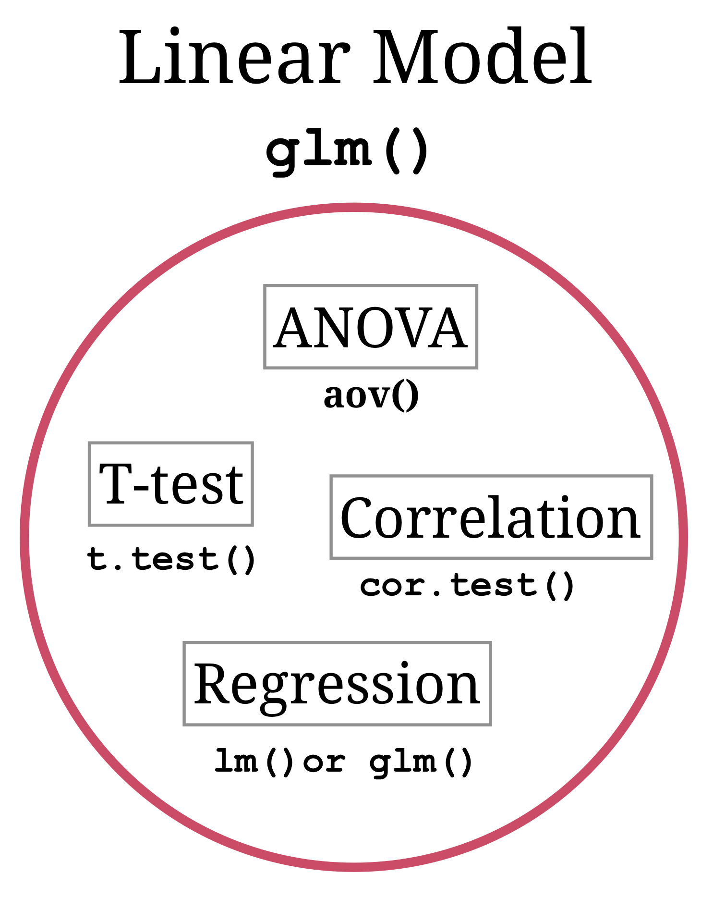
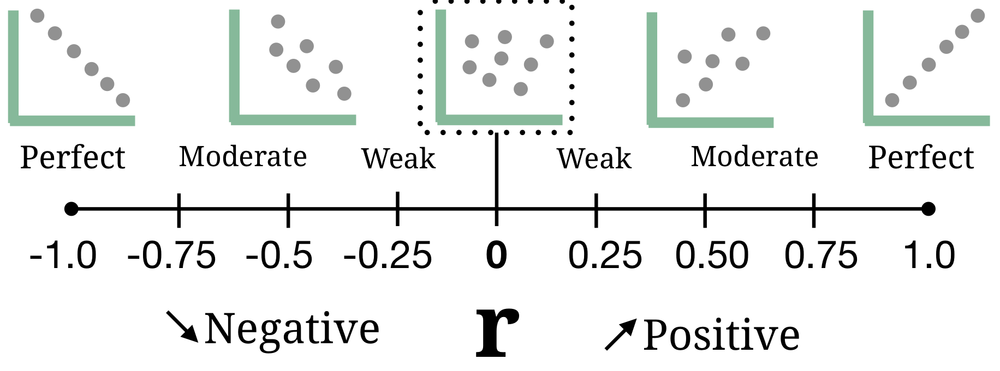

layout: true

<div class="my-footer">
  <span style="text-align:center">
    <span> 
      
    </span>
    <a href="https://therbootcamp.github.io/">
      <span style="padding-left:82px"> 
        <font color="#7E7E7E">
          www.therbootcamp.com
        </font>
      </span>
    </a>
    <a href="https://therbootcamp.github.io/">
      <font color="#7E7E7E">
       Statistics with R | April 2019
      </font>
    </a>
    </span>
  </div> 

---

```{r, eval = TRUE, echo = FALSE, warning=F,message=F}
# Code to knit slides

```

```{r setup, include=FALSE}
options(htmltools.dir.version = FALSE)
# see: https://github.com/yihui/xaringan
# install.packages("xaringan")
# see: 
# https://github.com/yihui/xaringan/wiki
# https://github.com/gnab/remark/wiki/Markdown
options(width = 110)
options(digits = 4)

# Load packages
require(tidyverse)

knitr::opts_chunk$set(dpi = 300, echo = TRUE, warning = FALSE, fig.align = 'center', warning = FALSE)

source("https://raw.githubusercontent.com/therbootcamp/therbootcamp.github.io/master/_materials/code/baselrbootcamp_palettes.R")

library(broom)

# Load data
baselers <- readr::read_csv("1_Data/baselers.csv")

baselers <- baselers %>%
  mutate(education = case_when(education == "apprenticeship" ~ "High School",
                               education == "obligatory_school" ~ "BA",
                               education == "SEK_II" ~ "MS",
                               education == "SEK_III" ~ "PhD"
                               ))

print2 <- function(x, nlines=10,...) {
   cat(head(capture.output(print(x,...)), nlines), sep="\n")}


```


```{r, echo = FALSE}

set.seed(105)
x <- rnorm(50, mean = 50, sd = 10)

id <- 1:50
drug <- sample(c("Drug", "Placebo"), size = 50, replace = TRUE)
effect <- rnorm(50)
effect[drug == "Drug"] <- 2.3 + rnorm(sum(drug == "Drug"), mean = 0, sd = 1.5) - .41
effect[drug == "Placebo"] <- 3.3 + rnorm(sum(drug == "Placebo"), mean = 0, sd = 1.5) - .12

dat <- tibble(id, drug, effect, group = rep("Baselers", 50))
avg <- dat %>%
  group_by(drug) %>%
  summarise(days_mean = mean(effect))

drug_placebo_gg <- ggplot(dat, aes(factor(drug), effect)) +
  geom_jitter(width = .05) +
  labs(y = "Days",
       x = "Condition",
       title = "Fictional data") +
  scale_y_continuous(breaks = seq(0, 10, 1), limits = c(0, 7)) +
  geom_label(data = avg, aes(x = drug, y = days_mean, label = round(days_mean, 2)))

```


# Linear Model Applications

.pull-left5[

<p style="padding-bottom:20px"><u>Linear Model Equation</u></p>

$$\Large y = \beta_{0} + \beta_{1}x_{1} + \beta_{2} x_{2} +  ... + \beta_{n}x_{n} + \epsilon$$

<p style="padding-top:20px"><u>Hypothesis tests are linear models!</u><br><br>

In fact, many of your favorite hypothesis tests, including <high>t-tests</high>, <high>correlation tests</high>, and <high>ANOVAs</high> can all be expressed as linear models! <br><br>

This means that you can use the `lm()` or `glm()` function to do all of these tests!<br><br>

However, R also has special <high>hypothesis test functions</high> with more user-friendly outputs.<br><br>
</p>

]

.pull-right4[

<p align = "center">
  
</p>

]


---

# Linear Model Applications

.pull-left5[

```{r, echo = FALSE, fig.width = 6, fig.height = 1.3, out.width = "100%"}

dat <- tibble(x = rnorm(1000, mean = 100, sd = 10),
              y = rep(.001, 1000) + rnorm(1000, mean = 0, sd = .0005))

p1 <- ggplot(data = data.frame(x = c(60, 140)), aes(x)) +
  stat_function(fun = dnorm, n = 1001, args = list(mean = 100, sd = 10), col = baselrbootcamp_cols("green"),size = 2) + 
  ylab("") +
  annotate("point", x = dat$x, y = dat$y, alpha = .1) +
  scale_y_continuous(breaks = NULL) +
  xlab("x")

  
p1
```

Many of these tests assume your dependent variable is <high>normally distributed</high>. What differentiates these tests is typically the <high>scale of your independent variable</high>.

<u> Types of predictor variables </u>

<table style="cellspacing:0; cellpadding:0; border:none" width=100%>
  <col width="10%">
  <col width="45%">
  <col width="40%">
<tr>
  <td bgcolor="white">
    <b>Scale</b>
  </td>
  <td bgcolor="white">
    <b>Description</b>
  </td> 
  <td bgcolor="white">
    <b>Examples</b>
  </td> 
</tr>
<tr>
  <td bgcolor="white">
    Nominal
  </td>
  <td bgcolor="white">
    A discrete category without order
  </td> 
  <td bgcolor="white">
    Sex, College, Favorite Color
  </td> 
</tr>
<tr>
  <td bgcolor="white">
    Ratio
  </td>
  <td bgcolor="white">
    A continuous number
  </td> 
  <td bgcolor="white">
    Income, Height, Weight
  </td> 
</tr>
</table>


]

.pull-right4[

<p align = "center">
  
</p>

]

---

# Null hypothesis testing

.pull-left45[

Null hypothesis testing is a statistical framework where one hypothesis (H<sub>0</sub>) is tested to defend the other, alternative hypothesis (H<sub>1</sub>).

<table style="cellspacing:0; cellpadding:0; border:none; padding-top:10px" width=100%>
  <col width="16%">
  <col width="44%">
  <col width="40%">
<tr>
  <td bgcolor="white">
    <b>Hypothesis</b>
  </td>
  <td bgcolor="white">
    <b>Description</b>
  </td>  
  <td bgcolor="white">
    <b>Example</b>
  </td>  
</tr>
<tr>
  <td bgcolor="white">
    Null (H<sub>0</sub>)
  </td>
  <td bgcolor="white">
    A proposed effect <high>does not exist</high> and variation <high>is not systematic</high>.
  </td>  
  <td bgcolor="white">
    Drug and placebo have the same effect.
  </td>  
</tr>
<tr>
  <td bgcolor="white">
    Alternative (H<sub>1</sub>)
  </td>
  <td bgcolor="white">
    A proposed effect <high>does exist</high> and variation <high>is systematic</high>
  </td>  
  <td bgcolor="white">
    Drug and placebo do *not* have the same effect
  </td>  
</tr>
</table>


]


.pull-right45[

```{r, echo = FALSE, fig.width = 3, fig.height = 3, out.width="90%"}
drug_placebo_gg
```


]


---

# Correlation test

.pull-left45[

<br2>

<font style="font-size:22px"><b>Does Y tend to change when X changes?</b></font>

Conduct a <high>correlation test</high> when you have 2 continuous, Normally distributed independent variables X and Y.

<font style="font-size:22px"><b>Formula</b></font>

$$\LARGE Y=\beta_{0}+\beta_{1}x$$

$$\LARGE \beta_{1}=\rho\frac{\sigma_{y}}{\sigma_{x}}$$

<table style="cellspacing:0; cellpadding:0; border:none; padding-top:10px" width=100%>
  <col width="15%">
  <col width="85%">
<tr>
  <td bgcolor="white">
    &#x3C1;
  </td>
  <td bgcolor="white">
    The <high>population correlation</high> between x and Y
  </td>  
</tr>
<tr>
  <td bgcolor="white">
    <mono>r</mono>
  </td>
  <td bgcolor="white">
    The <high>sample correlation</high> between x and Y
  </td>  
</tr>
</table>

]

.pull-right45[

```{r, echo = FALSE, fig.width = 3, fig.height = 3, out.width="90%", message = FALSE, warning = FALSE}
set.seed(104)
x <- rnorm(20, mean = 10, sd = 2)
pos_low <- x * 1 + rnorm(20, sd = 5)

pos_low_r <- cor(x, pos_low)


dat <- tibble(x, pos_low)

pos_low_gg <- ggplot(dat, aes(x = x, y = pos_low)) +
  geom_point() +
  labs(x = "x (Normally Distributed)", y = "y (Normally Distributed)", title = "Ready for a Correlation test!")

pos_low_gg

```


]


---

# Correlation test

.pull-left45[

<br2>

<font style="font-size:22px"><b>Correlation Coefficient</b></font>

<p align = "center">
  
</p>

<font style="font-size:22px"><b>Hypotheses</b></font>

Null: $H_{0}:\rho  = 0$, "There <high>is no</high> correlation in the population"

Alternative: $H_{A}:\rho  \neq 0$, "There <high>is a </high> (non-zero) correlation in the population!"

]

.pull-right45[

```{r, echo = FALSE, fig.width = 4.5, fig.height = 4.5}
set.seed(104)
x <- rnorm(20, mean = 10, sd = 2)
pos_low <- x * 1 + rnorm(20, sd = 5)
pos_high <- x * 1 + rnorm(20, sd = .5)
neg_low <- x * -1 + rnorm(20, sd = 5)
neg_high <- x * -1 + rnorm(20, sd = .5)

pos_low_r <- cor(x, pos_low)
pos_high_r <- cor(x, pos_high)
neg_low_r <- cor(x, neg_low)
neg_high_r <- cor(x, neg_high)


dat <- tibble(x, pos_low, pos_high, neg_low, neg_high)

pos_low_gg <- ggplot(dat, aes(x = x, y = pos_low)) +
  geom_point() +
  geom_smooth(se = FALSE, method = "lm", col = baselrbootcamp_cols("magenta")) +
  labs(title = "Low, positive corr.",
       subtitle = paste0("r = ", round(pos_low_r, 2)), x = "x", y = "y")

pos_high_gg <- ggplot(dat, aes(x = x, y = pos_high)) +
  geom_point() +
  geom_smooth(se = FALSE, method = "lm", col = baselrbootcamp_cols("magenta")) +
  labs(title = "High, positive corr.",
       subtitle = paste0("r = ", round(pos_high_r, 2)), x = "x", y = "y")

neg_low_gg <- ggplot(dat, aes(x = x, y = neg_low)) +
  geom_point() +
  geom_smooth(se = FALSE, method = "lm", col = baselrbootcamp_cols("magenta")) +
  labs(title = "Low, negative corr.",
       subtitle = paste0("r = ", round(neg_low_r, 2)), x = "x", y = "y")

neg_high_gg <- ggplot(dat, aes(x = x, y = neg_high)) +
  geom_point() +
  geom_smooth(se = FALSE, method = "lm", col = baselrbootcamp_cols("magenta")) +
  labs(title = "High, negative corr.",
       subtitle = paste0("r = ", round(neg_high_r, 2)), x = "x", y = "y")


ggpubr::ggarrange(pos_low_gg, neg_low_gg, pos_high_gg, neg_high_gg, ncol = 2, nrow = 2)
```


]


---

# Correlation test

.pull-left45[

<br2>

<font style="font-size:22px"><b>Correlation Coefficient</b></font>

<p align = "center">
  
</p>

<font style="font-size:22px"><b>Hypotheses</b></font>

Null: $H_{0}:\rho  = 0$, "There <high>is no</high> correlation in the population"

Alternative: $H_{A}:\rho  \neq 0$, "There <high>is a </high> (non-zero) correlation in the population!"

]

.pull-right45[

```{r, echo  = FALSE, warning = FALSE, fig.width = 4.5, fig.height = 4.5, dpi = 300, out.width = "100%"}
ggplot(baselers, aes(x = age, y = income)) +
  geom_point(alpha = .03, col = baselrbootcamp_cols("magenta")) +
  labs(title = "Age and Income of Baselers",
       caption = "Fake data :)")
```

]

---


# Correlation test

.pull-left45[

<br2>

<font style="font-size:22px"><b>Correlation Coefficient</b></font>

<p align = "center">
  
</p>

<font style="font-size:22px"><b>Hypotheses</b></font>

Null: $H_{0}:\rho  = 0$, "There <high>is no</high> correlation in the population"

Alternative: $H_{A}:\rho  \neq 0$, "There <high>is a </high> (non-zero) correlation in the population!"

]

.pull-right45[

```{r}
# Relationship between age and income?

inc_ht <- cor.test(formula = ~ age + income,
                   data = baselers)

# Print result
inc_ht
```


]

---

# Correlation test

.pull-left45[

<br2>

<font style="font-size:22px"><b>Correlation Coefficient</b></font>

<p align = "center">
  
</p>

<font style="font-size:22px"><b>Hypotheses</b></font>

Null: $H_{0}:\rho  = 0$, "There <high>is no</high> correlation in the population"

Alternative: $H_{A}:\rho  \neq 0$, "There <high>is a </high> (non-zero) correlation in the population!"

]

.pull-right45[

```{r, echo =F}
options(width=43)
```

```{r}
# Show all named elements
names(inc_ht)

# Show estimated correlation coefficient
inc_ht$estimate

# Show p-value
inc_ht$p.value
```

]

---

# t-test

.pull-left45[

<br2>

<font style="font-size:22px"><b>Does the mean of group A differ from group B?</b></font>

Conduct a <high>t-test</high> when you have one nominal independent variable with <high>2 levels</high> A and B

<font style="font-size:22px"><b>Formula</b></font>

$$\LARGE Y=\beta_{0}+\beta_{1}x$$

$$\beta_{0} = Mean\;of\;group\;A, \beta_{1} = Mean\;of\;group\;B$$


<table style="cellspacing:0; cellpadding:0; border:none; padding-top:25px" width=100%>
  <col width="50%">
  <col width="50%">
<tr>
  <td bgcolor="white">
    <b>Group</b>
  </td>
  <td bgcolor="white">
    <b>x</b>
  </td>  
</tr>
<tr>
  <td bgcolor="white">
    Group = A
  </td>
  <td bgcolor="white">
    x = 0
  </td>  
</tr>
<tr>
  <td bgcolor="white">
    Group = B
  </td>
  <td bgcolor="white">
    x = 1
  </td>  
</tr>
</table>
]


.pull-right45[

```{r, echo = FALSE, fig.width = 4, fig.height = 4}
set.seed(102)

global_mean <- 12

dat <- tibble(Group = rep(c("A", "B"), each = 50),
                             y = c(rnorm(50, mean = global_mean, sd = 3) - 1,
                                   rnorm(50, mean = global_mean, sd = 3) + 3))

t <- t.test(y ~ Group, data = dat)$statistic %>% round(2)
p <- t.test(y ~ Group, data = dat)$p.value %>% round(3)

mean_c <- dat %>% group_by(Group) %>% summarise(y = mean(y)) %>% pull(y) %>% round(2)
sd_avg <- dat %>% group_by(Group) %>% summarise(y = sd(y)) %>% pull(y) %>% mean() %>% round(2)

a_gg <- ggplot(data = dat) +
               aes(x = Group, y = y) +
      stat_summary(geom = "bar", fun.y = "mean", col = "black", fill = "white") +
                 geom_jitter(width = .1) +
  annotate("segment", x = c(1, 2), xend = c(1, 2), y = mean_c - sd_avg, yend = mean_c + sd_avg, size = 2, col = baselrbootcamp_cols("magenta")) +
  annotate("label", x = c(1, 2), y = mean_c, label = mean_c)  +
   labs(title = "Ready for a t-test!", y = "Y (Normally Distributed)") +
  ylim(0, 25) +
    coord_cartesian(clip = 'off') +
  guides(fill = FALSE)

a_gg
```


]


---

# t-test

.pull-left45[

<br2>

<font style="font-size:22px"><b>Does the mean of group A differ from group B?</b></font>

Conduct a <high>t-test</high> when you have one nominal independent variable with <high>2 levels</high> A and B

<font style="font-size:22px"><b>Formula</b></font>

$$\Large t = \frac{\bar{x}_{A}-\bar{x}_{B}}{\sqrt{s^{2}(\frac{1}{n_{A}}+\frac{1}{n_{B}})}}$$
$$\Large s^{2} = Pooled\;variance$$

<br>

*Pooled variance means "Average Variance"* 

]

.pull-right45[

```{r, echo = FALSE, fig.width = 7, fig.height = 7}
set.seed(102)

global_mean <- 12

dat <- tibble(Group = rep(c("A", "B"), each = 50),
                             y = c(rnorm(50, mean = global_mean, sd = 3) - .5,
                                   rnorm(50, mean = global_mean, sd = 3)))

t <- t.test(y ~ Group, data = dat)$statistic %>% round(2)
p <- t.test(y ~ Group, data = dat)$p.value %>% round(3)

mean_c <- dat %>% group_by(Group) %>% summarise(y = mean(y)) %>% pull(y) %>% round(2)
sd_avg <- dat %>% group_by(Group) %>% summarise(y = sd(y)) %>% pull(y) %>% mean() %>% round(2)

a_gg <- ggplot(data = dat) +
               aes(x = Group, y = y) +
      stat_summary(geom = "bar", fun.y = "mean", col = "black", fill = "white") +
                 geom_jitter(width = .1) +
  annotate("segment", x = c(1, 2), xend = c(1, 2), y = mean_c - sd_avg, yend = mean_c + sd_avg, size = 2, col = baselrbootcamp_cols("magenta")) +
  annotate("label", x = c(1, 2), y = mean_c, label = mean_c)  +
   labs(title = paste0("t = ", t, ", p = ", p),
       subtitle = paste0("Mean difference = ", diff(mean_c) %>% round(2),  ", s2 = ", sd_avg %>% round(2))) +
  ylim(0, 25) +
    coord_cartesian(clip = 'off')


dat <- tibble(Group = rep(c("A", "B"), each = 50),
                             y = c(rnorm(50, mean = global_mean - 2, sd = 7) + .2,
                                   rnorm(50, mean = global_mean + 2, sd = 7) - .2))

t <- t.test(y ~ Group, data = dat)$statistic %>% round(2)
p <- t.test(y ~ Group, data = dat)$p.value %>% round(3)

mean_c <- dat %>% group_by(Group) %>% summarise(y = mean(y)) %>% pull(y) %>% round(2)
sd_avg <- dat %>% group_by(Group) %>% summarise(y = sd(y)) %>% pull(y) %>% mean() %>% round(2)

b_gg <- ggplot(data = dat) +
               aes(x = Group, y = y) +
      stat_summary(geom = "bar", fun.y = "mean", col = "black", fill = "white", data = dat, aes(Group, y)) +
                 geom_jitter(width = .1) +
  annotate("segment", x = c(1, 2), xend = c(1, 2), y = mean_c - sd_avg, yend = mean_c + sd_avg, size = 2, col = baselrbootcamp_cols("magenta")) +
  annotate("label", x = c(1, 2), y = mean_c, label = mean_c)  +
   labs(title = paste0("t = ", t, ", p = ", p),
       subtitle = paste0("Mean difference = ", diff(mean_c) %>% round(2),  ", s2 = ", sd_avg %>% round(2))) +
  ylim(0, 25) +
    coord_cartesian(clip = 'off')


dat <- tibble(Group = rep(c("A", "B"), each = 50),
                             y = c(rnorm(50, mean = global_mean, sd = 2) + .58,
                                   rnorm(50, mean = global_mean, sd = 2)))

t <- t.test(y ~ Group, data = dat)$statistic %>% round(2)
p <- t.test(y ~ Group, data = dat)$p.value %>% round(3)

mean_c <- dat %>% group_by(Group) %>% summarise(y = mean(y)) %>% pull(y) %>% round(2)
sd_avg <- dat %>% group_by(Group) %>% summarise(y = sd(y)) %>% pull(y) %>% mean() %>% round(2)

c_gg <- ggplot(data = dat) +
               aes(x = Group, y = y) +
    stat_summary(geom = "bar", fun.y = "mean", col = "black", fill = "white") +
                 geom_jitter(width = .1) +
  annotate("segment", x = c(1, 2), xend = c(1, 2), y = mean_c - sd_avg, yend = mean_c + sd_avg, size = 2, col = baselrbootcamp_cols("magenta")) +
  annotate("label", x = c(1, 2), y = mean_c, label = mean_c)  +
   labs(title = paste0("t = ", t, ", p = ", p),
       subtitle = paste0("Mean difference = ", diff(mean_c) %>% round(2),  ", s2 = ", sd_avg %>% round(2))) +
  ylim(0, 25) +
    coord_cartesian(clip = 'off')


dat <- tibble(Group = rep(c("A", "B"), each = 50),
                             y = c(rnorm(50, mean = global_mean - 2, sd = 2) - .25,
                                   rnorm(50, mean = global_mean + 2, sd = 2) + .25))

t <- t.test(y ~ Group, data = dat)$statistic %>% round(2)
p <- t.test(y ~ Group, data = dat)$p.value %>% round(3)

mean_c <- dat %>% group_by(Group) %>% summarise(y = mean(y)) %>% pull(y) %>% round(2)
sd_avg <- dat %>% group_by(Group) %>% summarise(y = sd(y)) %>% pull(y) %>% mean() %>% round(2)

d_gg <- ggplot(data = dat) +
               aes(x = Group, y = y) +
      stat_summary(geom = "bar", fun.y = "mean", col = "black", fill = "white") +

                 geom_jitter(width = .1) +
  annotate("segment", x = c(1, 2), xend = c(1, 2), y = mean_c - sd_avg, yend = mean_c + sd_avg, size = 2, col = baselrbootcamp_cols("magenta")) +
  annotate("label", x = c(1, 2), y = mean_c, label = mean_c)  +
   labs(title = paste0("t = ", t, ", p = ", p),
       subtitle = paste0("Mean difference = ", diff(mean_c) %>% round(2),  ", s2 = ", sd_avg %>% round(2))) +
  ylim(0, 25) +
    coord_cartesian(clip = 'off')


t_test_grid_gg <- ggpubr::ggarrange(a_gg, b_gg, c_gg, d_gg, nrow = 2, ncol = 2)

t_test_grid_gg
```

]


---

# t-test

.pull-left45[

<br2>

<font style="font-size:22px"><b>Does the mean of group A differ from group B?</b></font>

Conduct a <high>t-test</high> when you have one nominal independent variable with <high>2 levels</high> A and B

<font style="font-size:22px"><b>Formula</b></font>

$$\Large t = \frac{\bar{x}_{A}-\bar{x}_{B}}{\sqrt{s^{2}(\frac{1}{n_{A}}+\frac{1}{n_{B}})}}$$
$$\Large s^{2} = Pooled\;variance$$

<br>

*Pooled variance means "Average Variance"* 

]

.pull-right45[

```{r, echo  = FALSE, warning = FALSE, fig.width = 4, fig.height = 4, dpi = 300, out.width = "100%"}
ggplot(baselers, aes(x = sex, y = income, col = sex)) +
    geom_jitter(alpha = .01, width = .1, col = "black") +
   geom_boxplot(col = baselrbootcamp_cols(c("magenta","green"))) +
  labs(title = "Income of female and male baselers",
       caption = "Fake data :)",
       x = "Sex",
       y = "Income (per month)") +
  guides(col = FALSE)
```

]


---

# t-test

.pull-left45[

<br2>

<font style="font-size:22px"><b>Does the mean of group A differ from group B?</b></font>

Conduct a <high>t-test</high> when you have one nominal independent variable with <high>2 levels</high> A and B

<font style="font-size:22px"><b>Formula</b></font>

$$\Large t = \frac{\bar{x}_{A}-\bar{x}_{B}}{\sqrt{s^{2}(\frac{1}{n_{A}}+\frac{1}{n_{B}})}}$$
$$\Large s^{2} = Pooled\;variance$$

<br>

*Pooled variance means "Average Variance"* 

]

.pull-right45[

```{r}
# 2-sample t-test
inc_ht <- t.test(formula = income ~ sex,
                 data = baselers)

# Print
inc_ht
```

]


---

# t-test

.pull-left45[

<br2>

<font style="font-size:22px"><b>Does the mean of group A differ from group B?</b></font>

Conduct a <high>t-test</high> when you have one nominal independent variable with <high>2 levels</high> A and B

<font style="font-size:22px"><b>Formula</b></font>

$$\Large t = \frac{\bar{x}_{A}-\bar{x}_{B}}{\sqrt{s^{2}(\frac{1}{n_{A}}+\frac{1}{n_{B}})}}$$
$$\Large s^{2} = Pooled\;variance$$

<br>

*Pooled variance means "Average Variance"* 

]
.pull-right45[

```{r}
# Show all named elements
names(inc_ht)

# Print the test statistic
inc_ht$statistic

# Print the p.value
inc_ht$p.value
```

]


---

# ANOVA

.pull-left45[

<br2>

<font style="font-size:22px"><b>Do the means of my (many) groups differ?</b></font>

Conduct an <high>ANOVA</high> when you have one nominal independent variable with <high>more than 2 levels</high> A, B, C, ...

<font style="font-size:22px"><b>Formula</b></font>

<br>

$$\Large F = \frac{Variance\;Between\;Groups}{Variance\;Within\;Groups}$$

<br>

*Is the variability between my groups large relative to the variability within each group?*

]

.pull-right45[

```{r, fig.width = 4.5, fig.height = 4, echo = FALSE}
a_y <- rnorm(100, mean = 10, sd = 2)
b_y <- rnorm(100, mean = 12, sd = 2)
c_y <- rnorm(100, mean = 10, sd = 2)

dat <- tibble(Group = rep(c("A", "B", "C"), each = 100),
              Y = c(a_y, b_y, c_y))

mean_c <- dat %>% group_by(Group) %>% summarise(x = mean(Y)) %>% pull(x) %>% round(2)
sd_avg <- dat %>% group_by(Group) %>% summarise(x = sd(Y)) %>% pull(x) %>% mean()


ggplot(data = dat, aes(x = Group, y = Y)) +
  stat_summary(geom = "bar", fun.y = "mean", col = "black", fill = "white") +
                 geom_jitter(width = .1) +
  annotate("segment", x = c(1, 2, 3), xend = c(1, 2, 3), y = mean_c - sd_avg, yend = mean_c + sd_avg, size = 2, col = baselrbootcamp_cols("magenta")) +
  annotate("label", x = c(1, 2, 3), y = mean_c, label = mean_c) +
  labs(title = "Ready for an ANOVA!")
```

]


---

.pull-left45[

# ANOVA

<br2>

<font style="font-size:22px"><b>Do the means of my (many) groups differ?</b></font>

Conduct an <high>ANOVA</high> when you have one nominal independent variable with <high>more than 2 levels</high> A, B, C, ...

<font style="font-size:22px"><b>Formula</b></font>

<br>

$$\Large F = \frac{Variance\;Between\;Groups}{Variance\;Within\;Groups}$$

<br>

*Is the variability between my groups large relative to the variability within each group?*

]

.pull-right5[

<br><br><br>

```{r, fig.width = 4, fig.height = 4.7, echo = FALSE, out.width = "80%"}
set.seed(100)

a_y <- rnorm(100, mean = 10, sd = 4) - .75
b_y <- rnorm(100, mean = 10, sd = 4) + .25
c_y <- rnorm(100, mean = 10, sd = 4) - .75

dat <- tibble(Group = rep(c("A", "B", "C"), each = 100),
              Y = c(a_y, b_y, c_y))

mean_c <- dat %>% group_by(Group) %>% summarise(x = mean(Y)) %>% pull(x) %>% round(2)
sd_avg <- dat %>% group_by(Group) %>% summarise(x = sd(Y)) %>% pull(x) %>% mean(2)

fstat <- aov(data = dat, formula = Y ~ Group) %>% tidy() %>% slice(1) %>% pull(statistic) %>% round(2)
p <- aov(data = dat, formula = Y ~ Group) %>% tidy() %>% slice(1) %>% pull(p.value) %>% round(2)


a_gg <- ggplot(data = dat, aes(x = Group, y = Y)) +
  stat_summary(geom = "bar", fun.y = "mean", col = "black", fill = "white") +
                 geom_jitter(width = .1) +
  annotate("segment", x = c(1, 2, 3), xend = c(1, 2, 3), y = mean_c - sd_avg, yend = mean_c + sd_avg, size = 2, col = baselrbootcamp_cols("magenta")) +
  annotate("label", x = c(1, 2, 3), y = mean_c, label = mean_c) +
  labs(title = paste0("F = ", fstat, ", p = ", p)) +
  ylim(c(0, 20))


a_y <- rnorm(100, mean = 10, sd = 2) - .75
b_y <- rnorm(100, mean = 10, sd = 2) + .25
c_y <- rnorm(100, mean = 10, sd = 2) - .75

dat <- tibble(Group = rep(c("A", "B", "C"), each = 100),
              Y = c(a_y, b_y, c_y))

mean_c <- dat %>% group_by(Group) %>% summarise(x = mean(Y)) %>% pull(x) %>% round(2)
sd_avg <- dat %>% group_by(Group) %>% summarise(x = sd(Y)) %>% pull(x) %>% mean(2)

fstat <- aov(data = dat, formula = Y ~ Group) %>% tidy() %>% slice(1) %>% pull(statistic) %>% round(2)
p <- aov(data = dat, formula = Y ~ Group) %>% tidy() %>% slice(1) %>% pull(p.value) %>% round(2)


b_gg <- ggplot(data = dat, aes(x = Group, y = Y)) +
  stat_summary(geom = "bar", fun.y = "mean", col = "black", fill = "white") +
                 geom_jitter(width = .1) +
  annotate("segment", x = c(1, 2, 3), xend = c(1, 2, 3), y = mean_c - sd_avg, yend = mean_c + sd_avg, size = 2, col = baselrbootcamp_cols("magenta")) +
  annotate("label", x = c(1, 2, 3), y = mean_c, label = mean_c) +
  labs(title = paste0("F = ", fstat, ", p = ", p)) +
  ylim(c(0, 20))


ggpubr::ggarrange(a_gg, b_gg, ncol = 1, nrow = 2)


```

]


---

# ANOVA with `aov()`

.pull-left45[

<br2>

<font style="font-size:22px"><b>Do the means of my (many) groups differ?</b></font>

Conduct an <high>ANOVA</high> when you have one nominal independent variable with <high>more than 2 levels</high> A, B, C, ...

<font style="font-size:22px"><b>Formula</b></font>

<br>

$$\Large F = \frac{Variance\;Between\;Groups}{Variance\;Within\;Groups}$$

<br>

*Is the variability between my groups large relative to the variability within each group?*

]

.pull-right45[

```{r, echo  = FALSE, warning = FALSE, fig.width = 4, fig.height = 3.7, dpi = 300, out.width = "100%"}
ggplot(baselers, aes(x = education, y = height, col = education)) +
  geom_jitter(alpha = .05, width = .1, col = "black") +
     geom_boxplot() +
  labs(title = "Baseler height based on education",
       caption = "Fake data :)") +
  guides(col = FALSE)
```

]


---

# ANOVA with `aov()`

.pull-left45[

<br2>

<font style="font-size:22px"><b>Do the means of my (many) groups differ?</b></font>

Conduct an <high>ANOVA</high> when you have one nominal independent variable with <high>more than 2 levels</high> A, B, C, ...

<font style="font-size:22px"><b>Formula</b></font>

<br>

$$\Large F = \frac{Variance\;Between\;Groups}{Variance\;Within\;Groups}$$

<br>

*Is the variability between my groups large relative to the variability within each group?*

]

.pull-right45[

```{r}
# Relationship height and education?
height_ht <- 
  aov(formula = height ~ education,
                data = baselers)

# Print result
height_ht
```

]


---

# ANOVA with `aov()`

.pull-left45[

<br2>

<font style="font-size:22px"><b>Do the means of my (many) groups differ?</b></font>

Conduct an <high>ANOVA</high> when you have one nominal independent variable with <high>more than 2 levels</high> A, B, C, ...

<font style="font-size:22px"><b>Formula</b></font>

<br>

$$\Large F = \frac{Variance\;Between\;Groups}{Variance\;Within\;Groups}$$

<br>

*Is the variability between my groups large relative to the variability within each group?*

]

.pull-right45[
  

```{r}
# Show summary results
summary(height_ht)
```

]


---

.pull-left35[

# ANOVA post-hoc with `TukeyHSD()`

<br2>

<font style="font-size:22px"><b>Which groups differ?</b></font>

After conducting an <high>ANOVA</high>, conduct a <high>post-hoc test</high> to see which specific pairs of groups differ
.
<font style="font-size:22px"><b>Formula</b></font>

<br>

$$\Large t = \frac{\bar{x}_{A}-\bar{x}_{B}}{Total\;Variability}$$

]

.pull-right55[

<br>


```{r, eval = FALSE}
# Conduct post-hoc tests
#   Which pairs of groups differ?

TukeyHSD(height_ht)
```

```{r, echo  =F}
# Conduct post-hoc tests
#   Which pairs of groups differ?

print2(TukeyHSD(height_ht),20)
```

]


---

# `tidy()`

.pull-left4[

The `tidy()` function from the `broom` package <high>converts</high> the most important results of many statistical objects to a <high>data frame</high>.

Try `tidy()` on your favorite statistical object and see what you get!

<p align = "center">
  
</p>


]

.pull-right55[

```{r, eval = TRUE, echo = TRUE}
# Load broom package
library(broom)   # For tidy()

# Conduct correlation test
income_htest <- cor.test(formula = ~ height + income,
                         data = baselers)

# Standard printout
income_htest
```

]


---

# `tidy()`

.pull-left4[

The `tidy()` function from the `broom` package <high>converts</high> the most important results of many statistical objects to a <high>data frame</high>.

Try `tidy()` on your favorite statistical object and see what you get!

<p align = "center">
  
</p>

]

.pull-right55[

```{r, eval = TRUE, echo = TRUE}
# Load broom package
library(broom)   # For tidy()

# Conduct correlation test
income_htest <- cor.test(formula = ~ height + income,
                         data = baselers)

tidy(income_htest)
```

]

---

# `tidy()`

.pull-left4[

The `tidy()` function from the `broom` package <high>converts</high> the most important results of many statistical objects to a <high>data frame</high>.

Try `tidy()` on your favorite statistical object and see what you get!

<p align = "center">
  
</p>


]

.pull-right55[

```{r, eval = TRUE, echo = TRUE}
# Load broom package
library(broom)   # For tidy()

# Conduct t.test
height_sex_ttest <- t.test(formula = height ~ sex,
                           data = baselers)
height_sex_ttest
```

]


---

# `tidy()`

.pull-left4[

The `tidy()` function from the `broom` package <high>converts</high> the most important results of many statistical objects to a <high>data frame</high>.

Try `tidy()` on your favorite statistical object and see what you get!

<p align = "center">
  
</p>


]

.pull-right55[

```{r, eval = TRUE, echo = TRUE}
# Load broom package
library(broom)   # For tidy()

# Conduct t.test
height_sex_ttest <- t.test(formula = height ~ sex,
                           data = baselers)

# tidy results
tidy(height_sex_ttest)
```

]


---

.pull-left45[

# Distribution functions

R has a several functions that allow you to draw <high>random samples</high> data from specified distributions:


<table style="cellspacing:0; cellpadding:0; border:none; padding-top:10px" width=100%>
  <col width="25%">
  <col width="25%">
  <col width="25%">
  <col width="25%">
<tr>
  <td bgcolor="white">
    <b>Type</b>
  </td>
  <td bgcolor="white">
    <b>CDF</b>
  </td> 
  <td bgcolor="white">
    <b>CDF<sup>-1</sup></b>
  </td> 
    <td bgcolor="white">
    <b>Simulate</b>
  </td> 
</tr>
<tr>
  <td bgcolor="white">
    Normal
  </td>
  <td bgcolor="white">
    <mono>pnorm()</mono>
  </td> 
  <td bgcolor="white">
    <mono>qnorm()</mono>
  </td> 
    <td bgcolor="white">
    <mono>rnorm()</mono>
  </td> 
</tr>
<tr>
  <td bgcolor="white">
    Uniform
  </td>
  <td bgcolor="white">
    <mono>punif()</mono>
  </td> 
  <td bgcolor="white">
    <mono>qunif()</mono>
  </td> 
    <td bgcolor="white">
    <mono>runif()</mono>
  </td> 
</tr>
<tr>
  <td bgcolor="white">
    F
  </td>
  <td bgcolor="white">
    <mono>pf()</mono>
  </td> 
  <td bgcolor="white">
    <mono>qf()</mono>
  </td> 
    <td bgcolor="white">
    <mono>rf()</mono>
  </td> 
</tr>
<tr>
  <td bgcolor="white">
    Binomial
  </td>
  <td bgcolor="white">
    <mono>pbinom()</mono>
  </td> 
  <td bgcolor="white">
    <mono>qbinom()</mono>
  </td> 
    <td bgcolor="white">
    <mono>rbinom()</mono>
  </td> 
</tr>
<tr>
  <td bgcolor="white">
    Chi-square
  </td>
  <td bgcolor="white">
    <mono>pchisq()</mono>
  </td> 
  <td bgcolor="white">
    <mono>qchisq()</mono>
  </td> 
    <td bgcolor="white">
    <mono>rchisq()</mono>
  </td> 
</tr>
</table>

<br>

<high>CDF</high> - Cumulative Density Function<br><high>CDF<sup>-1</sup></high> - Inverse Cumulative Density Function
]

.pull-right45[

<br><br><br><br>

```{r, echo = TRUE}
# Pr(z ≤ 2)
pnorm(2, mean = 0, sd = 1)

# z for p(z ≤ x) = 68%
qnorm(.68, mean = 0, sd = 1)

# simulate z
rnorm(23, mean = 0, sd = 1)

```


]

---

.pull-left45[

# Distribution functions

R has a several functions that allow you to draw <high>random samples</high> data from specified distributions:


<table style="cellspacing:0; cellpadding:0; border:none; padding-top:10px" width=100%>
  <col width="25%">
  <col width="25%">
  <col width="25%">
  <col width="25%">
<tr>
  <td bgcolor="white">
    <b>Type</b>
  </td>
  <td bgcolor="white">
    <b>CDF</b>
  </td> 
  <td bgcolor="white">
    <b>CDF<sup>-1</sup></b>
  </td> 
    <td bgcolor="white">
    <b>Simulate</b>
  </td> 
</tr>
<tr>
  <td bgcolor="white">
    Normal
  </td>
  <td bgcolor="white">
    <mono>pnorm()</mono>
  </td> 
  <td bgcolor="white">
    <mono>qnorm()</mono>
  </td> 
    <td bgcolor="white">
    <mono>rnorm()</mono>
  </td> 
</tr>
<tr>
  <td bgcolor="white">
    Uniform
  </td>
  <td bgcolor="white">
    <mono>punif()</mono>
  </td> 
  <td bgcolor="white">
    <mono>qunif()</mono>
  </td> 
    <td bgcolor="white">
    <mono>runif()</mono>
  </td> 
</tr>
<tr>
  <td bgcolor="white">
    F
  </td>
  <td bgcolor="white">
    <mono>pf()</mono>
  </td> 
  <td bgcolor="white">
    <mono>qf()</mono>
  </td> 
    <td bgcolor="white">
    <mono>rf()</mono>
  </td> 
</tr>
<tr>
  <td bgcolor="white">
    Binomial
  </td>
  <td bgcolor="white">
    <mono>pbinom()</mono>
  </td> 
  <td bgcolor="white">
    <mono>qbinom()</mono>
  </td> 
    <td bgcolor="white">
    <mono>rbinom()</mono>
  </td> 
</tr>
<tr>
  <td bgcolor="white">
    Chi-square
  </td>
  <td bgcolor="white">
    <mono>pchisq()</mono>
  </td> 
  <td bgcolor="white">
    <mono>qchisq()</mono>
  </td> 
    <td bgcolor="white">
    <mono>rchisq()</mono>
  </td> 
</tr>
</table>

<br>

<high>CDF</high> - Cumulative Density Function<br><high>CDF<sup>-1</sup></high> - Inverse Cumulative Density Function
]

.pull-right45[

<br><br><br><br>

```{r, echo = TRUE}
# Pr(t ≤ 2)
pt(2, df = 99)

# t for p(t ≤ x) = 68%
qt(.68, df = 99)

# simulate t
rt(23, df = 99)

```

]


---

class: middle, center

<h1><a href="https://therbootcamp.github.io/SwR_2019Apr/_sessions/LinearModelsII/LinearModelsII_practical.html">Practical</a></h1>


