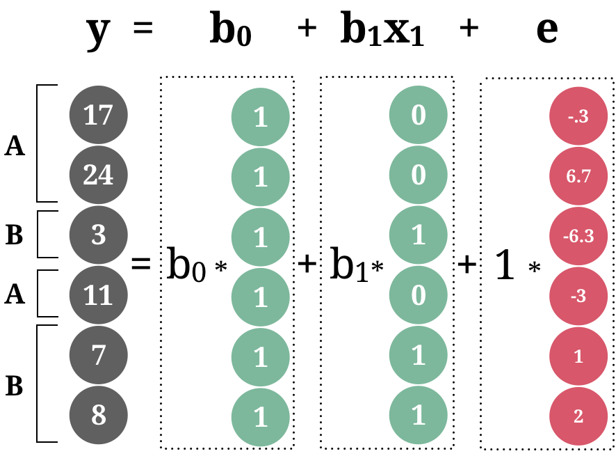
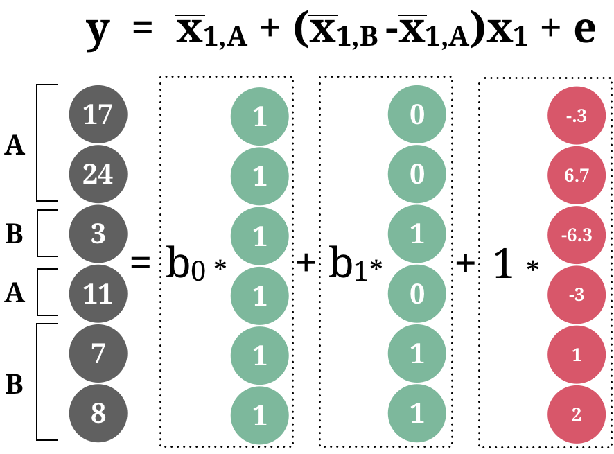
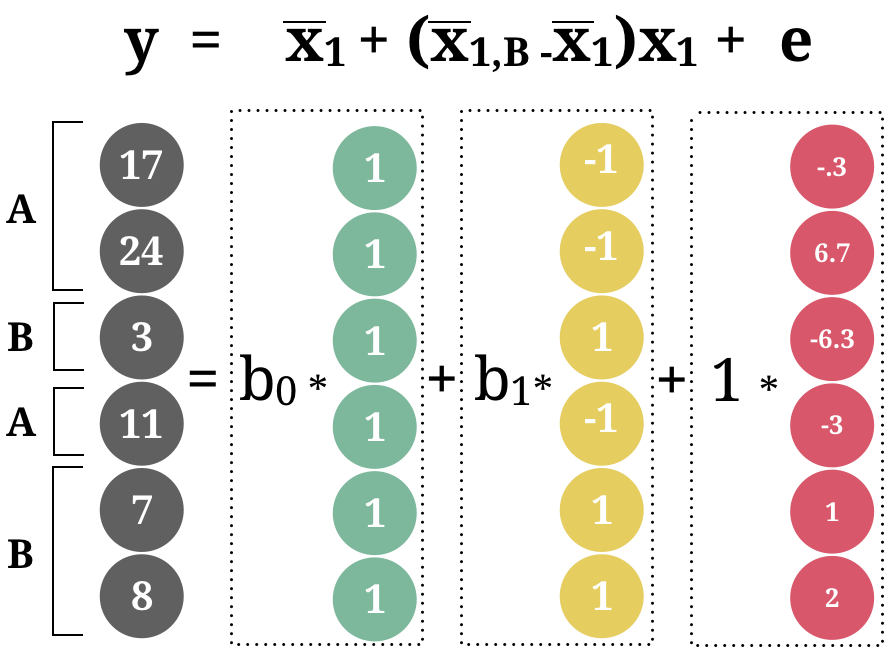
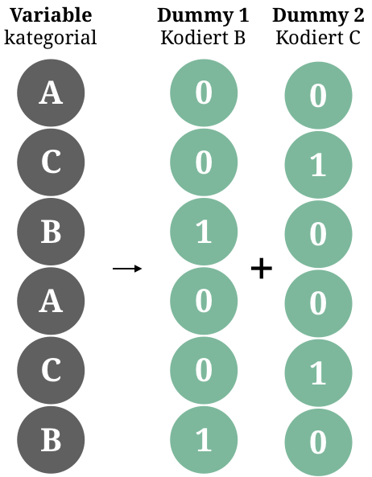

layout: true

<div class="my-footer">
  <span style="text-align:center">
    <span> 
      
    </span>
    <a href="https://therbootcamp.github.io/">
      <span style="padding-left:82px"> 
        <font color="#7E7E7E">
          www.therbootcamp.com
        </font>
      </span>
    </a>
    <a href="https://therbootcamp.github.io/">
      <font color="#7E7E7E">
       Statistik mit R | Mai 2020
      </font>
    </a>
    </span>
  </div> 

---

```{r, eval = TRUE, echo = FALSE, warning=F,message=F}
# Code to knit slides

```

```{r setup, include=FALSE}
options(htmltools.dir.version = FALSE)
options(width = 110)
options(digits = 4)

# Load packages
require(tidyverse)

print2 <- function(x, nlines=10,...) {
   cat(head(capture.output(print(x,...)), nlines), sep="\n")}

# Load data
baselers <- readr::read_csv("1_Data/baselers.csv")

# get color palette functions
source("../../_materials/palette/therbootcamp_palettes.R")
colors = baselrbootcamp_colors

knitr::opts_chunk$set(dpi = 300, echo = FALSE, warning = FALSE, fig.align = 'center', message= FALSE)

```

# Generalisiertes lineares Modell

.pull-left4[

<ul>
  <li class="m1"><span>Das allgemeine lineare Modell ist das schweizer Taschenmesser der Statistik.</span></li>
  <li class="m2"><span>Schliesst ein:</span></li>
  <ul class="level">
    <li><span><high>Regression</high></li></span>
    <li><span><high>t-Test<high></li></span>
    <li><span><high>Varianzanalyse (ANOVA)</high></li></span>
    <li><span>Mediationsanalyse</li></span>
    <li><span>Faktorenanalyse</li></span>
    <li><span>Strukturgleichungsmodelle</li></span>
  </ul>
</ul>

]

.pull-right5[

<p align="center">


</p>
]

---

# Link funktionen

.pull-left4[

<ul>
  <li class="m1"><span>Das allgemeine Lineare Modell kann auch mit <high>kategorialen Prädiktoren</high> umgehen.</span></li>
  <li class="m2"><span>Neben <high>dedizierten Tests</high> (e.g., <mono>t.test()</mono>), können solche Prädiktoren ebenfalls in <mono>lm()</mono> aufgenommen werden.</span></li>
  <li class="m3"><span>Beispiele</span></li>
  <ul class="level">
    <li><span><high>Gruppenvergleiche</high></li></span>
    <li><span><high>A/B Tests<high></li></span>
  </ul>
</ul>

]

.pull-right5[

```{r, echo = F, fig.width = 3.5, fig.height = 3}

library(tidyverse) ; library(ggrepel)

# Lade Tourismus Daten
tour <- read_csv('1_Data/Tourismus.csv') 
europa <- read_csv('1_Data/Europa.csv') 

# Berechne Nächte per Region
tour = tour %>%
  mutate(Nächte = Besucher * Dauer) %>%
  left_join(europa) %>% 
  mutate(Nächte_log = log2(Nächte),
         Region = stringr::str_trunc(Region, 7, ellipsis = "."))

tour %>%  filter(Region %in% c('Europa','Asien')) %>% 
  ggplot(aes(x = Region, 
             y = Nächte)) +
  scale_y_continuous(trans = 'log2') + 
  geom_boxplot() +
  theme_minimal() 

```

]

---

# Logistische Funktion

.pull-left4[
<ul>
  <li class="m1"><span>Der t-Test <high>vergleicht zwei Gruppen</high> in einer kontinuierlichen Variable.</span></li>
  <li class="m2"><span>Die Nullhypothese ist, dass die Gruppen einen <high>identischen Mittelwert</high> besitzen.</span></li>
  <li class="m3"><span>Beispiele</span></li>
  <ul class="level">
    <li><span><high>Gruppenvergleiche</high></li></span>
    <li><span><high>A/B Tests<high></li></span>
  </ul>
</ul>
]


.pull-right5[

```{r, echo = T, fig.width = 3.5, fig.height = 3}

t.test(tour$Nächte_log[tour$Region == 'Europa'],
       tour$Nächte_log[tour$Region == 'Asien'])
```


]

---

# Logistische Funktion

---

# Likelihood

---

# Interpretieren ...


---

# Poisson 


.pull-left4[
<ul>
  <li class="m1"><span>Der t-Test <high>vergleicht zwei Gruppen</high> in einer kontinuierlichen Variable.</span></li>
  <li class="m2"><span>Die Nullhypothese ist, dass die Gruppen einen <high>identischen Mittelwert</high> besitzen.</span></li>
  <li class="m3"><span>Beispiele</span></li>
  <ul class="level">
    <li><span><high>Gruppenvergleiche</high></li></span>
    <li><span><high>A/B Tests<high></li></span>
  </ul>
</ul>
]


.pull-right5[

```{r, echo = T, fig.width = 3.5, fig.height = 3}
lm(Nächte_log ~ Region, 
   data = tour %>% 
     filter(Region %in% c('Europa', 'Asien')))
```

]

---

# Kodierung


---

# Kodierung

.pull-left4[

<ul>
  <li class="m1"><span>Kategoriale Variablen werden.</span></li>
  <li class="m2"><span>Schliesst ein:</span></li>
  <ul class="level">
    <li><span><high>Regression</high></li></span>
    <li><span><high>t-Test<high></li></span>
    <li><span><high>Varianzanalyse (ANOVA)</high></li></span>
    <li><span>Mediationsanalyse</li></span>
    <li><span>Faktorenanalyse</li></span>
    <li><span>Strukturgleichungsmodelle</li></span>
  </ul>
</ul>

]

.pull-right5[

<p align="center">


</p>
]

---

# Designmatrix

.pull-left4[

<ul>
  <li class="m1"><span>Kategoriale Variablen werden.</span></li>
  <li class="m2"><span>Schliesst ein:</span></li>
  <ul class="level">
    <li><span><high>Regression</high></li></span>
    <li><span><high>t-Test<high></li></span>
    <li><span><high>Varianzanalyse (ANOVA)</high></li></span>
    <li><span>Mediationsanalyse</li></span>
    <li><span>Faktorenanalyse</li></span>
    <li><span>Strukturgleichungsmodelle</li></span>
  </ul>
</ul>

]

.pull-right5[

<p align="center">



</p>
]


---

# Designmatrix

.pull-left4[

<ul>
  <li class="m1"><span>Kategoriale Variablen werden.</span></li>
  <li class="m2"><span>Schliesst ein:</span></li>
  <ul class="level">
    <li><span><high>Regression</high></li></span>
    <li><span><high>t-Test<high></li></span>
    <li><span><high>Varianzanalyse (ANOVA)</high></li></span>
    <li><span>Mediationsanalyse</li></span>
    <li><span>Faktorenanalyse</li></span>
    <li><span>Strukturgleichungsmodelle</li></span>
  </ul>
</ul>

]

.pull-right5[

<p align="center">



</p>
]

---

# Designmatrix

.pull-left4[

<ul>
  <li class="m1"><span>Kategoriale Variablen werden.</span></li>
  <li class="m2"><span>Schliesst ein:</span></li>
  <ul class="level">
    <li><span><high>Regression</high></li></span>
    <li><span><high>t-Test<high></li></span>
    <li><span><high>Varianzanalyse (ANOVA)</high></li></span>
    <li><span>Mediationsanalyse</li></span>
    <li><span>Faktorenanalyse</li></span>
    <li><span>Strukturgleichungsmodelle</li></span>
  </ul>
</ul>

]

.pull-right5[

<p align="center">



</p>
]


---

# t-Test three ways

.pull-left4[
<ul>
  <li class="m1"><span>Der t-Test <high>vergleicht zwei Gruppen</high> in einer kontinuierlichen Variable.</span></li>
  <li class="m2"><span>Die Nullhypothese ist, dass die Gruppen einen <high>identischen Mittelwert</high> besitzen.</span></li>
  <li class="m3"><span>Beispiele</span></li>
  <ul class="level">
    <li><span><high>Gruppenvergleiche</high></li></span>
    <li><span><high>A/B Tests<high></li></span>
  </ul>
</ul>
]


.pull-right5[

```{r, echo = T, fig.width = 3.5, fig.height = 3}
# Regulärer t-test
t_test <- 
t.test(tour$Nächte_log[tour$Region == 'Europa'],
       tour$Nächte_log[tour$Region == 'Asien'])

# Regression mit dummy
lm_dummy <- lm(Nächte_log ~ Region, 
   data = tour %>% 
     filter(Region %in% c('Europa', 'Asien')))

# Regression mit effect
lm_effect <- lm(Nächte_log ~ Region, 
   data = tour %>% 
     filter(Region %in% c('Europa', 'Asien')),
   contrasts = list(Region = contr.sum))
```

]


---

# t-Test three ways

.pull-left4[
<ul>
  <li class="m1"><span>Der t-Test <high>vergleicht zwei Gruppen</high> in einer kontinuierlichen Variable.</span></li>
  <li class="m2"><span>Die Nullhypothese ist, dass die Gruppen einen <high>identischen Mittelwert</high> besitzen.</span></li>
  <li class="m3"><span>Beispiele</span></li>
  <ul class="level">
    <li><span><high>Gruppenvergleiche</high></li></span>
    <li><span><high>A/B Tests<high></li></span>
  </ul>
</ul>
]


.pull-right5[

```{r, echo = T, fig.width = 3.5, fig.height = 3}
t_test[c('statistic','parameter','p.value')]        %>% unlist

summary(lm_dummy)$coef

summary(lm_effect)$coef
```

]

---

# Multiple Kategorien

.pull-left4[
<ul>
  <li class="m1"><span>Der t-Test <high>vergleicht zwei Gruppen</high> in einer kontinuierlichen Variable.</span></li>
  <li class="m2"><span>Die Nullhypothese ist, dass die Gruppen einen <high>identischen Mittelwert</high> besitzen.</span></li>
  <li class="m3"><span>Beispiele</span></li>
  <ul class="level">
    <li><span><high>Gruppenvergleiche</high></li></span>
    <li><span><high>A/B Tests<high></li></span>
  </ul>
</ul>
]

.pull-right5[
```{r, echo = F, fig.width = 3.5, fig.height = 3}

tour %>%
  ggplot(aes(x = Region, 
             y = Nächte)) +
  scale_y_continuous(trans = 'log2') + 
  geom_boxplot() +
  theme_minimal() +
  theme(axis.text.x = element_text(angle = 45, hjust = 1))

```
]


---

# Multiple Kategorien

.pull-left4[
<ul>
  <li class="m1"><span>Der t-Test <high>vergleicht zwei Gruppen</high> in einer kontinuierlichen Variable.</span></li>
  <li class="m2"><span>Die Nullhypothese ist, dass die Gruppen einen <high>identischen Mittelwert</high> besitzen.</span></li>
  <li class="m3"><span>Beispiele</span></li>
  <ul class="level">
    <li><span><high>Gruppenvergleiche</high></li></span>
    <li><span><high>A/B Tests<high></li></span>
  </ul>
</ul>
]

.pull-right5[

<p align="center">



</p>
]


---

# `lm()`

.pull-left35[
<ul>
  <li class="m1"><span>Der t-Test <high>vergleicht zwei Gruppen</high> in einer kontinuierlichen Variable.</span></li>
  <li class="m2"><span>Die Nullhypothese ist, dass die Gruppen einen <high>identischen Mittelwert</high> besitzen.</span></li>
  <li class="m3"><span>Beispiele</span></li>
  <ul class="level">
    <li><span><high>Gruppenvergleiche</high></li></span>
    <li><span><high>A/B Tests<high></li></span>
  </ul>
</ul>
]


.pull-right55[

```{r}
options(width=55)
```

```{r, echo = T, fig.width = 3.5, fig.height = 3}
# Regression mit allen Regionen
lm(Nächte_log ~ Region, 
   data = tour)
```

]


---

# `lm()`

.pull-left35[
<ul>
  <li class="m1"><span>Der t-Test <high>vergleicht zwei Gruppen</high> in einer kontinuierlichen Variable.</span></li>
  <li class="m2"><span>Die Nullhypothese ist, dass die Gruppen einen <high>identischen Mittelwert</high> besitzen.</span></li>
  <li class="m3"><span>Beispiele</span></li>
  <ul class="level">
    <li><span><high>Gruppenvergleiche</high></li></span>
    <li><span><high>A/B Tests<high></li></span>
  </ul>
</ul>
]


.pull-right55[

```{r, echo = T, fig.width = 3.5, fig.height = 3}
# Regression mit allen Regionen
mod <- lm(Nächte_log ~ Region, 
   data = tour)

# Regressionstests
summary(mod)$coef
```

]

---

# `anova()`

.pull-left35[
<ul>
  <li class="m1"><span>Der t-Test <high>vergleicht zwei Gruppen</high> in einer kontinuierlichen Variable.</span></li>
  <li class="m2"><span>Die Nullhypothese ist, dass die Gruppen einen <high>identischen Mittelwert</high> besitzen.</span></li>
  <li class="m3"><span>Beispiele</span></li>
  <ul class="level">
    <li><span><high>Gruppenvergleiche</high></li></span>
    <li><span><high>A/B Tests<high></li></span>
  </ul>
</ul>
]


.pull-right55[

```{r, echo = T, fig.width = 3.5, fig.height = 3}
# Regression mit allen Regionen
mod <- lm(Nächte_log ~ Region, 
   data = tour)

# ANOVA tests
anova(mod)
```

]


---

# Post hoc 


---

# Interaktionen


---

# Standardisierung


---


# Post hoc


---


# Generalisiertes modell


---


---

class: middle, center

<h1><a href="https://therbootcamp.github.io/SwR_2019Apr/_sessions/LinearModelsII/LinearModelsII_practical.html">Practical</a></h1>


