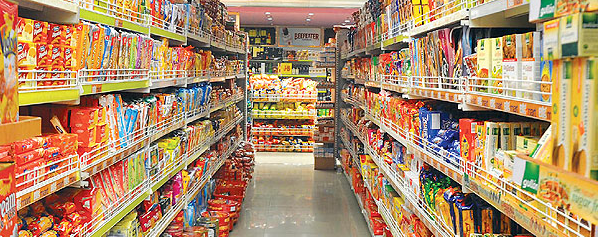

```{r setup, echo = FALSE, message = FALSE, warning = FALSE}
knitr::opts_chunk$set(comment = NA, 
                      fig.width = 6, 
                      fig.height = 6,
                      fig.align = 'center',
                      echo = FALSE, 
                      eval = FALSE, 
                      warning = FALSE)

options(digits = 3)

# Load packages
library(tidyverse)

# Load packages
#wein <- read_csv("_sessions/LinearModelsIII/1_Data/wein.csv")
#bigmart <- read_csv("_sessions/LinearModelsIII/1_Data/wein.csv")

```

<p align="center" width="100%">
  
  <br>
  <font style="font-size:10px">from <a href="http://seeksaurav.blogspot.com/2013/01/week-8.html">seeksaurav.blogspot.com</a></font>
</p>


# {.tabset}

## Überblick

Am Ende des Practicals wirst du wissen...

1. Wie du eine logistische Regression zur Analyse von binären Kriterien implementierst und interpretierst. 
2. Wie du eine Poisson Regression zur Analyse von Häufigkeiten implementierst und interpretierst.

## Aufgaben

### A - Setup

1. Öffne dein `TheRBootcamp` R project. Es sollte die Ordner `1_Data` und `2_Code` enthalten. Stelle sicher, dass du alle Datensätze, welche im `Datensätze` Tab aufgelisted sind, in deinem `1_Data` Ordner hast. 

2. Öffne ein neues R Skript. Schreibe deinen Namen, das Datum und "Lineare Modelle III Practical" als Kommentare an den Anfang des Skripts.

```{r, eval = FALSE, echo = TRUE}
## NAME
## DATUM
## Lineare Modelle III Practical
```

3. Speichere das neue Skript unter dem Namen `lineare_modelle_III_practical.R` im `2_Code` Ordner.

4. Lade die Pakete `tidyverse`.

```{r}
library(tidyverse)
```

5. Verwende die `read_csv()` Funktion um `wein.csv` und `bigmart.csv` einzulesen.

```{r, echo = T, eval = T, message = F}
# Lese Daten ein
wein <- read_csv(file = "1_Data/wein.csv")
bigmart <- read_csv(file = "1_Data/bigmart.csv")
```

3. Printe die Datensätze. 

4. Verwende `names(XX)`, `summary(XX)`, und `View()` um einen weiteren Überblick über die Daten zu bekommen.

5. Wiederum, führe den Code unten aus um sicherzustellen, dass alle `character` Variablen als Faktoren vorliegen, was den statistischen Modellen hilft kategoriale Variablen richtig zu interpretieren. 

```{r, echo = TRUE}
# Konvertiere alle character zu factor
wein <- wein %>% mutate_if(is.character, factor)
bigmart <- bigmart %>% mutate_if(is.character, factor)
```


### B - Logistische Regression: Wein redux

1. In diesem Abschnitt geht es darum die Analysen der vergangenen Abschnitte umzudrehen und zu untersuchen wie verschiedene Prädiktoren das Kriterium `Farbe` (Kriterium) vorhersagen. In anderen Worten, in welchen Geschtspunkten unterscheiden weisse von roten Weine voneinander. Verwende template um in einer Regression `Farbe` durch `Alkohol`, `Dichte`, und `Sulphate` vorherzusagen. Achtung: Es tritt ein Fehler auf. Siehe nächste Aufgabe.

```{r, eval = FALSE, echo = TRUE}
# Regression
wein_lm <- lm(formula = XX ~ XX + XX + XX, 
              data = wein)
```

2. Farbe ist natürlich eine kategoriale Variable. Wir können also nicht das standard lineare Modell verwenden, sondern müssen auf das generalisierte lineare Modell zurückgreifen. Verwende das Template unten um eine Regression mit `'binomial'` Link und Modell zu fitten, aka eine logistsiche Regression. Nenne das entstehende Objekt `wein_glm`.

```{r, eval = FALSE, echo = TRUE}
# Logistische Regression
wein_glm <- glm(formula = XX ~ XX + XX + XX, 
                data = XX,
                family = 'XX')
```

```{r}
# Logistische Regression
wein_glm <- glm(formula = Farbe ~ Alkohol + Dichte + Sulphate, 
               data = wein,
               family = 'binomial')
```

3. Printe `wein_glm`. Was verrät dir der Output? 

4. Zu allerst ist dir vielleicht aufgefallen, dass einige der Gewichte sehr gross sind. Vor allem der Intercept ist erstaunlich hoch, wenn man bedenkt dass Farbe eigentlich nur Werte zwischen 0 und 1 annehmen kann. Dies hat natürlich mit dem Link-Funktion zu tun. Das bedeutet, im generalisierten linearen Modell muss nun auch noch die Link-Funktion mitberücksichtigt werden.

5. Weiterhin ist die sicher aufgefallen, dass am Schluss des Outputs Ergebnisse angezeigt werden, die bei einem einfachen linearen Modell fehlen. Diese Werte haben etwas damit zu, dass nun mit Maximum Likelihood gefitted wird. Später mehr dazu. 

6. Lasse dir nun die `summary()` anzeigen. Der Output ist sehr ähnlich aufgebaut wie der von `lm()`. Lenke deine Aufmerksamkeit zunächst auf den Teil zu `Coefficients`. Welche Prädiktoren sind signifikant?

7. Alle Prädiktoren tragen signifikant zur Vorhersage der `Farbe` bei. Beachte, dass hier z-Werte anstatt t-Werte angegeben sind, was darauf zurückzuführen ist, dass hier ein anderes Datenmodell verwendet wird. Schaue dir nun den Schlussteil des Outputs an. Analog zur standard Regression stehen hier Informationen über den Gesamtfit des Modells. Zunächst einmal wird die `Null deviance` angegeben. Dies ist die Performanz des sogenannten Null-Modells, welches nur einen Intercept verwendet. Dieses Modell sagt für jeden Wein schlicht die relative Häufigkeit der häufigeren Kategorie voraus. D.h., im Datensatz ist der Anteil weisser `r mean(wein$Farbe == 'weiss')`. Entsprechend sagt ein solches Modell für jeden Wein voraus, dass eine Wahrscheinlichkeit von `r mean(wein$Farbe == 'weiss')`, dass der Wein weiss ist. Der folgende Code zeigt, wie du damit auf die `Null deviance` kommst. 

```{r, echo = TRUE}
# Wahrscheinlichkeit weiss für Null-Modell
wsk_weiss <- mean(wein$Farbe == 'weiss')

# Log likelihood Null-Modell
log_likelihood <- sum(log(wsk_weiss) * sum(wein$Farbe == 'weiss')) +
                  sum(log(1-wsk_weiss) * sum(wein$Farbe == 'rot'))

# Deviance Null-Modell
-2 * log_likelihood
```

8. Analog kannst du die Performanzwert für das `wein_glm` Modell bestimmen, nur musst du hier die eigentlichen vom Modell vorhergesagten Werte verwenden, die du mit `fitted()` extrahieren kannst.

```{r, echo = TRUE}
# Wahrscheinlichkeit weiss für wein_glm
wsk_weiss <- fitted(wein_glm)

# Log likelihood wein_glm
log_likelihood <- sum(log(wsk_weiss[wein$Farbe == 'weiss'])) + 
                  sum(log(1-wsk_weiss[wein$Farbe == 'rot']))

# Deviance wein_glm
-2 * log_likelihood
```

9. Die Deviance werte bzw. die log-Likelihoods lassen sich nur schwer absolut beurteilen. Das bedeutet auch, dass nicht ohne weiteres klar ist, ob `wein_glm` tatsächlich gut die `Farbe` erklärt. Bei standard Regression ist das leichter, da `R-squared` notwendigerweise zwischen `0` und `1` liegt. Um die Intepretation zu erleichtert, bietet R daher noch das Aikaike Informationskriterium (`AIC`), welches die Deviance in Vergleich zur Anzahl der Parameter setzt, d.h., `AIC <- Deviance + 2*k`, wobei `k` die Anzahl der Parameter (Regressionsgewichte ist). Wenn das `AIC` niedriger ist als die Null-Deviance, dann kann man klar davon ausgehen, dass das Modell (`wein_glm`) besser ist. Hier ist dies der Fall, was nicht überraschend ist, da die Prädiktoren jeweils sehr starke Effekte aufweisen.       

10. Dass starke Effekte vorliegen, lässt sich über sogenannte Odds Ratios (OR) darstellen. ORs sind eine übliche Effektstärke in der logistischen Regression, die sich leicht aus Regressionsgewichten ableiten lässt und zwar gilt `OR = exp(b)`, wobei `b` das Regressionsgewicht ist. Berechne die ORs für die drei im Modell enthaltenen Prädiktoren. Es ist i.d.R. einfacher mit positiven Gewichten zu arbeiten, solange man die Richtung in Erinnerung behält. 
 
```{r, echo = TRUE, eval  =FALSE}
# Odds ratios
exp(abs(XX))
exp(abs(XX))
exp(abs(XX))
```

```{r}
# Odds ratios
exp(abs(-0.95293))
exp(abs(-642.70591))
exp(abs(-7.81487))
```

11. Die ORs zeigen, dass die odds (`p / (1-p)`) dafür, dass ein Wein rot ist, um das `2.59` fache steigen, wenn man Alkohol um 1 Volumenprozent zunimmt, um das `1.33e+279` (fast unzählbar) fache, wenn Dichte um einen Wert von 1 steigt, und um das `2477` fache, wenn die Sulphatkonzentration um 1 steigt. Ziemlich extreme Werte oder? Könnte vielleicht wiederum mit der Skalierung zu tun haben. Rechne die logistische Regression erneut, diesmal mit skalierten Variablen.   
 
```{r, eval = FALSE, echo = TRUE}
# Skalierungsfunktion
skaliere = function(x) (x - mean(x))/sd(x)

# Logistische Regression mit Skalierung
wein_glm <- glm(formula = XX ~ XX + XX + XX, 
                data = XX %>% mutate_if(is.numeric, skaliere),
                family = 'XX')
```

```{r}
# Skalierungsfunktion
skaliere = function(x) (x - mean(x))/sd(x)

# Logistische Regression
wein_glm <- glm(formula = Farbe ~ Alkohol + Dichte + Sulphate, 
                data = wein %>% mutate_if(is.numeric, skaliere),
               family = 'binomial')
```
 
12. Nun berechne die ORs noch einmal mit den neuen Gewichten. Sind sie immer noch so extrem?

```{r, echo = TRUE, eval  =FALSE}
# Odds ratios
exp(abs(XX))
exp(abs(XX))
exp(abs(XX))
```

```{r}
# Odds ratios
exp(abs(-1.1366))
exp(abs(-1.9273))
exp(abs(-1.1629))
```

13. Die ORs sollten sich etwas beruhigt haben. Der Grund für die extreme OR für `Dichte` war, dass die Werte in `Dichte` nur zwischen `0.987` und `1.039`, was bedeutet, dass eine Veränderung von 1 eine Veränderung weit über den eigentlichen Wertebereich der Variablen hinausgeht. Wiederum, wenn es um den Vergleich der Gewichte geht und diese leicht interpretierbar werden sollen, erwäge zu standardisieren. 


### C - Poisson Regression: Bigmart

1. Nun 

```{r, echo = TRUE}
# Kodierungen der Farbe
wein <- wein %>% mutate(Farbe_dummy = ifelse(Farbe == 'rot', 0, 1),
                        Farbe_effekt = ifelse(Farbe == 'rot', -1, 1))
```

2. Rechne nun zwei Regression, jeweils eine mit einer der beiden Farbkodierungen als Prädiktor und speichere sie ab als `wein_dummy` und `wein_effekt`.   

```{r, eval = FALSE, echo = TRUE}
# Regression dummy
wein_dummy <- lm(formula = XX ~ XX, 
                 data = XX)

# Regression effekt
wein_effekt <- lm(formula = XX ~ XX, 
                  data = XX)
```

```{r}
# Regression dummy
wein_dummy <- lm(formula = Qualität ~ Farbe_dummy, 
                 data = wein)

# Regression effekt
wein_effekt <- lm(formula = Qualität ~ Farbe_effekt, 
                  data = wein)
```

3. Printe nun die beiden Objekte und vergleiche die Gewichte. Diejenigen der Dummy-Kodierung sollten dir bekannt vorkommen. Wie verhalten sich die Gewichte der Effektkodierung dagegen? Erkennst du den Zusammenhang?

4. Der Effekt der Farbe unter der Effektkodierung entspricht genau der Hälfte des Effekts unter der Dummykodierung und um dies auszugleichen hat sich der Intercept auch um genau den selben Wert verändert, nur in die andere Richtung. Verifiziert die Gewichte mit den einfachen Rechnungen im Code unten. 

```{r, echo = TRUE}
# Dummy-Kodierung
mean(rot) # intercept
mean(weiss) - mean(rot) # gewicht farbe

# EffekKodierung
(mean(rot) + mean(weiss))/2 # intercept
mean(weiss) - (mean(rot) + mean(weiss))/2 # gewicht farbe
```

5. Vergleiche nun die `summary()` der beiden Modelle. Was unterscheidet sich, und was nicht?

```{r}
# Regression dummy
summary(wein_dummy)

# Regression effekt
summary(wein_effekt)
```

6. Die Kodierung hat ausgenommen die Skalierung des Regressionsgewichts und des zugehörigen Standardfehlers für Farbe keinen Einfluss. t-Wert und signifikanz sind identisch. Einzig der Intercept ändert sich wesentlich, da er unter der Effektkodierung tatsächlich weiter von Null entfernt ist.

### C - Interaktionen

1. Der erste Abschnitt hat gezeigt, dass weisser Wein gegenüber Rotem bevorzugt wurde. Könnte dies daran liegen, dass nicht für andere Variablen kontrolliert wurde? Oder könnte es sein, dass dieser Unterschied nur unter bestimmten Bedingungen gilt, d.h., dass es Moderatoren für den Effekt der Farbe gibt? Rechne eine Regression die zusätzlich `Alkohol` mit aufnimmt und verknüpfe die Prädiktoren mit `*` sodass auch die Interaktion berücksichtigt wird.   

```{r, eval = FALSE, echo = TRUE}
# Regression mit Interaktion
wein_lm <- lm(formula = XX ~ XX * XX, 
              data = XX)
```

```{r}
# Regression mit Interaktion
wein_lm <- lm(formula = Qualität ~ Farbe * Alkohol, 
              data = wein)
```

2. Printe das Objekt und betrachte die Gewichte. Wie interpretierst du die einzelnen Werte?

3. Folgendermassen lassen sich die Gewichte inetrpretieren: Unter Berücksichtigung von Alkohol und der Interaktion, werden weisse Weine um `.7` besser bewertet. Unter Berücksichtigung der Farbe (d.h. für Farbe == 'rot') und der Interaktion, hat führt ein Anstieg von einem Volumenprozent zu einer Verbesserung der wahrgenommenen Qualität von `.36`. Unter Berücksichtigung von Farbe und Alkohol, führt die Interaktion, also das Produkt der beiden Prädiktoren zu einer Veränderung von `-.05`. Dies ist so zu interpretieren, dass der Effekt von Alkohol unter Weissweinen um genau diese Grösse kleiner ist. Dies bedeutet im Umkerhschluss dass der Effekt von Farbe unter hoch-alkoholischen Weinen kleiner ausfällt. Verwendet den Code unten um diese Ergebnisse zu visualisieren. Gelb bedeutet Weisswein, lila Rotwein.

```{r}
# Visualisierung
ggplot(data = wein, 
       aes(x = Alkohol, y = Qualität, col = Farbe, alpha = .01)) + 
  scale_color_manual(values = viridis::cividis(2)) + xlim(c(7, 14)) + 
  geom_jitter(width=2,height=1.5,size=.1) + theme_minimal() + theme(legend.position = 'none') +
  geom_smooth(data = wein %>% filter(Farbe == 'weiss'), method = 'lm') + 
  geom_smooth(data = wein %>% filter(Farbe == 'rot'), method = 'lm')

```

4. Lasse dir nun die `summary()` und inspiziere die t-Werte und Signifikanzen. Welche Prädiktoren sind signifikant?

5. Alle drei Prädiktoren sind signifikant. t-Wert und Signifikanz sind am extremsten für `Alkohol`, jedoch ist das Gewicht für `Alkohol` nur halb so gross. Wie ist dies zu erklären?  
6. Genau die Gewichte hängen auch von der Skalierung der Prädiktoren ab. Rechne nun die Regression noch einmal, aber diesmal mit skalierten Prädiktoren. Siehe Code unten.

```{r, eval = FALSE, echo = TRUE}
# Skalierungsfunktion
skaliere = function(x) (x - mean(x))/sd(x)

# Regression mit skalierten Prädiktoren
wein_lm <- lm(formula = XX ~ XX * XX, 
              data = XX %>% mutate_if(is.numeric, skaliere))
```

```{r}
# Regression mit skalierten Prädiktoren
wein_lm <- lm(formula = Qualität ~ Farbe * Alkohol, 
              data = wein %>% mutate_if(is.numeric, skaliere))
```

7. Printe zunächst einmal das Objekt und betrachtet die Gewichte. Alle Werte haben sich substantiell verändert. Insbesondere hat nun Alkohol das zweifach höhre Gewicht. Wie sind diese neuen Gewichte zu interpretieren, wenn du bedenkst, dass nach der Skalierung alle Variablen eine Standardabweichung = 1 haben? 

8. Nach Skalierung sind die Gewichte als Veränderungen in Standardabweichungen zu interpretieren. Z.B., eine Veränderung von einer Standardabweichungen in `Alkohol` führt demnach zu einer Veränderung von `.4928` Standardabweichungen in der Qualität. Am meisten hat sich der Intercept verändert. Wie interpretiert ihr diesen unter der Skalierung?     

9. Der Intercept ist der geschätzte Mittelwert des Kriteriums für den Fall in dem alle Prädiktoren Null sind. Ohne Skalierung ist dieser Fall schwer zu interpretieren, da Null nicht vorkommen muss in den Prädiktoren. Unter der Skalierung ändert sich dies aber, denn nun haben alle Prädiktoren, mit Ausnahme des Faktors `Farbe` einen Mittelwert von Null. Das heisst der Intercept spiegelt die Qualität für ein mittleres Level von Alkohol, rote Weine und keine Interaktion in Standardabweichungen wieder. Dies kannst du wiederum in per Visualisierung nachvollziehen. Benutze den Code unten und suche den Punkt auf der lila Linie für Alkohol = 0.    

```{r}
# Visualisierung
ggplot(data = wein %>% mutate_if(is.numeric, skaliere), 
       aes(x = Alkohol, y = Qualität, col = Farbe, alpha = .01)) + 
  scale_color_manual(values = viridis::cividis(2))  + 
  geom_jitter(width=2,height=1.5,size=.1) + theme_minimal() + theme(legend.position = 'none') +
  geom_smooth(data = wein %>% mutate_if(is.numeric, skaliere) %>% filter(Farbe == 'weiss'), method = 'lm') + 
  geom_smooth(data = wein %>% mutate_if(is.numeric, skaliere) %>% filter(Farbe == 'rot'), method = 'lm')

```

10. Schaue dir nun die `summary()` an. Was hat sich verändert bzgl. t-Werten, Signifikanzen, und Standardfehlern, und R-squared? 

11. Ein grosser und in diesem Fall der Einzige Einfluss besteht auf die Variable `Farbe`, welche als einzige nicht mit standardisiert wurde. Vor der standardisierung von `Alcohol` war Farbe beinahe perfekt mit der Interaktion korreliert, was zu einem extrem aufgeblasenen Standardfehler geführt hat. Die Standardisierung hat diese Korrelation jedoch stark reduziert, so dass der Standardfehler auf das Niveau der anderen Prädiktoren gefallen ist. In der Konklusion lohnt es sich beinahe immer die die Prädiktoren (oder auch das Kriterium) zu standardisieren, wenn ein Vergleich der Gewichte und Signifikanzen von Interesse ist. 


## Beispiele

```{r, eval = FALSE, echo = TRUE}
# Regression mit R

library(tidyverse)

# Model:
# Sagt der Hubraum (displ) die pro gallone 
# fahrbaren Meilen voraus?
hwy_mod <- glm(formula = hwy ~ displ,
               data = mpg)

# Ergebnisse 
summary(hwy_mod)
coef(hwy_mod)

# Gefittete Werte
hwy_fit <- fitted(hwy_mod)
hwy_fit

# Residuums 
hwy_resid <- residuals(hwy_mod)
hwy_resid


# R-squared value 

hwy_mod$r.squared

```


## Datensätze

|Datei | Zeile | Spalte |
|:----|:-----|:------|
|[wein.csv](https://raw.githubusercontent.com/therbootcamp/SmR_2020Mai/master/1_Data/wein.csv) | 6497 | 13 |

#### wein.csv

Der `wein.csv` Datensatz enthält aus den Jahren 2004 bis 2007 des Comissão De Viticultura Da Região Dos Vinhos Verdes, der Offiziellen Zertifizierungsagentur des Vinho Verde in Portugal. 

| Name | Beschreibung |
|:-------------|:-------------------------------------|
|Qualität | Qualitätsurteil über den Weins von 1-9 |
|Farbe| Rotr oder weisser Wien |
|Gelöste_Säure| Konzentration der im Wein gelösten Säuren |
|Freie_Säure| Konzenetration der verflüchtigbaren Säuren |
|Citronensäure| Citronensäurekonzentration im Wein |
|Restzucker| Zuckerkonzentration im Wein|
|Chloride| Chloridkonzentration im Wein|
|Freie_Schwefeldioxide| Konzenetration der verflüchtigbaren Schwefeldioxide |
|Gesamt_Schwefeldioxide| Konzenetration der Schwefeldioxide insgesamt |
|Dichte|Dichte des Weins|
|pH_Wert|pH-Wert des Weins. Je kleiner, desto sauerer. |
|Sulphate| Sulphatkontration im Wein |
|Alkohol| Alkoholkonzentration im Wein in %|

|Verkäufe||
|Gewicht||
|Fettgehalt||
|Visibilität||
|Typ||
|Max_Preis||
|Ladengrösse||


## Funktionen

### Pakete

|Package| Installation|
|:------|:------|
|`tidyverse`|`install.packages("tidyverse")`|

### Funktionen

| Function| Package | Description |
|:---|:------|:---------------------------------------------|
|   `glm`|`stats`| Fit a generalized linear model  | 
|   `fitted`|`stats`| Show fitted values from a statistical object| 
|   `residuals`|`stats`| Show residuals (fitted minus true) values from a statistical object| 

## Resourcen

### Books

https://cran.r-project.org/web/packages/pscl/vignettes/countreg.pdf

- [Discovering Statistics with R](https://www.amazon.com/Discovering-Statistics-Using-Andy-Field/dp/1446200469) von Andy Field is excellent
- [YaRrr! The Pirate's Guide to R](https://bookdown.org/ndphillips/YaRrr/) hat hilfreiche und unterhaltsame Kapitel zu Statistik mit R.
