layout: true

<div class="my-footer">
  <span style="text-align:center">
    <span> 
      
    </span>
    <a href="https://therbootcamp.github.io/">
      <span style="padding-left:82px"> 
        <font color="#7E7E7E">
          www.therbootcamp.com
        </font>
      </span>
    </a>
    <a href="https://therbootcamp.github.io/">
      <font color="#7E7E7E">
       Statistics with R | April 2019
      </font>
    </a>
    </span>
  </div> 

---

```{r, eval = TRUE, echo = FALSE, warning=F,message=F}
# Code to knit slides

```

```{r setup, include=FALSE}
options(htmltools.dir.version = FALSE)
# see: https://github.com/yihui/xaringan
# install.packages("xaringan")
# see: 
# https://github.com/yihui/xaringan/wiki
# https://github.com/gnab/remark/wiki/Markdown
options(width = 110)
options(digits = 4)

# Load packages
library(tidyverse)
library(lme4)
tomato_df <- read_csv("1_Data/Tomatometer_dat.csv")
df <- read_csv("1_Data/MEM_example.csv")
grand_mean <- mean(df$tomatometer)

baselers <- read_csv("https://raw.githubusercontent.com/therbootcamp/baselers/master/inst/extdata/baselers.txt")
baselers <- baselers %>% 
  filter(!is.na(income),!is.na(age),!is.na(height)) %>%
  slice(sample(1:nrow(baselers),1000)) %>% 
  mutate(sex01 = as.numeric(sex == 'male'))
source("https://raw.githubusercontent.com/therbootcamp/therbootcamp.github.io/master/_materials/code/baselrbootcamp_palettes.R")
set.seed(102)
x <- rnorm(10)
y <- .7 * x + rnorm(10, sd = .3) + 2
data <- data.frame(x, y)
mod <- lm(y ~ x, data = data)

great_intercept <- mod$coefficients[1]
great_slope <- mod$coefficients[2]
dat_great <- data.frame(x0 = x, x1 = x,
                        y0 = y, y1 = great_intercept + great_slope * x)
great_raw <- ggplot(dat_great, aes(x = x0, y = y0)) + geom_point(col = baselrbootcamp_cols("grey"), size = 2) +
  geom_abline(slope = great_slope, intercept = great_intercept, size = .5, linetype = 3) +
  theme_minimal() + xlim(c(-2, 3)) + ylim(c(0, 5)) +
  labs(subtitle = paste("Or this?"), x = "Predictor", y = "Criterion")
great_err <- great_raw + 
  geom_linerange(data = dat_great, aes(x = x0, ymin = y0, ymax = y1), col = baselrbootcamp_cols("magenta")) +
  geom_point(data = dat_great, aes(x = x0, y = y1, size = 2), col = baselrbootcamp_cols("green"), pch = "X", size = 4) +
  labs(subtitle = paste("Mean Squared Error (MSE) = ", round(mean((dat_great$y1 - dat_great$y0) ^ 2), 2)),
       x = "Predictor", y = "Criterion")


```

# Data Collection Example

<br>

.pull-left45[

<p align = "center">
<br>
</p>

]

.pull-right45[

<p align = "center">
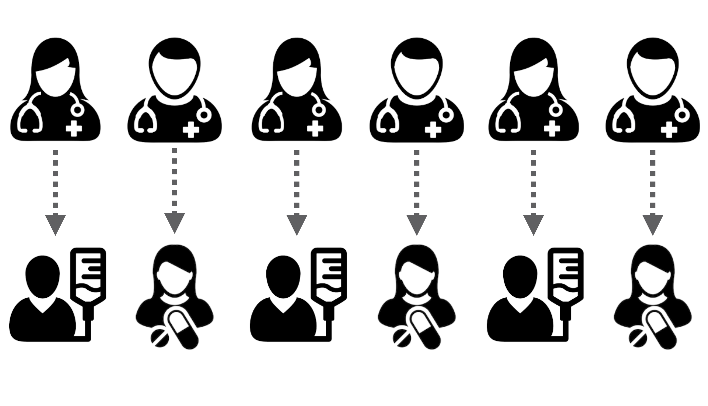<br>
</p>

]

---


# [IID](https://en.wikipedia.org/wiki/Independent_and_identically_distributed_random_variables) Assumption

.pull-left45[
Previous regression models assumed that the data points are independent and identically distributed (<high>iid</high>).

* <high>Independent</high>: The occurrence of one value does not affect the occurrence of another value.
* <high>Identically distributed</high>: All data points stem from the same probability distribution.


Previously considered models are <high>not robust</high> to violations of the independence assumption.


]

.pull-right45[

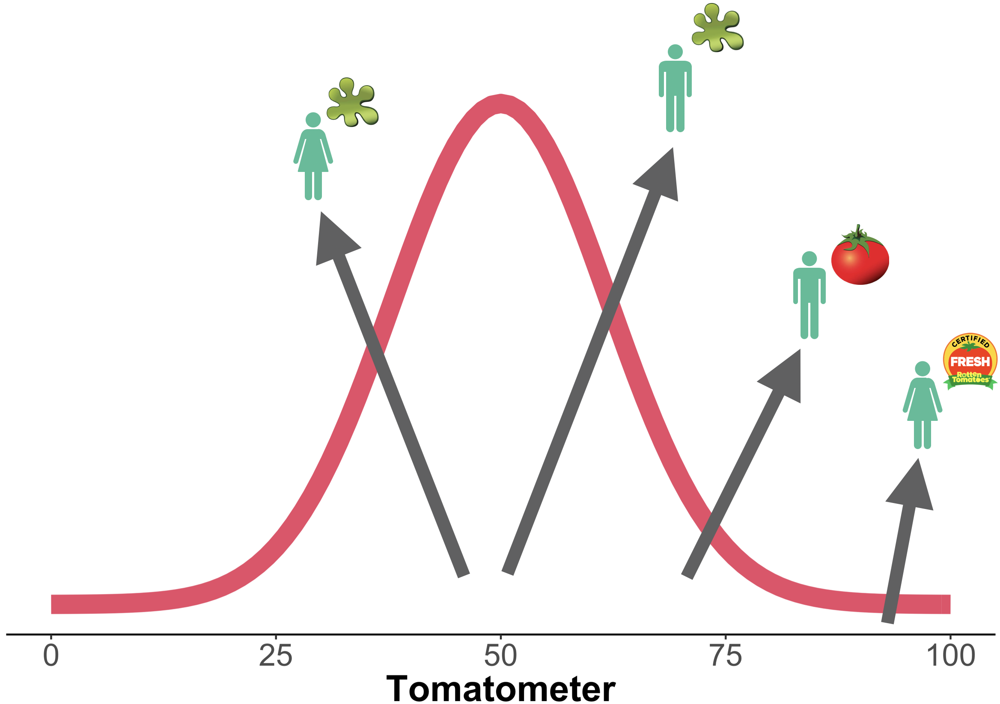


]

---

# Examples of Data Where the IID Assumption Is Violated


.pull-left55[

<br>

- Test of student performance in the PISA study (<high>students within classes within schools within countries</high>).
- Test of a drug in a clinical trial over multiple sites (<high>patients within doctors within sites</high>).
- Test of the best design or taste of different versions of a product with <high>multiple ratings from the same persons</high>.


*Failure to run the statistical model might lead to missleading results, such as overestimation of an effect.*


]

.pull-right35[


<p align = "center">
<br>
<font style="font-size:10px">from <a href="https://de.wikipedia.org/wiki/PISA-Studien">wikipedia.org</a></font>
</p>

<p align = "center">
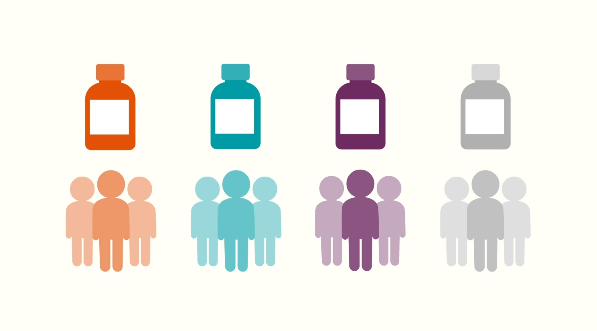<br>
<font style="font-size:10px">from <a href="https://www.mssociety.org.uk/research/latest-research/latest-research-news-and-blogs/first-multi-drug-clinical-trial-in-ms-successfully-completed">mssociety.org.uk</a></font>
</p>

<p align = "center">
<br>
<font style="font-size:10px">from <a href="https://londonist.com/london/free-and-cheap/this-5-metre-high-pick-n-mix-wall-has-half-a-tonne-of-free-sweets">londonist.com</a></font>
</p>


]

---

# Example Data

.pull-left45[

In this introduction we will work with the following data:

You are a researcher and want to gauge whether alcohol influences movie ratings on [Rotten Tomatoes](https://www.rottentomatoes.com/).

You let two subjects rate two movies once when they are sober and once when they've had 4 beers (we'll call this drunk; more alcohol would count as binge drinking and you don't get ethics approval for that.)

* Repeated measures (i.e., within subjects design)
* The same two movies at all time points for both participants


]

.pull-right45[


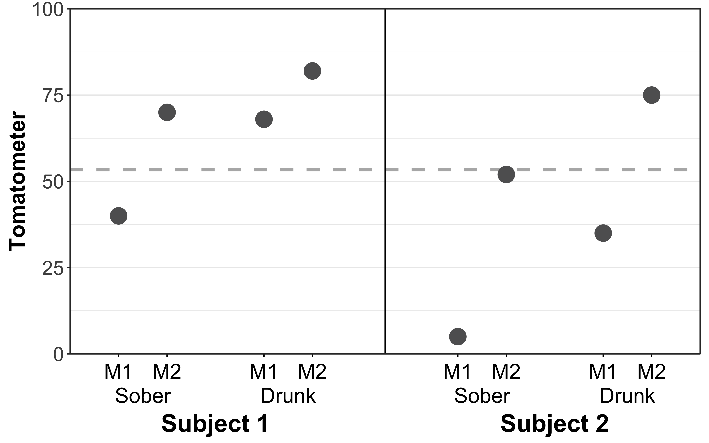


]

---

# Example Data

.pull-left45[

Because we have repeated measures, the independence assumption is violated. Several possibilities exist:

<br>

* Run separate regression models so only independent data points are used (<high>no pooling</high>)
* Average repeated measures and run a fixed effects model
* Treat observations as separate and just run a simple regression (<high>complete pooling</high>)
* Use mixed effects model (<high>partial pooling</high>)
we need to control for this and can do so by using mixed effects models
fixed and random effects


]

.pull-right45[


]


---

# Mixed Effects

.pull-left45[


Mixed effects models combine two kinds of effects that serve different purposes:


* <high>Fixed effects</high>
* <high>Random effects</high>


```{r eval = FALSE}
### Structure of a mixed effects model:

            # Fixed effects part
LMM <- lmer(y ~ FE1 + FE2 +
            # Random effects part
              (FE1|RE) + (FE2|RE),
            # Data
            data = df)
```


]

.pull-right45[


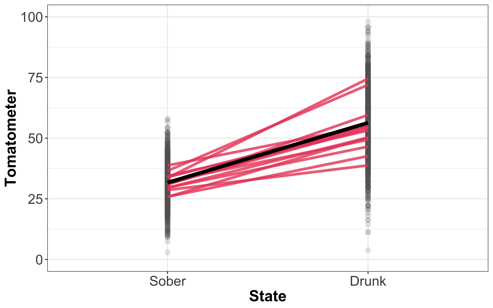


]

---

# Fixed Effects

.pull-left45[

Fixed effects represent the overall effect (main effect or interaction) of a predictor. For example the effect of a treatment.

So far we only considered "fixed effects only" models (e.g., simple regression, t-tests, ANOVA).

```{r eval = FALSE}

# continuous predictor
FE_cont <- lm(income ~ age,
              data = baselers)

# discrete predictor
FE_disc <- lm(income ~ sex,
              data = baselers)

```


]

.pull-right45[


<p align="center">
```{r, echo = FALSE, fig.width = 4.2, fig.height = 2.7, dpi = 400, out.width = "100%"}
great_err
```
</p>

]

---

# Random Effects

.pull-left45[
With random effects, we can account for random variability in the data that comes from different sources. We are usually not interested in the concrete instantiation of a particular level.

Random effects:

* are often part of what we want to generalize over
* are always categorical variables (<high>factors</high>)
* are thought to be randomly drawn from the population 

As expressed by [Singmann and Kellen](http://davidkellen.org/wp-content/uploads/2017/04/introduction-mixed-models.pdf):

> By specifying random effects in our model, we are able to factor out the idiosyncasies of our sample and obtain a more general estimate of the fixed effects of interest.


]

.pull-right45[


]

---

# Fixed Effects Only Model - Equations

<br><br><br>
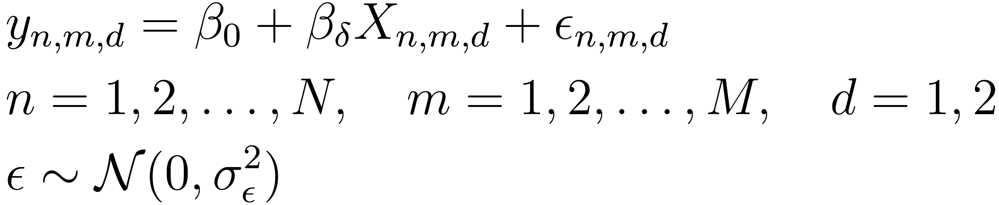


---

# Fixed Effects Only Model - Data Example


---

# Random Intercepts Model - Equations

<br><br><br>
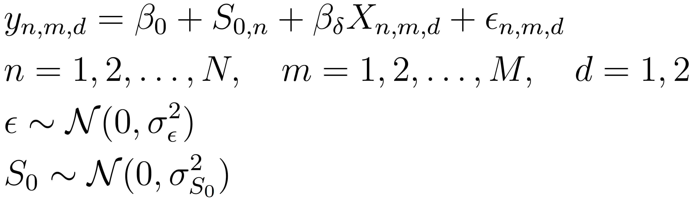


---

# Random Intercepts Model - Data Example

.pull-left45[


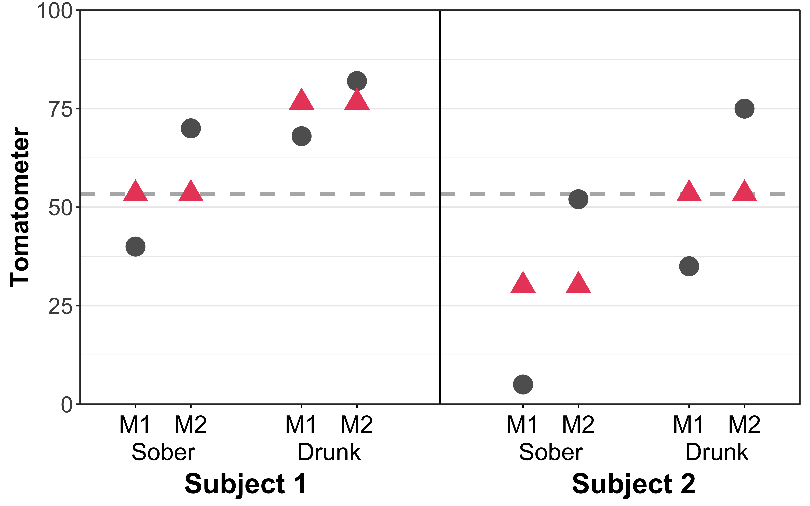
<p align = "center">
<figcaption align = "center" style="display: block; margin: auto;">By-Subject Random Intercepts</figcaption>
</p>


]

.pull-right45[


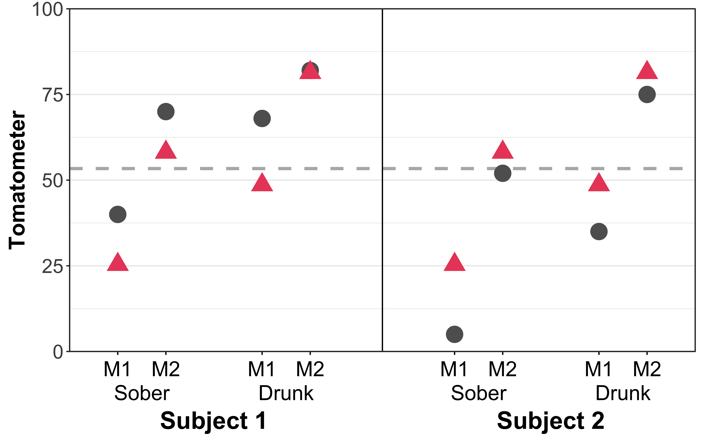
<p align = "center">
<figcaption align = "center" style="display: block; margin: auto;">By-Movie Random Intercepts</figcaption>
</p>

]


---

# Random Intercepts and Slopes Model - Equations

<br><br><br>
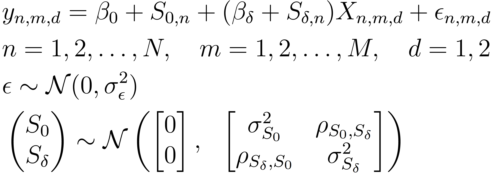


---

# Random Intercepts and Slopes Model - Data Example

.pull-left45[


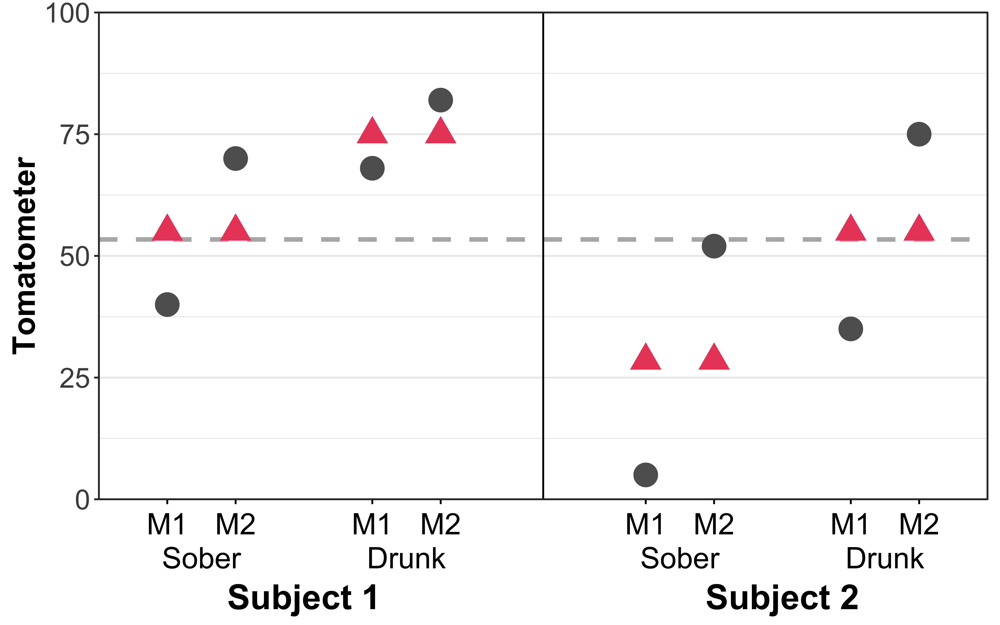
<p align = "center">
<figcaption align = "center" style="display: block; margin: auto;">By-Subject Random Intercepts and Slopes</figcaption>
</p>


]

.pull-right45[


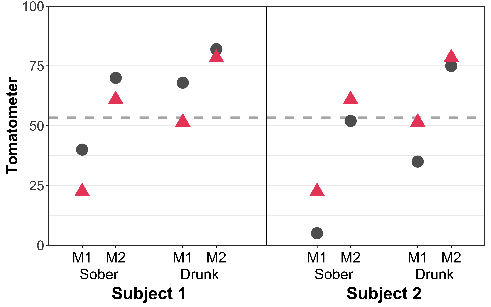
<p align = "center">
<figcaption align = "center" style="display: block; margin: auto;">By-Movie Random Intercepts and Slopes</figcaption>
</p>


]


---

# Crossed Random Effects Model - Equations

<br><br><br>
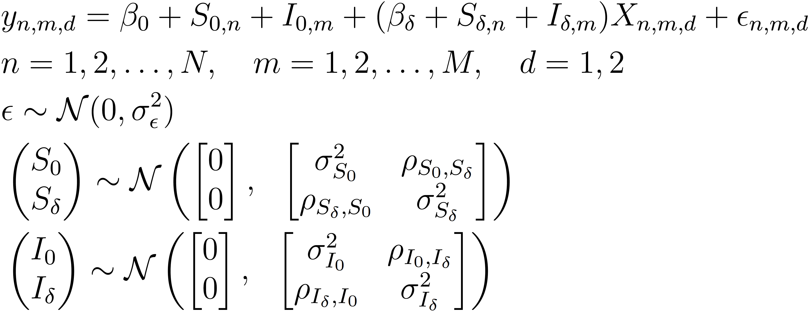


---

# Crossed Random Effects Model - Data Example

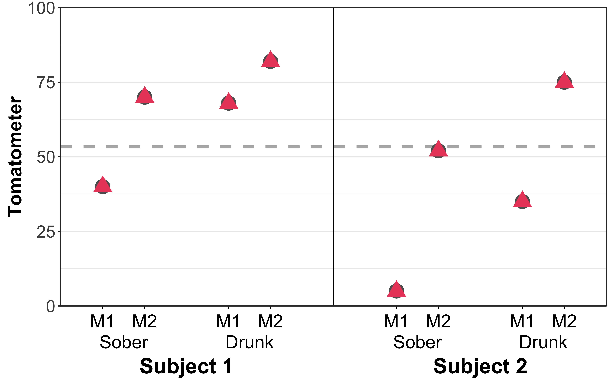


---

# Crossed vs. Nested Random Effects
<br>
.pull-left35[
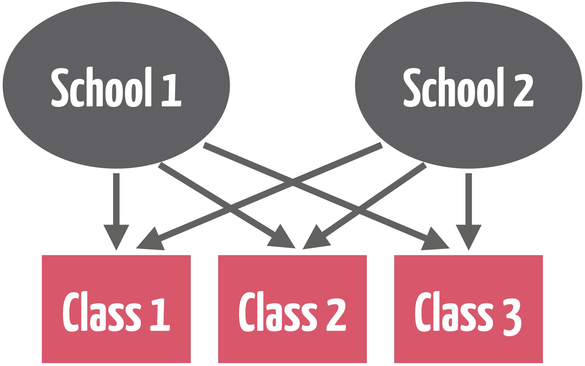
<p align = "center">
<figcaption align = "center" style="display: block; margin: auto;">Crossed Random Effects</figcaption>
</p>

<br><br>

Crossed random effects are all multiple random effects structures that are not nested.

]

.pull-right55[

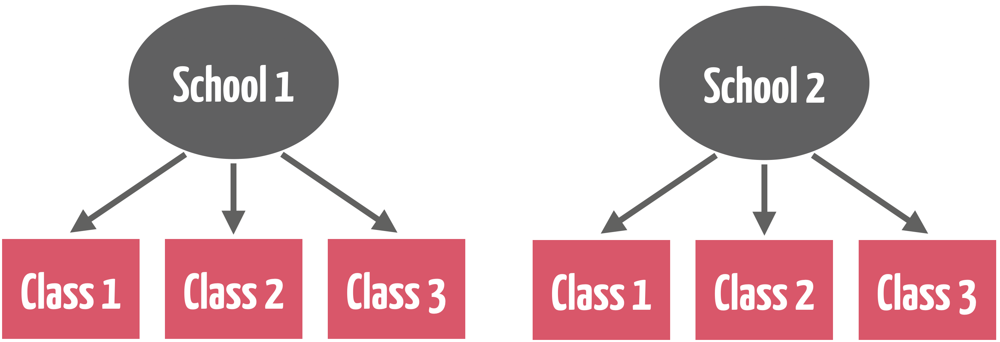
<p align = "center">
<figcaption align = "center" style="display: block; margin: auto;">Nested Random Effects</figcaption>
</p>

<br><br>

Every level of the nested factor only appears within a single level of the higher order factor.

]

---

# More on Random Effects

.pull-left45[

* <high>Hierarchical shrinkage</high>: Individual parameter estimates that are on the extremes of the distribution are adjusted (shrinked) towards the mean. Because of this, predicted cell means need not necessarily coincide with the observed cell means.

* Intra-Class Correlation <high>ICC</high>: The ICC is the proportion of variance explained by a grouping factor (random effect).


* Random effects parameters are harder to estimate numerically. Thus, mixed effects model much more frequently exhibit the problem of <high>non-convergence</high> than fixed effects only models.

]

.pull-right45[

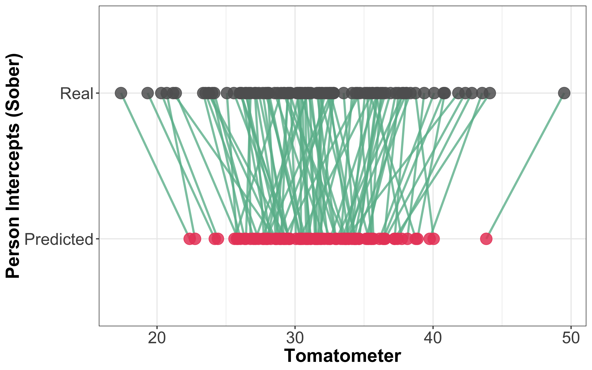
<p align = "center">
<figcaption align = "center" style="display: block; margin: auto;">Example of Hierarchical Shrinkage</figcaption>
</p>

]
---

# Keep It Maximal

.pull-left45[

Specifying the correct random effects structure is important. Failure to do so can result in inflated Type I errors.

Therefore, it has been argued that one should specify the <high>maximal random effects structure justified by the design</high> (maximal model; [Barr et al., 2014](https://www.ncbi.nlm.nih.gov/pmc/articles/PMC3881361/pdf/nihms533954.pdf)).

Note that this often leads to convergence problems and the random effects structure then has to be adapted.

But there is also criticism to this approach ([Matuschek, Kliegl, Vasishth. Baayen, & Bates](https://www.sciencedirect.com/science/article/pii/S0749596X17300013); but more on this in the practical).

]

.pull-right45[

<p align = "center">
<br>
<font style="font-size:10px">from <a href="https://www.vorsorge-3a.ch/vorsorge-saeule-3a/einzahlung-maximal-betrag-beitrag-steuerabzug.html">vorsoge-3a.ch</a></font>
</p>


]


---

# Keep It Maximal

.pull-left45[

Specifying the maximal model in our example:

* By-subject random effects: Random intercepts and slopes, with correlations, for all within-subject factors (<high>state</high> in our case).

* By-item random effects: Ignore the participant effect. Then the random effects structure of the item effect is the combination of all factors varying within items (again <high>state</high> in our case).

]

.pull-right45[

<p align = "center">
<br>
<font style="font-size:10px">from <a href="https://www.simpleusability.com/inspiration/2018/07/when-and-how-you-should-reuse-research-participants/">simpleusability.com</a></font>
</p>

<p align = "center">
<br>
<font style="font-size:10px">from <a href="https://www.bachelorprint.de/fragebogen-erstellen/">bachelorprint.de</a></font>
</p>


]

---

# Fitting Mixed Effects Models in R

.pull-left45[

Several packages exist to run mixed effects models in R. Here are some of them:

<br>

| Package| Function|
|:------|:----|
| [lme4](https://CRAN.R-project.org/package=lme4)| `glmer()` / `lmer()`|
| [afex](https://CRAN.R-project.org/package=afex)| `mixed()`|
| [rstanarm](https://CRAN.R-project.org/package=rstanarm)| `stan_glmer()` / `stan_lmer()` |


]

.pull-right45[

<br>

```{r eval = FALSE}
# mixed model using lme4::lmer()

# fixed effects
LMM_out <- lmer(Tomatometer ~ State +
# by-ID random slopes and intercepts
                  (State|ID) +
# by-ID random slopes and intercepts
                  (State|Movie),
# define data
                data = tomato_df)

# show output
summary(LMM_out)
```


]

---

# Specifying Random Effects in <high>lme4</high>


Random effects are specified with a new element to the formulas:


| Formula | Meaning |
|:----------|:-------------------|
| `(1 `&#124;` S)` | Random intercepts by `S` |
| `(1 `&#124;` S) + (1 `&#124;` I)` | Random intercepts by `S` and `I`|
| `(X1 `&#124;` S)` OR `(1 + X1`&#124;` S)`| Random intercepts by `S` and random slopes for `X1` by `S` with correlations  |
| `(X1 * X2 `&#124;` S)`| Random intercepts by `S` and random slopes for `X1`, `X2`, and their interaction `X1:X2` by `S` with correlations  |
| `(0 + X1 `&#124;` S)`| Random slopes for `X1`by `S`, no random intercepts |
| `(X1 `&#124;&#124;` S)`| Random intercepts by `S` and random slopes for `X1` by `S` no correlations |
| `(1 `&#124;` S/C)` OR `(1 `&#124;` S) + (1 `&#124;` S:C)`| Random intercepts by `S` and `C` with `C` nested under `S` |

---

# `lmer()` Output


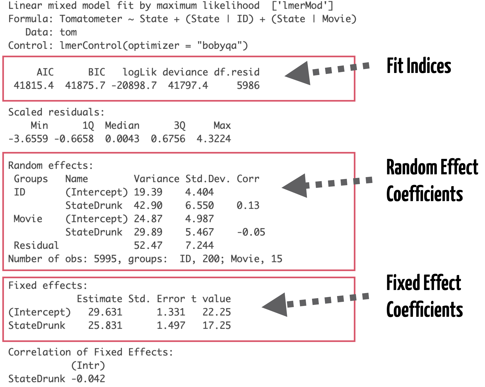

---

# Generalized Mixed Effects Models

<br>

.pull-left55[

In our example we used a <high>linear mixed effects model</high> fitted with `lmer()`. This model assumes a <high>Gaussian</high> (normal) distribution of responses, and an <high>identity</high> link function. But other scenarios are possible. For these we use `glmer()`.

For example, if we had binary data to predict:

```{r eval=FALSE}
# example of a mixed model with binomial
# distribution of the responses and a logit
# link function
glmm_out <- glmer(fasnacht ~ alcohol + (alcohol|id),
                  data = baselers,
                  family = binomial(link = "logit"))

```


]

.pull-right45[

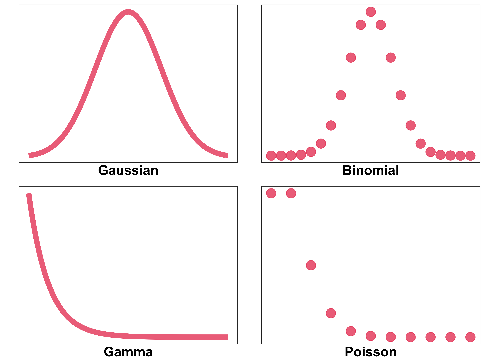

]

---

# Summary

*What are mixed effects models and when do we use them?*

- Mixed effects models are <high>regression models</high> that contain <high>both fixed and random effects</high>.
- They are used when we have <high>repeated measures</high> or <high>clusters</high> in the data, both of which could lead to violation of the IID assumption.

*Examples of when to apply them:*

- Comparison of students <high>across schools and classes</high>.
- Evaluating the effectiveness of a new drug in a clinical trial where <high>multiple sites are involved</high>.
- In political science studies to take into account the effect of <high>different countries or regions</high>.

*When do we add a variable as fixed effect and when as random effect?*

- We add a variable as fixed effect when we are interested in the <high>effects of the specific levels</high> in that variable.
- We add a variable as random effect when we want to <high>generalize over the levels to the population</high> these levels came from.


---

class: middle, center

<h1><a href="https://therbootcamp.github.io/SwR_2019Apr/_sessions/MixedModels/MixedModels_practical.html">Practical</a></h1>

