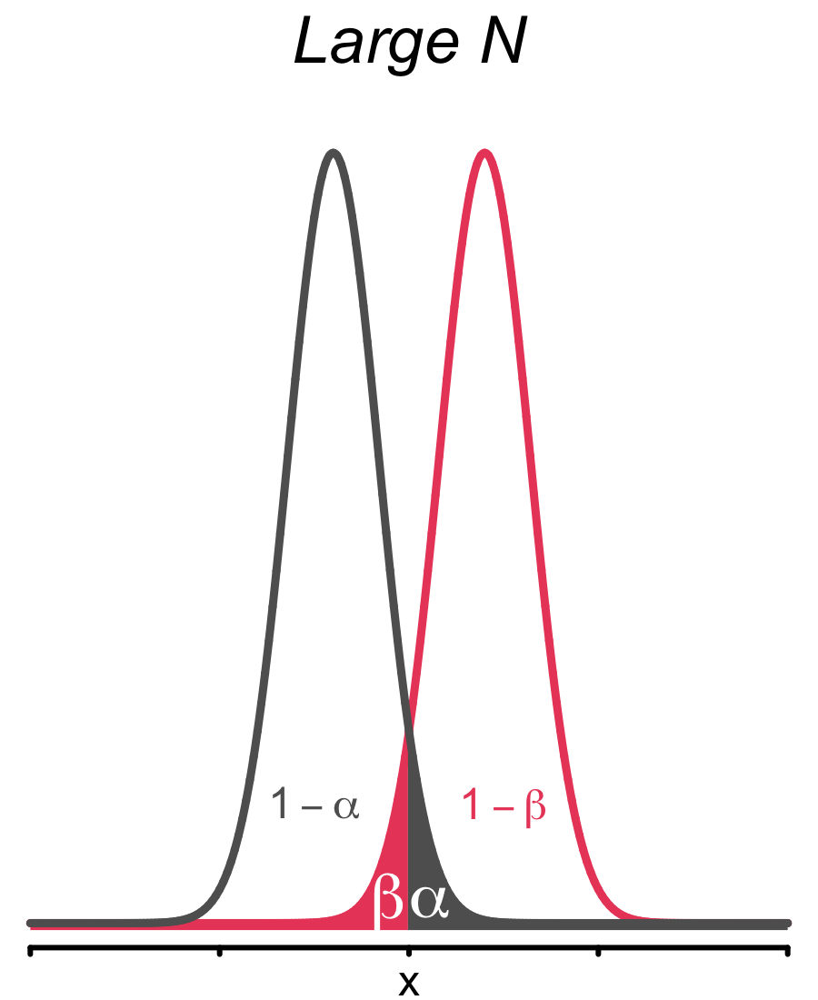

layout: true

<div class="my-footer">
  <span style="text-align:center">
    <span> 
      
    </span>
    <a href="https://therbootcamp.github.io/">
      <span style="padding-left:82px"> 
        <font color="#7E7E7E">
          www.therbootcamp.com
        </font>
      </span>
    </a>
    <a href="https://therbootcamp.github.io/">
      <font color="#7E7E7E">
       Statistics with R | April 2019
      </font>
    </a>
    </span>
  </div> 

---

```{r, eval = TRUE, echo = FALSE, warning=F,message=F}
# Code to knit slides

```

```{r setup, include=FALSE}
options(htmltools.dir.version = FALSE)
# see: https://github.com/yihui/xaringan
# install.packages("xaringan")
# see: 
# https://github.com/yihui/xaringan/wiki
# https://github.com/gnab/remark/wiki/Markdown
options(width = 110)
options(digits = 4)

# Load packages
require(tidyverse)
require(pwr)

# Load data
baselers <- readr::read_csv("1_Data/baselers.csv")

```

.pull-left45[

# New Statistics

<font style="font-size:20px">Recentering on values and ideas of the past.</font><br><br>

<font style="font-size:28px"><high>Better studies</high></font><br><br>

<font style="font-size:20px">&nbsp;&nbsp;&nbsp;&nbsp;Informative designs</font><br>
<font style="font-size:20px">&nbsp;&nbsp;&nbsp;&nbsp;Sample size planning</font><br>
<font style="font-size:20px">&nbsp;&nbsp;&nbsp;&nbsp;Registrations</font><br>
<font style="font-size:20px">&nbsp;&nbsp;&nbsp;&nbsp;No p-hacking</font><br>
<font style="font-size:20px">&nbsp;&nbsp;&nbsp;&nbsp;Full reporting</font><br>
<font style="font-size:20px">&nbsp;&nbsp;&nbsp;&nbsp;Replication</font><br>

<br><font style="font-size:28px"><high>Betters statistics</high></font><br><br>

<font style="font-size:20px">&nbsp;&nbsp;&nbsp;&nbsp;Reporting uncertainty</font><br>
<font style="font-size:20px">&nbsp;&nbsp;&nbsp;&nbsp;Bayesian statistics</font><br>

</font>

]

.pull-right45[

<br><br>
<p align = "center">
<br>
<font style="font-size:10px">from <a href="https://www.amazon.com/Blast-Past-Brendan-Fraser/dp/0780626494">amazon.com</a></font>
</p>

]

---

# Replication crises

.pull-left4[

There are various <high>replication crises rumbling</high> in diverse academic fields.

Large-scale replication attempt in [Psychology]() found that <high>only 36% weare replicable</high>.

The low replicability is the result of <high>Questionable Research Practices</high>. 

<br><br><br><br>
Similar assessments in [**Medicine**](https://therbootcamp.github.io/SwR_2019Apr/_sessions/NewStats/literature/Ioannidis2005.pdf), [**Economics**](https://therbootcamp.github.io/SwR_2019Apr/_sessions/NewStats/literature/Camerer2016.pdf), [**Marketing**](https://therbootcamp.github.io/SwR_2019Apr/_sessions/NewStats/literature/Hunter2001.pdf), [**Social sciences**](https://therbootcamp.github.io/SwR_2019Apr/_sessions/NewStats/literature/Camerer2018.pdf). 

]


.pull-right5[

<p align = "center">
<br>
<font style="font-size:10px">from <a href="https://ink.library.smu.edu.sg/cgi/viewcontent.cgi?article=6256&context=lkcsb_research">Open Science Collaboration</a></font>
</p>

]


---

# Hallmarks of good studies


.pull-left45[
<br2>
<font style="font-size:20px"> 1 Informative designs </font><br>
<font style="font-size:16px"><i> Conduct the best possible test of your hypothesis? </i></font><br><br>

<font style="font-size:20px"> 2 <high>Sample size planning</high> </font><br>
<font style="font-size:16px"><i> Determine how many observation you need for clear-cut conclusions? </i></font><br><br>

<font style="font-size:20px"> 3 Registrations </font><br>
<font style="font-size:16px"><i> Register your hypotheses before data collection. </i></font><br><br>

<font style="font-size:20px"> 4 <high>No p-hacking</high> </font><br>
<font style="font-size:16px"><i> Conduct only planned tests or report as exploratory. </i></font><br><br>

<font style="font-size:20px"> 5 Full reporting </font><br>
<font style="font-size:16px"><i> Report everything you did. </i></font><br><br>

<font style="font-size:20px"> 6 Replication </font><br>
<font style="font-size:16px"><i> Replicate your findings. </i></font><br><br>

</font>
]

.pull-right45[

<p align = "center">
<br>
<font style="font-size:10px">adapted from <a href="http://neuroskeptic
.blogspot.com/2010/11/9-circles-of-scientific-hell.html">neurosceptic.blogpost.com</a>, see <a href="http://pages.ucsd.edu/~cmckenzie/Neuroskeptic2012Perspectives.pdf">article</a> <a></font>
</p>

]

---

# Sample size planning

.pull-left45[

Sample size should be planned such that there is <high>sufficient power to detect an effect</high>, if it is present.

Increasing sample size means <high>narrower sampling distributions</high> and <high>smaller decision errors</high>.  


<p align = "center">
<br>
</p>

]


.pull-right5[

<p align = "center">
<br>
</p>

]

---

# Sample size planning

.pull-left45[

Sample size should be planned such that there is <high>sufficient power to detect an effect</high>, if it is present.

Increasing sample size means <high>narrower sampling distributions</high> and <high>smaller decision errors</high>.  

<p align = "center">
<br>
</p>

]

.pull-right5[

<p align = "center">
<br>
</p>

]

---

# Sample size planning in R

.pull-left45[

Sample size should be planned such that there is <high>sufficient power to detect an effect</high>, if it is present.

Increasing sample size means <high>narrower sampling distributions</high> and <high>smaller decision errors</high>.  

<p align = "center">
<br>
</p>

]

.pull-right5[

```{r}
# N for large effect in t-test
pwr.t.test(sig.level = .05, 
           power = .95, 
           d = .8) # large effect

```

]
---

# Sample size planning in R

.pull-left45[

Sample size should be planned such that there is <high>sufficient power to detect an effect</high>, if it is present.

Increasing sample size means <high>narrower sampling distributions</high> and <high>smaller decision errors</high>.  

<p align = "center">
<br>
</p>

]

.pull-right5[

```{r}
# N for small effect in t-test
pwr.t.test(sig.level = .05, 
           power = .95, 
           d = .2) # small effect

```

]

---

.pull-left2[

# p-hacking

<high><i>“If you torture the data long enough, it will confess.”</i></high>

Ronald Coase

<br><br><br><br><br><br><br><br><br><br><br><br>

<p align="right"><font style="font-size:10px">from <a href="https://fivethirtyeight.com/features/science-isnt-broken/#part1">fivethirtyeight.com</a></font>
</p>


]


.pull-right75[
<br>
<iframe src="https://projects.fivethirtyeight.com/p-hacking/index.html?initialWidth=1024&amp;childId=phacking&amp;parentTitle=Science%20Isn%E2%80%99t%20Broken%20%7C%20FiveThirtyEight&amp;parentUrl=https%3A%2F%2Ffivethirtyeight.com%2Ffeatures%2Fscience-isnt-broken%2F" width="100%" scrolling="yes" marginheight="0" frameborder="0" height="550px"></iframe>

]

---

# p-hacking: Dos and Don'ts


.pull-left5[

<p align="center">

  

  <h style="font-size:60px;position:absolute;bottom:390px;left:168px;color:white">Exploration</h><br>
  <font style="font-size:10px">Columbus looking for India, from <a href="https://www.history.com/topics/exploration">history.com</a></font>
  <br><br>
  
  <font style="font-size:28px"><i>Do</i></font><br><br2>
  
  Everything.<br><bt>

  <br><br><br><br><font style="font-size:28px"><i>Don't</i></font><br><br2>
  
  Present your result as confirmatory.<br><br>
  
  </font>

</p>

]


.pull-right5[

<p align="center">

  

  <h style="font-size:60px;position:absolute;bottom:390px;left:675px;color:white">Confirmation</h><br>
  <font style="font-size:10px">Villemard vision for 2000, from <a href="https://www.sadanduseless.com/world-in-2000/">sadanduseless.com</a></font>
  <br><br>

  <font style="font-size:28px"><i>Do</i></font><br><br2>
  
  Make predictions.<br>
  Predetermine sample size.<br>
  Predetermine analysis plan.<br>
  Register.<br>

  <br><font style="font-size:28px"><i>Don't</i></font><br><br2>
  
  Engage in non-planned analyses.<br><br>
  
  </font>

</p>

</p>

]

---

# Better statistics

Report uncertainty (Confidence intervals)

Use Bayesian statistics


---

class: middle, center

<h1><a href="https://therbootcamp.github.io/SwR_2019Apr/_sessions/RegressionI/RegressionI_practical.html">Practical</a></h1>

