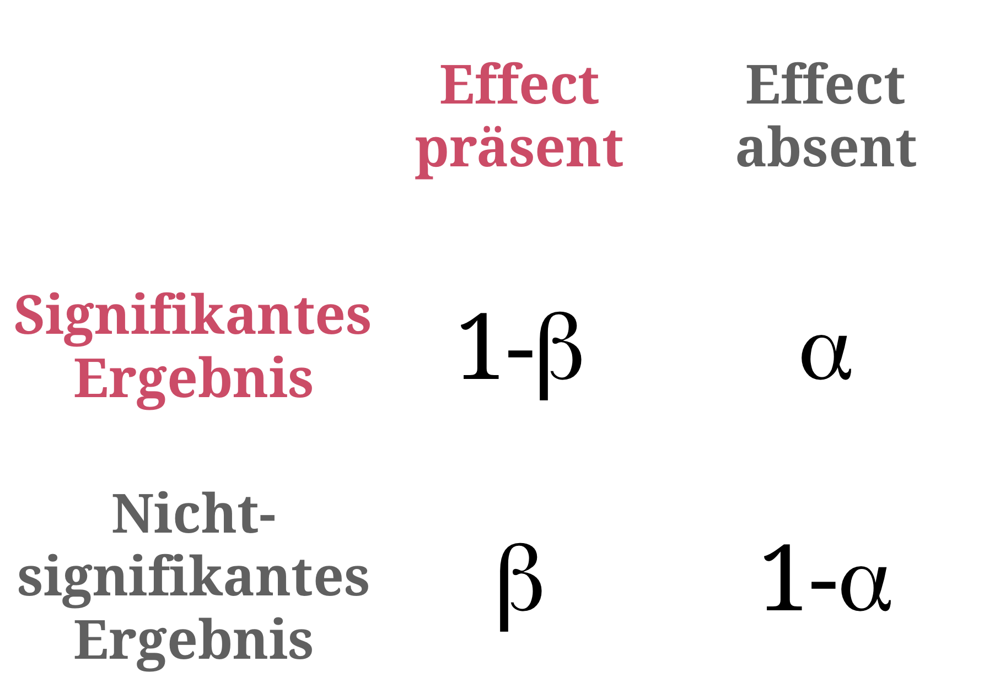

```{r, eval = TRUE, echo = FALSE, warning=F,message=F}
# Code to knit slides

```

```{r setup, include=FALSE}
options(htmltools.dir.version = FALSE)
options(width = 110)
options(digits = 4)

# Load packages
require(tidyverse)
require(boot)

print2 <- function(x, nlines=10,...) {
   cat(head(capture.output(print(x,...)), nlines), sep="\n")}

# Load data
baselers <- readr::read_csv("1_Data/baselers.csv")

# get color palette functions
source("../../_materials/palette/therbootcamp_palettes.R")
colors = baselrbootcamp_colors

knitr::opts_chunk$set(dpi = 300, echo = FALSE, warning = FALSE, fig.align = 'center', message= FALSE)

```

.pull-left4[

# Neue = Alte Statistik

<ul>
  <li class="m1"><span><high>Bessere Studien</high></span></li>
  <ul class="level">
    <li><span>Informative designs</span></li>
    <li><span>Planung der Stichprobengrösse</span></li>
    <li><span>Registrierung</span></li>
    <li><span>Kein p-hacking</span></li>
    <li><span>Vollständiges berichten</span></li>
    <li><span>Replikation</span></li>
  </ul>
  <br>
  <li class="m2"><span><high>Bessere Statistik</high></span></li>
  <ul class="level">
    <li><span>Unsicherheit berichten</span></li>
    <li><span><i>p</i> Herabsetzen</span></li>
    <li><span>Bayesianische Statistik</span></li>
  </ul>
</ul>


]

.pull-right5[

<br><br><br>
<p align = "center">
<br>
<font style="font-size:10px">from <a href="https://www.amazon.com/Blast-Past-Brendan-Fraser/dp/0780626494">amazon.com</a></font>
</p>

]

---

# Replication crises

.pull-left4[

<ul>
  <li class="m1"><span>Eine Replikationskrise gehz um in <high>diversen akademischen Feldern</high></span></li>
  <li class="m2"><span>In einer grossen Studie in der Psychologie konnten <high>nur 36% der Ergebnisse repliziert</high> werden.</span></li>
  <li class="m3"><span>Die niedrige Replikationsrate ist das Ergebnis von <high>Questionable Research Practices</high>.</span></li>
</ul>

<br><br>
Siehe vergleichbare Studien in [**Medicine**](https://therbootcamp.github.io/SwR_2019Apr/_sessions/NewStats/literature/Ioannidis2005.pdf), [**Economics**](https://therbootcamp.github.io/SwR_2019Apr/_sessions/NewStats/literature/Camerer2016.pdf), [**Marketing**](https://therbootcamp.github.io/SwR_2019Apr/_sessions/NewStats/literature/Hunter2001.pdf), [**Social sciences**](https://therbootcamp.github.io/SwR_2019Apr/_sessions/NewStats/literature/Camerer2018.pdf). 

]


.pull-right5[

<p align = "center">
<br>
<font style="font-size:10px">from <a href="https://ink.library.smu.edu.sg/cgi/viewcontent.cgi?article=6256&context=lkcsb_research">Open Science Collaboration</a></font>
</p>

]


---

# Zeichen guter Studien

.pull-left4[
<ul>
  <li class="m1"><span>Informative Designs<br><font style="font-size:16px">Designe den bestmöglichen Test der Hypothese.</font></span></li>
  <li class="m2"><span><high>Stichprobenplanung</high><br><font style="font-size:16px">Wähle angemessenes <i>N</i> für klare Entscheidungen.</font></span></li>
  <li class="m3"><span>Registrierungen<br><font style="font-size:16px">Registriere deine Hypothesen vor der Datenerhebung.</font></span></li>
  <li class="m4"><span><high>Kein <i>p</i>-hacking</high><br><font style="font-size:16px">Teste geplante Analysen oder berichte sie als explorativ.</font></span></li>
  <li class="m5"><span>Vollständige Berichterstattung<br><font style="font-size:16px">Berichte alle durchgeführten Analysen.</font></span></li>
  <li class="m6"><span>Replikation<br><font style="font-size:16px">Wiederhole deine Studie.</font></span></li>
</ul>

]

.pull-right5[

<p align = "center">
<br>
<font style="font-size:10px">adapted from <a href="https://www.someecards.com/usercards/viewcard/MjAxMy0zOGE1Mzg3YjY4YzE1NTA0/?tagSlug=birthday">Someecards.com</a></font>
</p>

]

---

# Stichprobenplanung

.pull-left4[


<ul>
  <li class="m1"><span>Die Grösse der Stichprobe sollte die nötige <high>Trennschärfe für das Detektieren eines Effekts ermöglichen</high></high></span></li>
  <li class="m2"><span>Grössere Stichproben &rarr; <high>schmalere Stichprobenverteilungen</high> &rarr; höhere Trennschärfe.</span></li>
</ul>

<p align = "center">
<br>
</p>

]


.pull-right5[

<p align = "center">
<br>
</p>

]

---

# Sample size planning

.pull-left4[

<ul>
  <li class="m1"><span>Die Grösse der Stichprobe sollte die nötige <high>Trennschärfe für das Detektieren eines Effekts ermöglichen</high></high></span></li>
  <li class="m2"><span>Grössere Stichproben &rarr; <high>schmalere Stichprobenverteilungen</high> &rarr; höhere Trennschärfe.</span></li>
</ul>

<p align = "center">
<br>
</p>

]

.pull-right5[

<p align = "center">
<br>
</p>

]

---

# Sample size planning in R

.pull-left4[

<ul>
  <li class="m1"><span>Die Grösse der Stichprobe sollte die nötige <high>Trennschärfe für das Detektieren eines Effekts ermöglichen</high></high></span></li>
  <li class="m2"><span>Grössere Stichproben &rarr; <high>schmalere Stichprobenverteilungen</high> &rarr; höhere Trennschärfe.</span></li>
</ul>

<p align = "center">
<br>
</p>

]

.pull-right5[

```{r, echo = TRUE}
# Lade pwr Paket
library(pwr)

# N für einen grossen Effekt im t-test
pwr.t.test(sig.level = .05, 
           power = .95, 
           d = .8) # grosser Effekt
```

]
---

# Sample size planning in R

.pull-left4[

<ul>
  <li class="m1"><span>Die Grösse der Stichprobe sollte die nötige <high>Trennschärfe für das Detektieren eines Effekts</high> ermöglichen.</span></li>
  <li class="m2"><span>Grössere Stichproben &rarr; <high>schmalere Stichprobenverteilungen</high> &rarr; höhere Trennschärfe.</span></li>
</ul>

<p align = "center">
<br>
</p>

]

.pull-right5[

```{r, echo = TRUE}
# Lade pwr Paket
library(pwr)

# N für einen grossen Effekt im t-test
pwr.t.test(sig.level = .05, 
           power = .95, 
           d = .8) # grosser Effekt
```

]

---

.pull-left2[

# <i>p</i>-hacking

<high><i>“If you torture the data long enough, it will confess.”</i></high>

Ronald Coase

<br><br><br><br><br><br><br><br><br><br><br><br>

<p align="right"><font style="font-size:10px">from <a href="https://fivethirtyeight.com/features/science-isnt-broken/#part1">fivethirtyeight.com</a></font>
</p>


]


.pull-right75[
<br>
<iframe src="https://projects.fivethirtyeight.com/p-hacking/index.html?initialWidth=1024&amp;childId=phacking&amp;parentTitle=Science%20Isn%E2%80%99t%20Broken%20%7C%20FiveThirtyEight&amp;parentUrl=https%3A%2F%2Ffivethirtyeight.com%2Ffeatures%2Fscience-isnt-broken%2F" width="100%" scrolling="yes" marginheight="0" frameborder="0" height="550px"></iframe>

]

---

.pull-left45[

# <i>p</i>-hacking

<ul>
  <li class="m1"><span><i>p</i>-hacking bezeichnet des Missbrauch von Datenanalyse, um <high>Effekte zu zeigen wo es eigentlich keine gibt</high>.</span></li><br>
  <li class="m2"><span><high>Optionales Stoppen</high><br><br>Stoppen der Datenanalyse sobald Signifikanz erreicht wurde.</span></li><br>
  <li class="m3"><span><high>HARKing</high><br><br>Hypothesizing After the Data are Known. Geschieht wenn nicht-geplante Analysen als geplant dargestellt werden..</span></li>
</ul>

]


.pull-right45[
<br>
<p align = "center">
<br>
</p>

]


---

# Dos and Don'ts

.pull-left5[

<p align="center">

  

  <h style="font-size:60px;position:absolute;bottom:390px;left:168px;color:white">Exploration</h><br>
  <font style="font-size:10px">Columbus looking for India, from <a href="https://www.history.com/topics/exploration">history.com</a></font>
  <br><br>
  
  <font style="font-size:28px"><i>Do</i></font><br><br2>
  
  Alles<br><bt>

  <br><br><br><br><font style="font-size:28px"><i>Don't</i></font><br><br2>
  
  Die Ergebnisse als konfirmatorisch präsentieren.<br><br>
  
  </font>

</p>

]


.pull-right5[

<p align="center">

  

  <h style="font-size:60px;position:absolute;bottom:390px;left:675px;color:white">Konfirmation</h><br>
  <font style="font-size:10px">Villemard vision for 2000, from <a href="https://www.sadanduseless.com/world-in-2000/">sadanduseless.com</a></font>
  <br><br>

  <font style="font-size:28px"><i>Do</i></font><br><br2>
  
  Stelle Vorhersagen auf.<br>
  Plane die Stichprobengrösse.<br>
  Lege den Analyseplan fest.<br>
  Registriere.<br>

  <br><font style="font-size:28px"><i>Don't</i></font><br><br2>
  
  Führe nicht-geplante Analysen durch.<br><br>
  
  </font>

</p>

</p>

]

---

.pull-left45[

# New Statistics

<high>Problems with <i>p</i>-values</high>

&nbsp;&nbsp;&nbsp;&nbsp;They are <high>difficult to interpret</high> as measures 
&nbsp;&nbsp;&nbsp;&nbsp;of evidence.

&nbsp;&nbsp;&nbsp;&nbsp;They are used for <high>arbitrary binarization</high> via 
&nbsp;&nbsp;&nbsp;&nbsp;comparison to $\alpha$.
 

<high>New statistics</high>

&nbsp;&nbsp;&nbsp;&nbsp;Focus on <high>estimation</high>: *How large is the* 
&nbsp;&nbsp;&nbsp;&nbsp;*difference?* rather than *Is it different from 0?*. 

&nbsp;&nbsp;&nbsp;&nbsp;Communication of <high>uncertainty</high>: *How accurate* 
&nbsp;&nbsp;&nbsp;&nbsp;*is my estimate?* rather than *Is it significant?*.

<br>

$$Confidence\,Interval\,(CI) = \bar{x} \pm t_{1-\alpha} \sigma_{\bar{x}}$$

]

.pull-right45[

<br>
<p align = "center">
<br>
</p>

]

---

.pull-left45[

# Confidence interval

Confidence intervals essentially are <high>rearranged significance tests</high>.

<table style="cellspacing:0; cellpadding:0; border:none">
  <col width="30%">
  <col width="70%">
<tr>
  <td bgcolor="white">
    t-test
  </td>
  <td bgcolor="white" style="padding-top:15px;padding-bottom:15px">
    <br>
  </td>
</tr>
<tr>
  <td bgcolor="white">
    Step 1
  </td>
  <td bgcolor="white" style="padding-top:15px;padding-bottom:15px">
    <br>
  </td>
</tr>
<tr>
  <td bgcolor="white">
    Step2
  </td>
  <td bgcolor="white" style="padding-top:15px;padding-bottom:15px;bgcolor:white">
    <br>
  </td>
</tr>
<tr>
  <td bgcolor="white">
    CI
  </td>
  <td bgcolor="white" style="padding-top:15px;padding-bottom:15px">
    
    
  </td>
</tr>
</table>


]

.pull-right45[

<br>
<p align = "center">
<br>
</p>

]


---

# Confidence interval

.pull-left45[

Confidence intervals essentially are <high>rearranged significance tests</high>.

<table style="cellspacing:0; cellpadding:0; border:none">
  <col width="30%">
  <col width="70%">
<tr>
  <td bgcolor="white">
    t-test
  </td>
  <td bgcolor="white" style="padding-top:15px;padding-bottom:15px">
    <br>
  </td>
</tr>
<tr>
  <td bgcolor="white">
    Step 1
  </td>
  <td bgcolor="white" style="padding-top:15px;padding-bottom:15px">
    <br>
  </td>
</tr>
<tr>
  <td bgcolor="white">
    Step2
  </td>
  <td bgcolor="white" style="padding-top:15px;padding-bottom:15px;bgcolor:white">
    <br>
  </td>
</tr>
<tr>
  <td bgcolor="white">
    CI
  </td>
  <td bgcolor="white" style="padding-top:15px;padding-bottom:15px">
    
    
  </td>
</tr>
</table>


]

.pull-right5[


```{r, echo = F}
# standard confidence interval
t_1 <- rnorm(100, 3, 1) 
t_2 <- rnorm(100, 4, 1) 

```

```{r}
# standard confidence interval
N     <- length(t_1)
Delta <- mean(t_1 - t_2)
SE    <- sd(t_1 - t_2) / sqrt(N)
Delta + SE * qt(.95, N - 1) * c(-1, 1)
```

]


---

# Confidence interval

.pull-left45[

Confidence intervals essentially are <high>rearranged significance tests</high>.

<table style="cellspacing:0; cellpadding:0; border:none">
  <col width="30%">
  <col width="70%">
<tr>
  <td bgcolor="white">
    t-test
  </td>
  <td bgcolor="white" style="padding-top:15px;padding-bottom:15px">
    <br>
  </td>
</tr>
<tr>
  <td bgcolor="white">
    Step 1
  </td>
  <td bgcolor="white" style="padding-top:15px;padding-bottom:15px">
    <br>
  </td>
</tr>
<tr>
  <td bgcolor="white">
    Step2
  </td>
  <td bgcolor="white" style="padding-top:15px;padding-bottom:15px;bgcolor:white">
    <br>
  </td>
</tr>
<tr>
  <td bgcolor="white">
    CI
  </td>
  <td bgcolor="white" style="padding-top:15px;padding-bottom:15px">
    
    
  </td>
</tr>
</table>


]

.pull-right5[


```{r, eval = F}
# bootstrapped confidence interval
bf <- function(x,ind) {
  sum(x[ind])/length(x[ind])
  }
boot_res <- boot(t_1 - t_2, bf, 1000)
boot.ci(boot_res)
```

```{r, echo = F}
# bootstrapped confidence interval
bf <- function(x,ind) {
  sum(x[ind])/length(x[ind])
  }
boot_res <- boot(t_1 - t_2, bf, 1000)
options(width = 45)
print2(boot.ci(boot_res), n = 10)
```

]


---

.pull-left45[

# Bayesian statistics

Bayesian statistics extends classic (Frequentist) statistics by a <high>prior</high> distribution, specifying the prior <high>probability of the hypotheses</high> before seeing the data.

The prior permits calculation of a <high>true <i>p</i>-value</high>, the <high>posterior probability</high>.

<p align = "center" style="padding-top:20px">
<br>
</p>

]

.pull-right45[

<br>
<p align = "center">
<br>
<font style="font-size:10px">from <a = href="https://xkcd.com/1132/">xkcd.com</a></font>
</p>

]

---

.pull-left45[

# Bayesian statistics

For two reasons Bayesian statistics has long been rejected...

&nbsp;&nbsp;&nbsp;&nbsp; 1 <high>Computational needs</high> to calculate $p(D)$<br><br>
&nbsp;&nbsp;&nbsp;&nbsp; 2 <high>Subjectivity</high> in choosing the prior

<br>
However,...

&nbsp;&nbsp;&nbsp;&nbsp; 1 Computers have become <high>fast enough</high><br><br>
&nbsp;&nbsp;&nbsp;&nbsp; 2 Statistical inference is <high>necessarily</high><br> 
&nbsp;&nbsp;&nbsp;&nbsp;&nbsp;&nbsp;&nbsp; <high>subjective</high><br><br>
&nbsp;&nbsp;&nbsp;&nbsp; 3 The influence of priors can be limited<br>
&nbsp;&nbsp;&nbsp;&nbsp;&nbsp;&nbsp;&nbsp; through <high>ignorance priors<high>

]

.pull-right45[

<br>
<p align = "center">
<br>
<font style="font-size:10px">from <a = href="https://xkcd.com/1132/">xkcd.com</a></font>
</p>

]

---

# Bayesian statistics

.pull-left45[

The <a href="https://cran.r-project.org/package=rstanarm/"><mono><b>rstanarm</b></mono></a> and
<a href="https://cran.r-project.org/package=BayesFactor/"><mono><b>BayesFactor</b></mono></a> packages make Bayesian stats very easy to use. 

<table style="cellspacing:0; cellpadding:0; border:none; padding-bottom:30px">
  <col width="25%">
  <col width="20%">
  <col width="55%">
<tr>
  <td bgcolor="white">
    <b>Function</b>
  </td>
  <td bgcolor="white">
    <b>Package</b>
  </td>  
  <td bgcolor="white">
    <b>Description</b>
  </td>
</tr>
<tr>
  <td bgcolor="white">
    <mono>stan_glm</mono>, <mono>stan_glmer</mono>
  </td>
  <td bgcolor="white">
    <mono>rstanarm</mono>
  </td>
  <td bgcolor="white">
    Bayesian (mixed) regression
  </td>
</tr>
<tr>
  <td bgcolor="white">
    <mono>ttestBF</mono>, <mono>anovaBF</mono>
  </td>
  <td bgcolor="white">
    <mono>BayesFactor</mono>
  </td>
  <td bgcolor="white">
    Standard h-tests
  </td>
</tr>
<tr>
  <td bgcolor="white">
    <mono>lmBF</mono>
  </td>
  <td bgcolor="white">
    <mono>BayesFactor</mono>
  </td>
  <td bgcolor="white">
    Bayesian (mixed) regressions
  </td>
</tr>
</table>

```{r, eval = F}
# Baysian stats with rstanarm
library(rstanarm)

stan_glm(formula = income ~ height,
         data = baselers)
```

]

.pull-right5[

```{r, include = FALSE}
library(rstanarm)

# Baysian stats with rstanarm
stan_res <- stan_glm(formula = income ~ height,
     data = baselers[!is.na(baselers$income) & !is.na(baselers$height),][1:300,])
```

```{r, echo = F}
options(width = 45)
print2(stan_res, 21)
```

]

---

# Bayesian statistics

.pull-left45[

The <a href="https://cran.r-project.org/package=rstanarm/"><mono><b>rstanarm</b></mono></a> and
<a href="https://cran.r-project.org/package=BayesFactor/"><mono><b>BayesFactor</b></mono></a> packages make Bayesian stats very easy to use. 

<table style="cellspacing:0; cellpadding:0; border:none; padding-bottom:30px">
  <col width="25%">
  <col width="20%">
  <col width="55%">
<tr>
  <td bgcolor="white">
    <b>Function</b>
  </td>
  <td bgcolor="white">
    <b>Package</b>
  </td>  
  <td bgcolor="white">
    <b>Description</b>
  </td>
</tr>
<tr>
  <td bgcolor="white">
    <mono>stan_glm</mono>, <mono>stan_glmer</mono>
  </td>
  <td bgcolor="white">
    <mono>rstanarm</mono>
  </td>
  <td bgcolor="white">
    Bayesian (mixed) regression
  </td>
</tr>
<tr>
  <td bgcolor="white">
    <mono>ttestBF</mono>, <mono>anovaBF</mono>
  </td>
  <td bgcolor="white">
    <mono>BayesFactor</mono>
  </td>
  <td bgcolor="white">
    Standard h-tests
  </td>
</tr>
<tr>
  <td bgcolor="white">
    <mono>lmBF</mono>
  </td>
  <td bgcolor="white">
    <mono>BayesFactor</mono>
  </td>
  <td bgcolor="white">
    Bayesian (mixed) regressions
  </td>
</tr>
</table>

```{r, eval = F}
# Baysian stats with BayesFactor
library(BayesFactor)

lmBF(formula = income ~ height,
     data = baselers)
```

]

.pull-right5[

```{r, include = FALSE}
# Baysian stats with BayesFactor
library(BayesFactor)

bf_res <- lmBF(formula = income ~ height,
     data = baselers[!is.na(baselers$income) & !is.na(baselers$height),][1:300,])
```

```{r, echo = F}
options(width = 45)
print2(bf_res, 21)
```

]

---

class: middle, center

<h1><a href="https://therbootcamp.github.io/SwR_2019Apr/_sessions/NewStats/NewStats_practical.html">Practical</a></h1>

