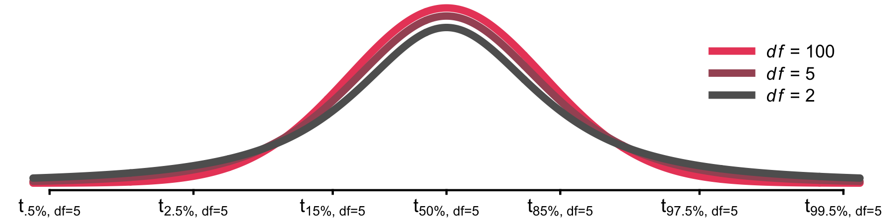

```{r setup, echo = FALSE, message = FALSE, warning = FALSE}
knitr::opts_chunk$set(comment = NA, 
                      fig.width = 6, 
                      fig.height = 6,
                      fig.align = 'center',
                      echo = FALSE, 
                      eval = FALSE, 
                      warning = FALSE)

options(digits = 3)

# Load packages
library(tidyverse)

# Load packages
#read_csv("1_Data/...")

```

<p align="center" width="100%">

  <a href="https://www.youtube.com/watch?v=fn7-JZq0Yxs">  
  </a>
  <br>
  <font style="font-size:10px">Steven Tash as a psi-test subject in Ghostbusters, from 
    <a href="https://www.imdb.com/name/nm0850865/">
      imdb.com
    </a>
  </font>
</p>


# {.tabset}

## Overview

<p align ="center">
"The term psi denotes anomalous processes of information or energy transfer that are currently unexplained in terms of known physical or biological mechanisms. Two variants of psi are precognition (conscious cognitive awareness) and premonition (affective apprehension) of a future event that could not otherwise be anticipated through any known inferential process."<br><i>Daryl J. Bem, professor emeritus, Cornell University</i>

</p>

In this practical, you will analyze Daryl Bem's infamous psychological study on human's *psi*-abilities and along the way practice everything around new statistics.

By the end of this practical you will know how to:

1. P-hack
2. Determine appropriate sample sizes
3. Compute confidence intervals
4. Run simple Bayesian analyses

## Tasks

### A - Setup

1. Open your `BaselRBootcamp` R project. It should already have the folders `1_Data` and `2_Code`. Make sure that the data files listed in the `Datasets` section above are in your `1_Data` folder

```{r}
# Done!
```

2. Open a new R script. At the top of the script, using comments, write your name and the date. Save it as a new file called `newstats_practical.R` in the `2_Code` folder.  

```{r}
# Done!
```

3. Using `library()` load the `tidyverse` package (if you don't have it, you'll need to install it with `install.packages()`)!

```{r, echo = TRUE, eval = FALSE}
# Load packages necessary for this script
library(tidyverse)
library(pwr)
library(rstanarm)
library(BayesFactor)
```

4. Using the following template, load the `psi_exp1.csv` and `psi_exp2.csv` data into R and store them as a new object called `psi1` and `psi2`, respectively (Hint: Don't type the path directly! Use the "tab" completion!).

```{r, echo = TRUE}
# Load XXX.csv from the 1_Data folder

psi1 <- read_csv(file = "1_Data/psi_exp1.csv")
psi2 <- read_csv(file = "1_Data/psi_exp2.csv")
```

5. Take a look at the first few rows of the data sets by printing them to the console.

```{r, echo = TRUE}
# Print psi1 and psi2 object
psi1
psi2
```

7. Use the the `summary()` function to print more details on the columns of the data sets.

```{r, echo = TRUE}
# Show summaries for psi1 and psi2
summary(psi1)
summary(psi2)
```

8. Use the `View()` function to view the entire data frames in new windows

```{r, echo = TRUE, eval = FALSE}
# Show the full data for psi1 and psi2
View(psi1)
View(psi2)
```


### B - p(si)-Hacking competitions

1. The first part of this practical consists of two a p-hacking competitions. 

1.1 The goal of both competition is to achieve the smallest possible p-value by hacking the sh__ out of the Bem's experimental data. To do this find up to three analyses that either show that people actually have *psi* abilities (i.e., that `hit_rate` higher than chance) and that other variables can predict *psi* ability (i.e., `hit_rate`, implying the existence of *psi*). There are no rules. You can use any test. You are even permitted to use only parts of the (e.g., using `data %>% filter(condition)`).  

1.2 For each of two competitions you are permitted to submit up to 3 models. You work alone or join forces with other participants. For information on the data and variables see the *Datasets* tab. The key criterion is `hit_rate`. The person or group submitting the lowest p-value for a competition wins &#x1F36B;&#x1F36B;&#x1F36B;.  


1.3 Submit your results using these links:

<a href="https://docs.google.com/forms/d/e/1FAIpQLScw5MmBX9wnmv3YO7SzdqdWMWSSwdCjWu0EUM2kurLRJLpEOQ/viewform?usp=sf_link"><font color="#EA4B68" style="font-size:18px;font-weight:900">Submit competition 1</font></a>, 
<a href="https://docs.google.com/forms/d/e/1FAIpQLSeJDsFtOSCFx7KmjzG4qq2bBMArPMWdaFKmUOqFfthspDhshQ/viewform?usp=sf_link"><font color="#EA4B68" style="font-size:18px;font-weight:900">Submit competition 2</font></a>


### C - Power analysis

1. In his paper, Bem's first analysis is whether the hit rate for erotic pictures is on average larger than `50%`. For this condition he observed an average proportion of `53.13%`. Determine, for experiment 1, what this means in terms of Cohen's effect size *d*, which is calculated by dividing the average deviance from $H_0$ (i.e., 50) by the standard deviation of the values the average is calculated from. 

```{r, echo = TRUE, eval = FALSE}
# extract erotic hit rate
hit_rate_erotic <- psi1$hit_rate[psi1$condition == "erotic"]

# calculate the deviance from H0
hit_rate_erotic_delta <- XX - 50

# calculate d
d <- mean(XX - YY) / sd(XX)
```

```{r}
# extract erotic hit rate
hit_rate_erotic <- psi1$hit_rate[psi1$condition == "erotic"]

# calculate the deviance from H0
hit_rate_erotic_delta <- hit_rate_erotic - 50

# calculate d
d = mean(hit_rate_erotic_delta) / sd(hit_rate_erotic_delta)
```

2. An effect size of `d = .25` is typically considered a small, but meaningful effect. Let us know take the perspective of rival researchers, who would like to replicate Bem's effect. Specifically, we would like to conduct an experiment that has a small chance of false positives, e.g., $\alpha = 0.05$ (`sig.level`) and an equally low chance of missing the effect, i.e., $\beta = .05$ implying $1-\beta = power = .95$. How many observations would we have to make to be able to conduct such a test? Use the template below. 

```{r, echo = TRUE, eval = FALSE}
# N to test d=.25, alpha = .05, power = .95
pa <- pwr.t.test(d = XX, 
                 sig.level = XX, 
                 power = XX, 
                 alternative = "greater")
pa
```

```{r}
# N to test d=.25, alpha = .05, power = .95
pa <- pwr.t.test(d = .25, 
                 sig.level = .05, 
                 power = .95, 
                 alternative = "greater")
pa
```

3. The analysis shows that we would have to run a study with 347 individuals. You can also illustrate this using `plot.power.htest()`. Apply the function to  `pa`. 

```{r}
# sample size plot
plot.power.htest(pa) 
```

4. Using the plot, you can also already get an idea, how large the power, i.e., the probability of detecting an effect given that it is truly there to detect, was for Bem's study. You can also again use the `pwr.t.test()` function. To do this, set `n = length(hit_rate_erotic)` and `power = NULL`. Call the result `pa_bem`.

```{r}
# Bems post-hoc power
pa_bem <- pwr.t.test(n = length(hit_rate_erotic), 
                     d = .25, 
                     sig.level = .05, 
                     alternative = "greater")
pa_bem
```

5. The previous analysis is called post-hoc (after the fact) power analysis, which should not be confused with an actual power analysis carried out before the data collection. In Bem's case we find that the power was only `.547` meaning that there was almost only a 50-50 chance that an effect of the observed size could have been observed. Let's now consider what would happen, if the effect was actually very small, say `d = .1`. What large would Bem's post-hoc power have been and how large a sample size was necessary for `power = .95`.


```{r}
# Bems post-hoc power
pa_bem.1 <- pwr.t.test(n = length(hit_rate_erotic), 
                       d = .1, 
                       sig.level = .05, 
                       alternative = "greater")
pa_bem.1

# Sample
pa.1 <- pwr.t.test(d = .1, 
                  sig.level = .05, 
                  power = .95, 
                  alternative = "greater")
pa.1
```

6. Bem's post-hoc power would have been a meager 17.4%, while the N necessary for a conclusive study lies upwards of 2000 individuals. This means that Bem either knew we would be finding a substantive effect, or he actually engaged in pretty poor study planning. Go explore,  can you determine the post-hoc power and n necessary your analyses? Use `pwr.r.test()` for correlation tests and `pwr.chisq.test()` for chi-square tests. Unfortunately, there are not functions for regression models.  


### D - Confidence intervals

1. Confidence intervals are another way of using a significance test that places focus on the uncertainty inherent in the result. The basic idea is that rather than dividing an estimate by its standard error we assess the range spanned by the standard error to the left and right of the estimate. Let's begin by computing a standard paired t-test for the hit-rate using the template below and storing the result in an object called `test()`. 

```{r, eval = FALSE, echo = TRUE}
# extract hit rates 
hit_rate_erotic <- psi1$hit_rate[psi1$condition == "erotic"]
hit_rate_neutral <- psi1$hit_rate[psi1$condition != "erotic"]

# compute t-test
test <- t.test(x = XX, 
               y = YY, 
               paired = TRUE)

```

2. Next inspect the names of the `test` object using `names()`. 

```{r}
names(test)
```

3. The you will have observed that the t-test object actually already contains a `conf.in` object. Access it using `$` and print it to the console. 

```{r}
test$conf.int
```

4. Let us now try to recreate the confidence interval. The first element we need for this is the average difference, which is simply the average of the differences between `hit_rate_erotic` and `hit_rate_neutral`. First, calculate the differences and store them as `hit_rate_diff`. Then calculate the mean of `hit_rate_diff` and call it `hit_rate_diff_mean`. 

```{r}
# differences 
hit_rate_diff <- hit_rate_erotic - hit_rate_neutral

# mean differences
hit_rate_diff_mean <- mean(hit_rate_diff)
```

5. The second element is the standard error. In case of paired samples this is very easy to calculate. The standard error is the standard deviation (`sd()`) of the differences divided by the square root of the number of differences (`sqrt(length())`). Store the standard error as `hit_rate_diff_se`.

```{r}
# differences 
hit_rate_diff_se <- sd(hit_rate_diff) / sqrt(length(hit_rate_diff))
```

5. The final element is the value in the t-distribution that corresponds to a certain confidence interval width, e.g., 95% or 99%. If the goal is to determine a 95% confidence interval then we need to identify the t-values that encapsulate this proportion of t-values in the t-distribution, which is the t-value at which 2.5% of t-values are smaller, i.e., $t_{2.5\%}$ and the t-value at which 97.5% are smaller, i.e., $t_{97.5\%}$. See the figure below. Locate these values in the figure below.  

</img>

6. We can calculate the precise t-values corresponding to certain probabilities using the cumulative distribution function of t `qt(p = XX, df = YY)`. To use it, you must provide the proportion `p` of t-values that should be smaller than the target value and the degrees of freedom `df`, which in this case must be set to `n-1`. Determine $t_{2.5\%}$ and $t_{97.5\%}$ and store them as `t.25` and `t97.5`.     

```{r}
# t-values for p = 2.5% and p = 97.5%
t.25 <- qt(p = .025, df = length(hit_rate_diff) - 1)
t97.5 <- qt(p = .975, df = length(hit_rate_diff) - 1)
```

7. Compare the two t-values. Anything surprising? Given the symmetric nature of the t-distribution the two values are their respective mirror image. Ok, now you have all the ingredients that you need to construct a confidence interval. To calculate the lower bound, you want to move exactly `t.25` times the standard error to the left of the mean hit rate difference. And to calculate the bound, you want to move exactly `t97.5` times the standard error to the right of the mean hit rate difference. Do this and name the lower and upper bounds `hit_rate_lowerb` and `hit_rate_upperb`.

```{r}
# confidence limits
hit_rate_lowerb <- hit_rate_diff_mean + t.25 * hit_rate_diff_se
hit_rate_upperb <- hit_rate_diff_mean + t97.5 * hit_rate_diff_se
```

8. Now compare your calculated values against the confidence interval determined by the t-test. Are they the same? The confidence interval is many ways the better alternative to the classic inferential test because it prefers more information. A test is just significant or not. The confidence interval reveals this information too by including the 0 or not, but it also reveals the oftentimes considerable uncertainty inherent in our estimate, which is otherwise easily forgotten.  

9. Play around with the confidence intervals. How do the bounds change, when you choose higher (e.g., 99%) or lower (90%) percentages.

### X - Advanced: Bayesian statistics

1. Bayesian statistics have become readily available in R mainly through two R packages `rstanarm` and `Bayesfactor`. Both packages are great and allow you to do almost anything, but they do follow a slightly different philosophy. Let's begin with `rstanarm`. Use the template below to run a regression predicting `hit_rate` by  `gender` and `condition`. 

```{r, echo = TRUE, message=F, warning=F}
# Bayesian regression predicting hit_rate by gender and condition
bm1 <- stan_glm(formula = hit_rate ~ gender + condition, 
                data = psi1)
```

2. Print the object and inspect the output. You'll see it looks different than the output of a regular regression. Focusing only on the part after the separating hyphens, there are three main parts:

- The first part shows the coefficients and their standard deviation. Different from a regular regression output, we do not receive any statistics or significance values. Moreover estimates are labeled Median and MAD_SD. This is because of the fact that in Bayesian statistics, we can more or less choose which centrality measure to compute from the posterior distribution. `rstanarm` chooses the median, because the median is typically more robust. 

- The second part labeled *Auxiliary parameter(s)* lists another set of estimates (in this case only 1), which had to be computed in order to be able to fit the model. In this case this is a single standard deviation for the residual distribution (here you can see the importance of the homoscedascity assumption. Without it a lot more sigmas would have to be estimated).

- The third part labeled *Sample avg. posterior predictive distribution of y* shows the mean value predicted by the model, which is, more or less, the average of the fitted values.  

3. In order to make statistical decisions, Bayesian statistics commonly relies on intervals, which in Bayesian statistics are called *credible interval* rather than *confidence interval*. Credible intervals truly provide the ranges that encompass the true value with 95% probability, which cannot strictly be said about confidence intervals. You can compute these intervals using the `posterior_interval()` function on the `bm1` object.    

```{r, message=F, warning=F}
# Bayesian regression predicting hit_rate by gender and condition
posterior_interval(bm1)
```

4. Now let's run the same analysis using the `BayesFactor` package using the `lmBF` function.  

```{r, echo = TRUE, message=F, warning=F}
# Bayesian regression predicting hit_rate by gender and condition
psi1$gender_dummy <- as.numeric(psi1$gender == 'Male')
psi1$condition_dummy <- as.numeric(psi1$condition == "erotic")

bm2 <- regressionBF(formula = hit_rate ~ gender_dummy + condition_dummy, 
                    data = psi1)
```

5. Print `bm2` and inspect the output. You'll see it's very different. The `BayesFactor` focuses more on model comparisons than parameter estimation. Accordingly, the output informs you about a model comparison, in this case, between the regression model provided and a model only containing an intercept as a predictor, the `Intercept only` model. The results are what is known *BayesFactor*s. The `BayesFactor` quantifies the amount of evidence that the data provides in favor of the model in question, relative to the comparison model. Values larger than 1 mean that the data favors the model in question, although only values above 10 are considered meaningful. Values lower than 1 indicate that the comparison model is actually more likely. The output presents results independently for each predictor and their combination. So what is it in this case? Are the predictors any good. 

6. The previous result illustrates one of several major benefits of Bayesian statistics and that is to be able to specify the evidence in favor of the Null-hypothesis. In general, everything can be done with either package. Go explore. 

## Examples

```{r, eval = FALSE, echo = TRUE}

# power analysis -----------

# N needed for one-sided test with a mean difference of
# .3 standard deviations, a false positive error rate (sig.level)
# of .05, and power of .95
pwr.t.test(d = .3, 
           sig.level = .05, 
           power = .95, 
           alternative = "greater")

# Power obtained for one-sided test with mean difference of
# .3 standard deviations, a false positive error rate (sig.level)
# of .05, and a sample size of 100
pwr.t.test(n = 100,
           d = .3, 
           sig.level = .05, 
           power = .95, 
           alternative = "greater")


# confidence intervals -----------

#  split data (not strictly necessary)
mpg_suv     <- mpg %>% filter(class == 'suv')
mpg_compact <- mpg %>% filter(class == 'compact')

# mean difference and pooled standard deviation
mpg_diff = mean(mpg_suv$hwy) - mean(mpg_compact$hwy)
mpg_diff_sd = sqrt((var(mpg_suv$hwy) + var(mpg_compact$hwy))/2)
df = length(mpg_suv$hwy) + length(mpg_compact$hwy) - 2
mpg_diff_se = mpg_diff_sd / sqrt(df)

# upper and lower bounds
mpg_diff + qt(.025, df) * mpg_diff_se
mpg_diff + qt(.975, df) * mpg_diff_se

# both at the same time
mpg_diff + qt(.975, df) * mpg_diff_se * c(-1,1)

# Bayesian regression -----------

# using rstanarm
bm1 <- stan_glm(hwy ~ displ, data = mpg)

# rstanarm credible intervals
posterior_interval(bm1)

# using BayesFactor
bm2 <- regressionBF(hwy ~ displ, data = mpg)

# sample from posterior
posterior(bm2, iterations = 1000)
```


## Datasets

|File | Rows | Columns |
|:----|:-----|:------|
|[psi_exp1.csv](https://therbootcamp.github.io/SwR_2019Apr/1_Data/psi_exp1.csv) | 200 | 7 |
|[psi_exp2.csv](https://therbootcamp.github.io/SwR_2019Apr/1_Data/psi_exp2.csv)  | 150 | 5 |

The data sets stem from actual (para-) psychological investigation of people's ability to ["Feel the future"](https://therbootcamp.github.io/SwR_2019Apr/_sessions/NewStats/literature/Bem_Psi_2011.pdf). The infamous study published in a respected Social Psychology journal was one of the main reasons that triggered the replication crisis and the associated efforts for better scientific practice in Psychology and beyond. The data sets contain the data of the first two experiments. Experiment 1 investigated whether people can successfully (better than chance) predict behind which of two occluding curtains a picture is hiding as a function of, among other things, whether the picture has erotic content. Experiment 2 is an attempt to replicate study 2. Both studies also measures how stimulus seeking (a variant of extraversion) individuals were, to see whether this influences individuals *psi* ability.  

#### Variable description

| Name | Description |
|:-------------|:-------------------------------------|
| `gender` | The gender of the participant. |
| `age` | The age of the participant. |
| `stimulus_seeking` | The degree of stimulus-seeking exhibited by the participant. |
| `hour_of_day` | The hour of day at which the participant was tested. |
| `condition` | The study condition: "erotic" or "control" (only psi1) |
| `depicted_gender` | The gender on the presented photo: "Female" or "Male" (only psi1) |
| `n_trials` | The number of choices made. |
| `hit_rate` | %-correct choices (with regard to showing *psi*). |

## Functions

### Packages

|Package| Installation|
|:------|:------|
|`tidyverse`|`install.packages("tidyverse")`|
| `pwr` | `install.packages("pwr")` |
| `rstanarm` | `install.packages("rstanarm")` |


### Functions

| Function| Package | Description |
|:---|:------|:---------------------------------------------|
| `pwr.t.test`|`pwr`| t-test power analyses | 
| `plot.power.htest`|`pwr`| Plot power analyses | 
| `qt`, `anorm`, `qF`, etc. | `stats`| Functions needed to determine confidence intervals | 
| `stan_lm` | `rstanarm`| Bayesian regression using `rstanarm` | 
| `posterior_interval` | `rstanarm`| Bayesian credible interval using `rstanarm` | 
| `regressionBF` | `BayesFactor`| Bayesian regression using `BayesFactor` | 
| `posterior` | `BayesFactor`| Sample from the posterior using `BayesFactor` | 


## Resources

### vignettes

Find vignettes to these packages: [pwr](https://cran.r-project.org/web/packages/pwr/vignettes/pwr-vignette.html), [rstanarm](http://mc-stan.org/rstanarm/articles/rstanarm.html), [BayesFactor](https://richarddmorey.github.io/BayesFactor/)


