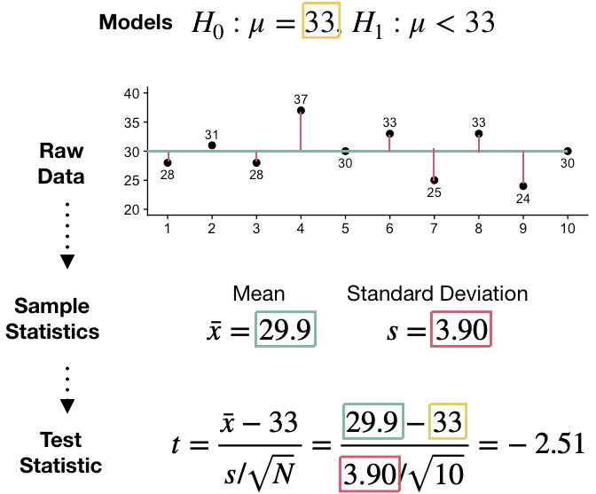
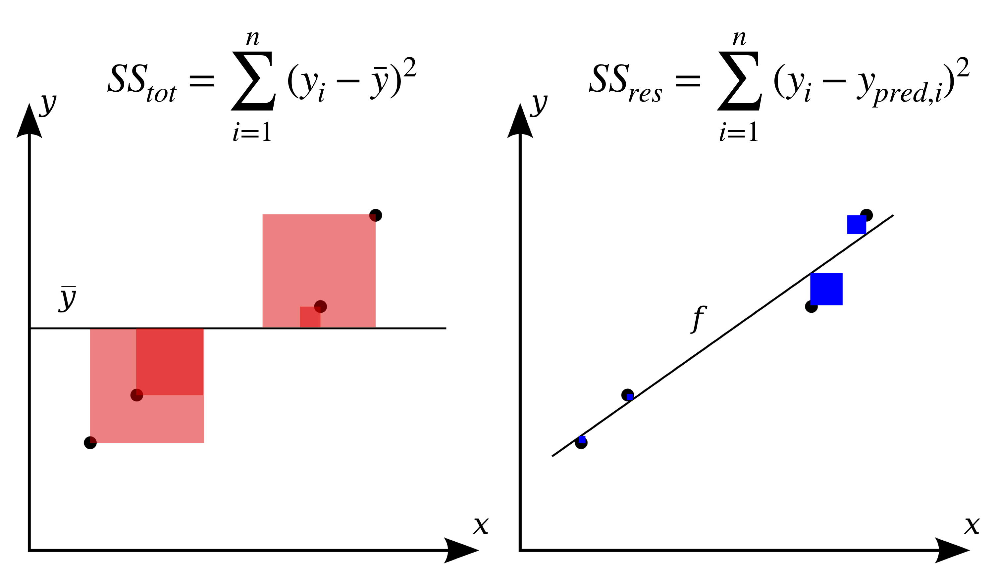

layout: true

<div class="my-footer">
  <span style="text-align:center">
    <span> 
      
    </span>
    <a href="https://therbootcamp.github.io/">
      <span style="padding-left:82px"> 
        <font color="#7E7E7E">
          www.therbootcamp.com
        </font>
      </span>
    </a>
    <a href="https://therbootcamp.github.io/">
      <font color="#7E7E7E">
       Statistics with R | April 2019
      </font>
    </a>
    </span>
  </div> 


---

```{r setup, include=FALSE}
options(htmltools.dir.version = FALSE,
        message=F,
        warning=F)
# see: https://github.com/yihui/xaringan
# install.packages("xaringan")
# see: 
# https://github.com/yihui/xaringan/wiki
# https://github.com/gnab/remark/wiki/Markdown
options(width=110)
options(digits = 4)

require(tidyverse)

baselers <- readr::read_csv("1_Data/baselers.csv")

print2 <- function(x, nlines=10,...) {
   cat(head(capture.output(print(x,...)), nlines), sep="\n")}


# get color palette functions
source("https://raw.githubusercontent.com/therbootcamp/therbootcamp.github.io/master/_materials/code/baselrbootcamp_palettes.R")
```


.pull-left45[


# Null hypothesis testing


Null hypothesis testing is a statistical framework where one hypothesis (H<sub>0</sub>) is tested to defend the other, alternative hypothesis (H<sub>1</sub>).

This evaluation is performed by calculating the likelihood of obtaining the data <high>assuming</high> that the null hypothesis true.

<table style="cellspacing:0; cellpadding:0; border:none; padding-top:10px" width=100%>
  <col width="16%">
  <col width="44%">
  <col width="40%">
<tr>
  <td bgcolor="white">
    <b>Hypothesis</b>
  </td>
  <td bgcolor="white">
    <b>Description</b>
  </td>  
  <td bgcolor="white">
    <b>Example</b>
  </td>  
</tr>
<tr>
  <td bgcolor="white">
    Null (H<sub>0</sub>)
  </td>
  <td bgcolor="white">
    A proposed effect <high>does not exist</high> and variation <high>is not systematic</high>.
  </td>  
  <td bgcolor="white">
    Drug and placebo have the same effect.
  </td>  
</tr>
<tr>
  <td bgcolor="white">
    Alternative (H<sub>1</sub>)
  </td>
  <td bgcolor="white">
    A proposed effect <high>does exist</high> and variation <high>is systematic</high>
  </td>  
  <td bgcolor="white">
    Drug and placebo do *not* have the same effect
  </td>  
</tr>
</table>

]


.pull-right45[

<br><br><br><br>

```{r, echo = FALSE}

set.seed(105)
x <- rnorm(50, mean = 50, sd = 10)

id <- 1:50
drug <- sample(c("Drug", "Placebo"), size = 50, replace = TRUE)
effect <- rnorm(50)
effect[drug == "Drug"] <- 2.3 + rnorm(sum(drug == "Drug"), mean = 0, sd = 1.5) - .41
effect[drug == "Placebo"] <- 3.3 + rnorm(sum(drug == "Placebo"), mean = 0, sd = 1.5) - .12

dat <- tibble(id, drug, effect, group = rep("Baselers", 50))
avg <- dat %>%
  group_by(drug) %>%
  summarise(days_mean = mean(effect))

drug_placebo_gg <- ggplot(dat, aes(factor(drug), effect)) +
  geom_jitter(width = .05) +
  labs(y = "Days",
       x = "Condition",
       title = "Fictional data comparing Drug to Placebo arm") +
  scale_y_continuous(breaks = seq(0, 10, 1), limits = c(0, 7)) +
  geom_label(data = avg, aes(x = drug, y = days_mean, label = round(days_mean, 2))) +
  theme(plot.title = element_text(size = 10))
```

```{r, echo = FALSE, fig.width = 3, fig.height = 3, out.width="100%", warning=F, dpi=300}
drug_placebo_gg
```


]


---

.pull-left45[

# Likelihood

Using the binomial distributions on the right, answer the following questions:

### Q1

If there is a 50% chance of a clinical trial being successful, then out of 10 drugs, <high>how likely is it that exactly 5 will be successful</high>?


### Q2

If there is a 10% chance that a customer will default on his/her loan, then out of 10 customers, <high>how likely is it that none (0) will default</high>?

]


.pull-right5[

<br><br><br><br>

```{r, echo = FALSE, fig.width = 4, fig.height = 3.35, out.width = "100%", dpi=300, warning=F}

d1 <-  data.frame(x = seq(0, 10, 1),
                               y = dbinom(seq(0, 10, 1), size = 10, prob = .5))

d2 <-  data.frame(x = seq(0, 10, 1),
                               y = dbinom(seq(0, 10, 1), size = 10, prob = .1))


p1 <- ggplot(data =d2, 
             aes(x = x, y = y)) +
  geom_hline(yintercept =  seq(0, .5, .1), col = "gray", size = .3, alpha = .5) +
  geom_vline(xintercept =  seq(0, 10), col = "gray", size = .3, alpha = .5) +
  geom_point(data = d1, col = baselrbootcamp_cols("green"), size = 2) +
  geom_line(data = d1, size = .5, col = "black", lty = 3) + 
  geom_point(data = d2, col = baselrbootcamp_cols("yellow"), size = 2) +
  geom_line(data = d2, size = .5, col = "black", lty = 3) + 
  ylab("Likelihood") +
  ylim(0, .5) + 
  annotate("text", x = 2, y = .45, label =parse(text = paste0('p == .1 ~ n== 10')), size = 5) +
  annotate("text", x = 5, y = .3, label =parse(text = paste0('p == .5 ~ n== 10')), size = 5) +
  scale_x_continuous(breaks = 0:10)

p1

```

]

---


.pull-left45[

# Test statistics

Sample statistics (like means and standard deviations) are converted into <high>test statistics</high>.

Test statistics are unit-free numbers that help you quantify how likely data is given a null hypothesis. The <high>more extreme</high> (i.e.; highly positive or highly negative) your test statistic is, the <high>more evidence against</high> the null hypothesis.

<table style="cellspacing:0; cellpadding:0; border:none; padding-top:10px" width=100%>
  <col width="40%">
  <col width="60%">
<tr>
  <td bgcolor="white">
    <b>Test</b>
  </td>
  <td bgcolor="white">
    <b>Test statistic</b>
  </td>  
</tr>
<tr>
  <td bgcolor="white">
    t-test
  </td>
  <td bgcolor="white">
    t-statistic
  </td>  
</tr>
<tr>
  <td bgcolor="white">
    Correlation test
  </td>
  <td bgcolor="white">
    t-statistic
  </td>  
</tr>
<tr>
  <td bgcolor="white">
    Binomial
  </td>
  <td bgcolor="white">
    z-statistic
  </td>  
</tr>
</table>


]


.pull-right45[

<br><br><br><br>

<p align = "center">
  
</p>

]


---

# What is a linear model?

.pull-left5[

A linear model is <high>just addition and multiplication</high> and can be written in the following forms: 

<br>

<center><u>Version 1</u><center>

$$\huge y = \beta_{0} + \beta_{1}x_{1} + \beta_{2} x_{2} +  ... + \beta_{n}x_{n} + \epsilon$$

<br>

<center><u>Version 2</u><center>


$$\huge y = \beta_{0} + \sum_{i=1}^{n}\beta_{i}x_{i}+ \epsilon$$


]


.pull-right4[

<p align = "center">
  <br>
  <font style="font-size:10px">
    from <a href="https://66.media.tumblr.com/6e401f0cffebf9c7440894d4fa6c48b2/tumblr_o0af44kS071u7w7kwo1_1280.jpg"> media.tumblr.com</a>
  </font>
</p>

]

---

# R<sup>2</sup> (R-Squared)

.pull-left45[

R-Squared $R^{2}$ is the most common method of calculating the <high>overall performance</high> of a model.

<br>

$$\huge R^{2} = 1 - \frac{SS_{res}}{SS_{tot}}$$


<table style="cellspacing:0; cellpadding:0; border:none; padding-top:10px" width=100%>
  <col width="15%">
  <col width="85%">
<tr>
  <td bgcolor="white">
    <b>R<sup>2</sup></b>
  </td>
  <td bgcolor="white">
    <b>Interpretation</b>
  </td> 
</tr>
<tr>
  <td bgcolor="white">
    0
  </td>
  <td bgcolor="white">
    Model explains no variance in y.
  </td> 
</tr>
<tr>
  <td bgcolor="white">
   .5
  </td>
  <td bgcolor="white">
    Model explains half the variance in y.
  </td> 
</tr>
<tr>
  <td bgcolor="white">
   1
  </td>
  <td bgcolor="white">
    Model explains <i>all</i> half the variance in y.
  </td> 
</tr>
</table>

]

.pull-right5[

<p align="center"> 
  
  <font style="font-size:10px"> from <a   href='https://en.wikipedia.org/wiki/Coefficient_of_determination'>Wikipedia</a></font>
  </a>
</p>
]


---

# Key Functions

.pull-left35[

<font style="font-size:20px"><u>Fitting</u></p>

<table style="cellspacing:0; cellpadding:0; border:none; padding-top:10px" width=100%>
  <col width="40%">
  <col width="60%">
<tr>
  <td bgcolor="white">
    <b>Function</b>
  </td>
  <td bgcolor="white">
    <b>Description</b>
  </td> 
</tr>
<tr>
  <td bgcolor="white">
    <mono>glm(formula, data)</mono>
  </td>
  <td bgcolor="white">
    Fit a linear model to data and calculate best coefficients
  </td> 
</tr>
</table>

<font style="font-size:20px"><u>Evaluation</u></p>

<table style="cellspacing:0; cellpadding:0; border:none; padding-top:10px" width=100%>
  <col width="40%">
  <col width="60%">
<tr>
  <td bgcolor="white">
    <b>Function</b>
  </td>
  <td bgcolor="white">
    <b>Description</b>
  </td> 
</tr>
<tr>
  <td bgcolor="white">
   <mono>coef(mod)</mono>
  </td>
  <td bgcolor="white">
    Get coefficients from a model
  </td> 
</tr>
<tr>
  <td bgcolor="white">
   <mono>fitted(mod)</mono>
  </td>
  <td bgcolor="white">
    Get fitted results.
  </td> 
</tr>
<tr>
  <td bgcolor="white">
   <mono>resid(mod)</mono>
  </td>
  <td bgcolor="white">
    Get residuals (errors)
  </td> 
</tr>
</table>

]

.pull-right6[

```{r, echo = TRUE}
# Create a model income_glm

# Y = income
# X1 = age, X2 = children

income_glm <- glm(formula = income ~ age + children,
                  data = baselers)
```

<br>

| id| income| age| children|
|--:|------:|---:|--------:|
|  1|   6300|  44|        2|
|  2|  10900|  65|        2|

]


---

# Key Functions

.pull-left35[


<font style="font-size:20px"><u>Fitting</u></p>

<table style="cellspacing:0; cellpadding:0; border:none; padding-top:10px" width=100%>
  <col width="40%">
  <col width="60%">
<tr>
  <td bgcolor="white">
    <b>Function</b>
  </td>
  <td bgcolor="white">
    <b>Description</b>
  </td> 
</tr>
<tr>
  <td bgcolor="white">
    <mono>glm(formula, data)</mono>
  </td>
  <td bgcolor="white">
    Fit a linear model to data and calculate best coefficients
  </td> 
</tr>
</table>

<font style="font-size:20px"><u>Evaluation</u></p>

<table style="cellspacing:0; cellpadding:0; border:none; padding-top:10px" width=100%>
  <col width="40%">
  <col width="60%">
<tr>
  <td bgcolor="white">
    <b>Function</b>
  </td>
  <td bgcolor="white">
    <b>Description</b>
  </td> 
</tr>
<tr>
  <td bgcolor="white">
   <mono>coef(mod)</mono>
  </td>
  <td bgcolor="white">
    Get coefficients from a model
  </td> 
</tr>
<tr>
  <td bgcolor="white">
   <mono>fitted(mod)</mono>
  </td>
  <td bgcolor="white">
    Get fitted results.
  </td> 
</tr>
<tr>
  <td bgcolor="white">
   <mono>resid(mod)</mono>
  </td>
  <td bgcolor="white">
    Get residuals (errors)
  </td> 
</tr>
</table>

]

.pull-right6[


```{r, echo = TRUE}
# Print income_glm

income_glm
```

]


---

# Key Functions

.pull-left35[

<font style="font-size:20px"><u>Fitting</u></p>

<table style="cellspacing:0; cellpadding:0; border:none; padding-top:10px" width=100%>
  <col width="40%">
  <col width="60%">
<tr>
  <td bgcolor="white">
    <b>Function</b>
  </td>
  <td bgcolor="white">
    <b>Description</b>
  </td> 
</tr>
<tr>
  <td bgcolor="white">
    <mono>glm(formula, data)</mono>
  </td>
  <td bgcolor="white">
    Fit a linear model to data and calculate best coefficients
  </td> 
</tr>
</table>

<font style="font-size:20px"><u>Evaluation</u></p>

<table style="cellspacing:0; cellpadding:0; border:none; padding-top:10px" width=100%>
  <col width="40%">
  <col width="60%">
<tr>
  <td bgcolor="white">
    <b>Function</b>
  </td>
  <td bgcolor="white">
    <b>Description</b>
  </td> 
</tr>
<tr>
  <td bgcolor="white">
   <mono>coef(mod)</mono>
  </td>
  <td bgcolor="white">
    Get coefficients from a model
  </td> 
</tr>
<tr>
  <td bgcolor="white">
   <mono>fitted(mod)</mono>
  </td>
  <td bgcolor="white">
    Get fitted results.
  </td> 
</tr>
<tr>
  <td bgcolor="white">
   <mono>resid(mod)</mono>
  </td>
  <td bgcolor="white">
    Get residuals (errors)
  </td> 
</tr>
</table>

]

.pull-right6[

```{r, echo = TRUE, eval = F}
# Show summary info
summary(income_glm)
```


```{r, echo = FALSE}
# Show summary info
print2(summary(income_glm),17)
```

]


---

.pull-left45[
<br><br><br><br><br><br><br><br><br>

<p align="center">
  <font size=8><hfont><high>Questions?</high></hfont></font><br>
  <font size = 4><a href = "https://therbootcamp.github.io/SwR_2019Apr/">Link to schedule</a></font>
</p>

]


.pull-right45[


]
