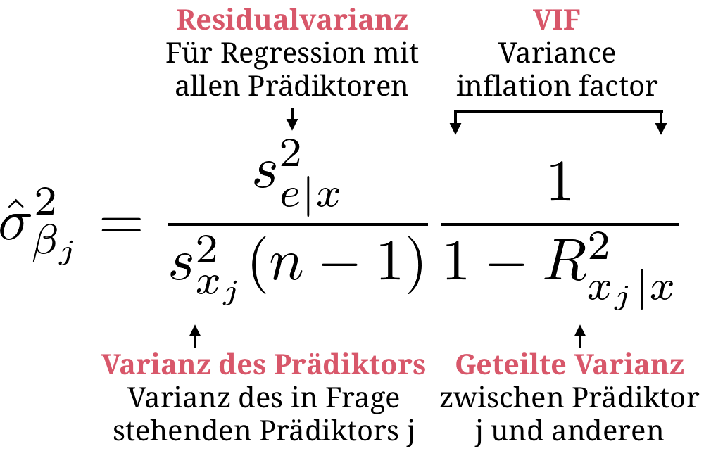

layout: true

<div class="my-footer">
  <span style="text-align:center">
    <span> 
      
    </span>
    <a href="https://therbootcamp.github.io/">
      <span style="padding-left:82px"> 
        <font color="#7E7E7E">
          www.therbootcamp.com
        </font>
      </span>
    </a>
    <a href="https://therbootcamp.github.io/">
      <font color="#7E7E7E">
       Statistics with R | April 2019
      </font>
    </a>
    </span>
  </div> 

---

```{r, eval = TRUE, echo = FALSE, warning=F,message=F}
# Code to knit slides

```

```{r setup, include=FALSE}
options(htmltools.dir.version = FALSE)
# see: https://github.com/yihui/xaringan
# install.packages("xaringan")
# see: 
# https://github.com/yihui/xaringan/wiki
# https://github.com/gnab/remark/wiki/Markdown
options(width = 110)
options(digits = 4)

# Load packages
require(tidyverse)


# Load data
baselers <- readr::read_csv("1_Data/baselers.csv")

```


# Robust statistics

.pull-left45[

### Parametric assumptions

Parametric statistics models and the associated tests come with <high>many assumptions</high>.

For the models and tests to be <high>consistent</high> and <high>efficient</high> those assumptions should hold.  

### Non-parametric statistics

Non-parametric statistics model the data as coming from <high>no specific probability distribution</high>. 

Involves <high>ranking</high>, <high>combinatorics</high>, and/or <high>bootstrap samples</high>

]

.pull-right45[

<p align = "center">
<br>
<font style="font-size:10px">from <a href="https://xkcd.com/1781/">xkcd.com</a></font>
</p>


]

---

# Regression assumptions

.pull-left45[

In *plain* English...

<high>Are the data appropriate?</high>

- Quantitative or dichotomous (A1)
- Nonzero variance (A2)
- Not too highly correlated (A3)

<high>Is the model appropriate?</high> 

- Linear relationship (A4, A5, A7)
- Constant error variance (A6)
- Normally distributed errors (A8)

]

.pull-right45[

<p align = "center">
<br>
<font style="font-size:10px">from <a href="">Berry (1993)</a></font>
</p>


]

---

# Are the data appropriate?

.pull-left45[

The most serious data problem are predictor correlations. If k-1 predictors can explain predictor k...

&nbsp;&nbsp;&nbsp;&nbsp;&nbsp;...perfectly then the regression model cannot
&nbsp;&nbsp;&nbsp;&nbsp;&nbsp;be calculated (<high>singularity</high>).

&nbsp;&nbsp;&nbsp;&nbsp;&nbsp; ...with high accuracy then the estimates
&nbsp;&nbsp;&nbsp;&nbsp;&nbsp;become very vague (<high>multicollinearity</high>).

<br>
The <high>variance inflation factor</high> (VIF) indicates the amount of variance of each predictor explained by the other predictors. The literature recommends retaining predictors with <high>VIF < 10</high> [(Stine, 1995)](https://therbootcamp.github.io/SwR_2019Apr/_sessions/RobustStats/literature/Stine1995.pdf)

]

.pull-right45[

<p align = "center">

</p>

]
---

# Is the model appropriate?

.pull-left45[

The appropriateness of the model is best inspected (and demonstrated) using <high>graphical illustrations.</high> 

Additionally, several <high>statistics can be computed to support the assessment.</high> 


<table style="cellspacing:0; cellpadding:0; border:none; padding-top:10px">
  <col width="50%">
  <col width="50%">
<tr>
  <td bgcolor="white">
    <b>Assumption</b>
  </td>
  <td bgcolor="white">
    <b>Statistics</b>
  </td>  
</tr>
<tr>
  <td bgcolor="white">
    Linearity
  </td>
  <td bgcolor="white">
   <mono>lm</mono>, <mono>glm</mono> (curve fitting)
  </td>  
</tr>
<tr>
  <td bgcolor="white">
    Homoscedasticity
  </td>
  <td bgcolor="white">
    <mono>bartlett.test</mono>
  </td>  
</tr>
<tr>
  <td bgcolor="white">
    Normality
  </td>
  <td bgcolor="white">
    <mono>skewness</mono>, <mono>kurtosis</mono>, <mono>shapiro.test</mono>
  </td>  
</tr>
<tr>
  <td bgcolor="white">
    Outliers
  </td>
  <td bgcolor="white">
    <mono>cooks.distance</mono>, <mono>mahalanobis</mono>, etc.
  </td>  
</tr>
</table>

]


.pull-right45[

<p align = "center">
<font style="font-size=10px"><i>Simple regression</i></font><br>

</p>

]

---

# Is the model appropriate?

.pull-left45[

The appropriateness of the model is best inspected (and demonstrated) using <high>graphical illustrations.</high> 

Additionally there several <high>statistics can be computed to support the assessment.</high> 


<table style="cellspacing:0; cellpadding:0; border:none; padding-top:10px">
  <col width="50%">
  <col width="50%">
<tr>
  <td bgcolor="white">
    <b>Assumption</b>
  </td>
  <td bgcolor="white">
    <b>Statistics</b>
  </td>  
</tr>
<tr>
  <td bgcolor="white">
    Linearity
  </td>
  <td bgcolor="white">
   <mono>lm</mono>, <mono>glm</mono> (curve fitting)
  </td>  
</tr>
<tr>
  <td bgcolor="white">
    Homoscedasticity
  </td>
  <td bgcolor="white">
    <mono>bartlett.test</mono>
  </td>  
</tr>
<tr>
  <td bgcolor="white">
    Normality
  </td>
  <td bgcolor="white">
    <mono>skewness</mono>, <mono>kurtosis</mono>, <mono>shapiro.test</mono>
  </td>  
</tr>
<tr>
  <td bgcolor="white">
    Outliers
  </td>
  <td bgcolor="white">
    <mono>cooks.distance</mono>, <mono>mahalanobis</mono>, etc.
  </td>  
</tr>
</table>

]


.pull-right45[

<p align = "center">
<font style="font-size=10px"><i>Residual analysis</i></font><br>

</p>

]

---

.pull-left45[

# Missing predictors

<br2>

Most serious are <high>violations of the linearity assumption</high>.  

Typically they arise from <high>missing predictors</high>, such as higher order trends or important temporal variables.    

Whether additional predictors improve the fit to the data can be tested by comparing the model with and without the addition predictor using a <high>ANOVA deviance test</high>: 

`anova(model_1, model_2)`.

]


.pull-right45[
<br><br>
<p align = "center">

</p>


]


---

.pull-left5[

# Missing predictors

Testing the merit of including a <high>quadratic trend of Stress</high>. 

```{r, echo = F}
n = 300
x1 = sort(rnorm(n,0,2) + runif(n,-3,3))
x2 = x1 ** 2
y = x2 + 2*x1 + rnorm(n,0,7)

x1 = scale(x1)
x2 = scale(x2)
y = scale(y)

stress_df = tibble("error_rate" = y, "stress" = x1, "stress2" = x2 )
options(width=43)
```


```{r}
# ANOVA deviance test
model_1 <- lm(error_rate ~ stress,
              data = stress_df)
model_2 <- lm(error_rate ~ stress + stress2,
              data = stress_df)
anova(model_1, model_2)
```


]


.pull-right45[
<br><br>
<p align = "center">

</p>


]


---

# Non-parametric statistics

.pull-left45[

When assumptions don't hold, researchers can make use of a wide array of <high>more robust</high>, non-parametric methods. 


<table style="cellspacing:0; cellpadding:0; border:none; padding-top:10px">
  <col width="50%">
  <col width="50%">
<tr>
  <td bgcolor="white">
    <b>Approach</b>
  </td>
  <td bgcolor="white">
    <b>Methods</b>
  </td>  
</tr>
<tr>
  <td bgcolor="white">
    Rank combinatorics
  </td>
  <td bgcolor="white">
   <mono>wilcox.test</mono>, <mono>friedman.test</mono>
  </td>  
</tr>
<tr>
  <td bgcolor="white">
    Freq. combinatorics
  </td>
  <td bgcolor="white">
   <mono>sign.test</mono>, <mono>chisq.test</mono>
  </td>  
</tr>
<tr>
  <td bgcolor="white">
    M-estimation
  </td>
  <td bgcolor="white">
    <mono>rq</mono> (quantile regr.), <mono>rfit</mono> (rank regr.)
  </td>  
</tr>
<tr>
  <td bgcolor="white">
    Bootstrap
  </td>
  <td bgcolor="white">
    <mono>boot</mono> (anything)
  </td>  
</tr>
</table>


]


.pull-right45[

<p align = "center">

</p>

]

---

.pull-left45[

# Wilcoxon test

One classic relying on the combinatorics of ranks is the Wilcoxon or Mann-Whitney U test. 

The Wilcoxon test evaluates the assumption that the <high>ranks sums of jointly ranked groups are identical</high>. The formula shows the normal approximation for large N. 

<p align = "center">

</p>


]


.pull-right45[

<br><br>
<p align = "center">

</p>


]

---

.pull-left45[

# Wilcoxon test

One classic relying on the combinatorics of ranks is the Wilcoxon or Mann-Whitney U test. 

The Wilcoxon test evaluates the assumption that the <high>ranks sums of jointly ranked groups are identical</high>. The formula shows the normal approximation for large N. 

<p align = "center">

</p>


]


.pull-right45[

<br><br><br><br>

```{r, eval = F}
# data
group_1 <- c(18, 24, 29, 12, 11, 31)
group_2 <- c(27, 16, 23, 8, 15, 21)

# wilcoxon test
wilcox.test(group_1, group_2)

```

```{r, echo  =F}
# data
group_1 <- c(18, 24, 29, 12, 11, 31)
group_2 <- c(27, 16, 23, 8, 15, 21)

options(width=40)

# wilcoxon test
wilcox.test(group_1, group_2)

```

]


---

.pull-left45[

# Sign test 

A very simple test relying on the combinatorics of frequencies is the <high>sign test</high>. 

The sign test evaluates the assumption that the <high>signs of differences (+, -) are equally likely</high>, i.e., $p_+ = p_- = .5$. 

<p align = "center">

</p>

]

.pull-right45[

<br><br>
<p align = "center">

</p>


]


---

.pull-left45[

# Sign test 

A very simple test relying on the combinatorics of frequencies is the <high>sign test</high>. 

The sign test evaluates the assumption that the <high>signs of differences (+, -) are equally likely</high>, i.e., $p_+ = p_- = .5$. 

<p align = "center">

</p>

]

.pull-right45[

<br><br><br><br>

```{r}
# data
time_1 <- c(18, 24, 29, 12, 11, 31)
time_2 <- c(27, 16, 23, 8, 15, 21)

# sign test
N <- length(time_1)
n_plus = sum(sign(time_1 - time_2) == 1)
ps <- dbinom(x = n_plus : N, 
             size = N, 
             prob = .5) # H0 assumption 
sum(ps)
```
]

---

.pull-left55[

# Robust regressions

Various options exist to improve the robustness of regression-based models.

They all <high>minimize a specific function $\rho$ of the residuals</high>:

<p align = "center">
  
</p>


<table style="cellspacing:0; cellpadding:0; border:none; padding-top:10px">
  <col width="13%">
  <col width="13%">
  <col width="35%">
  <col width="30%">
<tr>
  <td bgcolor="white">
    <b>Function</b>
  </td>
  <td bgcolor="white">
    <b>Package</b>
  </td>  
  <td bgcolor="white">
    <b>Function</b>
  </td>
  <td bgcolor="white">
    <b>Description</b>
  </td>
</tr>
<tr>
  <td bgcolor="white">
    <mono>lm</mono>
  </td>
  <td bgcolor="white">
    <mono>stats</mono>
  </td>  
  <td bgcolor="white">
    
  </td>
  <td bgcolor="white">
    Ordinary least square
  </td>
</tr>
<tr>
  <td bgcolor="white">
    <mono>rq</mono>
  </td>
  <td bgcolor="white">
    <mono>quantreg</mono>
  </td>  
  <td bgcolor="white">
    
  </td>
  <td bgcolor="white">
    Quantile regression
  </td>
</tr>
<tr>
  <td bgcolor="white">
    <mono>rfit</mono>
  </td>
  <td bgcolor="white">
    <mono>Rfit</mono>
  </td>  
  <td bgcolor="white">
    
  </td>
  <td bgcolor="white">
    Rank-based regression
  </td>
</tr>
</table>
]

.pull-right4[
  
  <br><br>
  <p align = "center">
  
  </p>

]

---

.pull-left55[

# Robust regressions

Various options exist to improve the robustness of regression-based models.

They all <high>minimize a specific function $\rho$ of the residuals</high>:

<p align = "center">
  
</p>


<table style="cellspacing:0; cellpadding:0; border:none; padding-top:10px">
  <col width="13%">
  <col width="13%">
  <col width="35%">
  <col width="30%">
<tr>
  <td bgcolor="white">
    <b>Function</b>
  </td>
  <td bgcolor="white">
    <b>Package</b>
  </td>  
  <td bgcolor="white">
    <b>Function</b>
  </td>
  <td bgcolor="white">
    <b>Description</b>
  </td>
</tr>
<tr>
  <td bgcolor="white">
    <mono>lm</mono>
  </td>
  <td bgcolor="white">
    <mono>stats</mono>
  </td>  
  <td bgcolor="white">
    
  </td>
  <td bgcolor="white">
    Ordinary least square
  </td>
</tr>
<tr>
  <td bgcolor="white">
    <mono>rq</mono>
  </td>
  <td bgcolor="white">
    <mono>quantreg</mono>
  </td>  
  <td bgcolor="white">
    
  </td>
  <td bgcolor="white">
    Quantile regression
  </td>
</tr>
<tr>
  <td bgcolor="white">
    <mono>rfit</mono>
  </td>
  <td bgcolor="white">
    <mono>Rfit</mono>
  </td>  
  <td bgcolor="white">
    
  </td>
  <td bgcolor="white">
    Rank-based regression
  </td>
</tr>
</table>
]

.pull-right4[

<br><br><br><br>

```{r, echo = F}

set.seed(100)

x = scale(rnorm(300,0,1))
y = scale(x + rnorm(300,0,1))

x_extra = c(runif(10,3,4),runif(10,-4,-3))
y_extra = c(runif(10,-4,-3), runif(10,3,4))

x_c = c(x, x_extra)
y_c = c(y, y_extra)

outlier_df = tibble(y = y_c, x = x_c)
options(width=35)
```

```{r, message=F, warning=F}
# Quantile regression
require(quantreg)
m = rq(y ~ x, data = outlier_df)
summary(m)

```

]


---

.pull-left55[

# Robust regressions

Various options exist to improve the robustness of regression-based models.

They all <high>minimize a specific function $\rho$ of the residuals</high>:

<p align = "center">
  
</p>


<table style="cellspacing:0; cellpadding:0; border:none; padding-top:10px">
  <col width="13%">
  <col width="13%">
  <col width="35%">
  <col width="30%">
<tr>
  <td bgcolor="white">
    <b>Function</b>
  </td>
  <td bgcolor="white">
    <b>Package</b>
  </td>  
  <td bgcolor="white">
    <b>Function</b>
  </td>
  <td bgcolor="white">
    <b>Description</b>
  </td>
</tr>
<tr>
  <td bgcolor="white">
    <mono>lm</mono>
  </td>
  <td bgcolor="white">
    <mono>stats</mono>
  </td>  
  <td bgcolor="white">
    
  </td>
  <td bgcolor="white">
    Ordinary least square
  </td>
</tr>
<tr>
  <td bgcolor="white">
    <mono>rq</mono>
  </td>
  <td bgcolor="white">
    <mono>quantreg</mono>
  </td>  
  <td bgcolor="white">
    
  </td>
  <td bgcolor="white">
    Quantile regression
  </td>
</tr>
<tr>
  <td bgcolor="white">
    <mono>rfit</mono>
  </td>
  <td bgcolor="white">
    <mono>Rfit</mono>
  </td>  
  <td bgcolor="white">
    
  </td>
  <td bgcolor="white">
    Rank-based regression
  </td>
</tr>
</table>
]

.pull-right4[

<br><br><br><br>

```{r, echo = F}

set.seed(100)

x = scale(rnorm(300,0,1))
y = scale(x + rnorm(300,0,1))

x_extra = c(runif(10,3,4),runif(10,-4,-3))
y_extra = c(runif(10,-4,-3), runif(10,3,4))

x_c = c(x, x_extra)
y_c = c(y, y_extra)

outlier_df = tibble(y = y_c, x = x_c)
options(width=35)
```

```{r, message=F, warning=F}
# Rank-based regression
require(Rfit)
m = rfit(y ~ x, data = outlier_df)
summary(m)
```

]


---

# Bootstrapping

.pull-left45[

Bootstrapping refers to statistical tests based on <high>sampling with replacement from the observed data</high>. 

The core idea is that the distribution of the sample statistic in question, e.g., the mean of a difference or a regression weight, can be <high>simulated directly from the data without making distributional assumptions</high>. 

The term bootstrapping stems from the saying <high>pull oneself up by one's bootstraps</high>, which is sometimes attributed to Baron Münchhausen's story of pulling himself and his horse out of the swamp by his pigtail.  

]

.pull-right45[

  <p align = "center">
  <br>
    <font style="font-size:10px">Baron Münchhausen, from <a href="https://de.wikipedia.org/wiki/Datei:M%C3%BCnchhausen-Sumpf-Hosemann.png">wikipedia.org</a></font>
  </p>

]


---

.pull-left4[

# Bootstrapping

Bootstrapping can be used to obtain sampling distributions for any statistic. 

<b>Step 1</b><br>Take $R$ <high>bootstrap samples</high> $B_i$ of $n$ observations, typically one row in our data. 

<b>Step 2</b><br><high>Calculate statistic</high> $f(B_i)$, e.g., the difference in means or regression coefficients, from each of the $R$ bootstrap samples. 

<b>Step 3</b><br><high>Evaluate the simulated statistics</high>, e.g., via a confidence intervals.

<p align="center"></p>


]

.pull-right45[
  
  <br><br>
  <p align = "center">
  
  </p>

]


---

.pull-left4[

# Bootstrapping

Bootstrapping can be used to obtain sampling distributions for any statistic. 

<b>Step 1</b><br>Take $R$ <high>bootstrap samples</high> $B_i$ of $n$ observations, typically one row in our data. 

<b>Step 2</b><br><high>Calculate statistic</high> $f(B_i)$, e.g., the difference in means or regression coefficients, from each of the $R$ bootstrap samples. 

<b>Step 3</b><br><high>Evaluate the simulated statistics</high>, e.g., via a confidence intervals.

<p align="center"></p>


]

.pull-right5[
  
<br><br><br><br>  
  
```{r, echo = F}
n = 300
x1 = sort(rnorm(n,2,2) + runif(n,-3,3))
x2 = x1 ** 2
y = x2 + 2*x1 + rnorm(n,2,7)

x1 = scale(x1,center=F)
x2 = scale(x2,center=F)
y = scale(y,center=F)

stress_df = tibble("error_rate" = y, "stress" = x1, "stress2" = x2 )
options(width=43)
```


```{r, message=F, warning=F}
# Bootstrap
require(boot)

# bootstrap function
stat_fun <- function(data, indices){
  data <- data[indices,] # bootstrap
  m <- lm(error_rate ~ stress + stress2, 
          data = data)
  coefficients(m)
  }

# bootstrap samples
B <- boot(stress_df, 
          statistic = stat_fun, 
          R = 1000)

```

]

---

.pull-left4[

# Bootstrapping

Bootstrapping can be used to obtain sampling distributions for any statistic. 

<b>Step 1</b><br>Take $R$ <high>bootstrap samples</high> $B_i$ of $n$ observations, typically one row in our data. 

<b>Step 2</b><br><high>Calculate statistic</high> $f(B_i)$, e.g., the difference in means or regression coefficients, from each of the $R$ bootstrap samples. 

<b>Step 3</b><br><high>Evaluate the simulated statistics</high>, e.g., via a confidence intervals.

<p align="center"></p>


]

.pull-right5[

<br><br><br><br>

```{r, message=F, warning=F}
# Bootstrap CI for stress
boot.ci(B, index = 2)
```

]

---

.pull-left4[

# Bootstrapping

Bootstrapping can be used to obtain sampling distributions for any statistic. 

<b>Step 1</b><br>Take $R$ <high>bootstrap samples</high> $B_i$ of $n$ observations, typically one row in our data. 

<b>Step 2</b><br><high>Calculate statistic</high> $f(B_i)$, e.g., the difference in means or regression coefficients, from each of the $R$ bootstrap samples. 

<b>Step 3</b><br><high>Evaluate the simulated statistics</high>, e.g., via a confidence intervals.

<p align="center"></p>


]

.pull-right5[

<br><br><br><br>

```{r, message=F, warning=F}
# Bootstrap CI for stress2
boot.ci(B, index = 3)
```

]

---

class: middle, center

<h1><a href="https://therbootcamp.github.io/SwR_2019Apr/_sessions/RegressionI/RegressionI_practical.html">Practical</a></h1>

