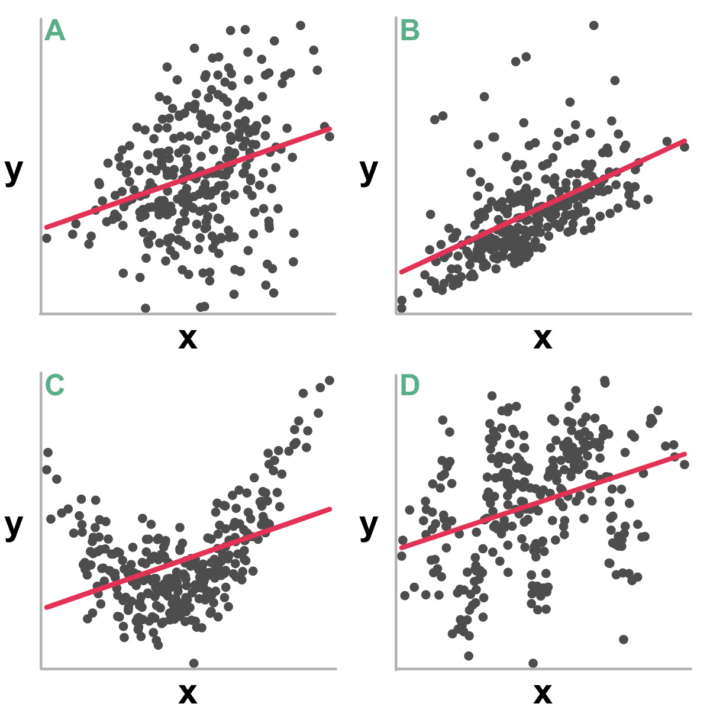

layout: true

<div class="my-footer">
  <span style="text-align:center">
    <span> 
      
    </span>
    <a href="https://therbootcamp.github.io/">
      <span style="padding-left:82px"> 
        <font color="#7E7E7E">
          www.therbootcamp.com
        </font>
      </span>
    </a>
    <a href="https://therbootcamp.github.io/">
      <font color="#7E7E7E">
       Statistics with R | April 2019
      </font>
    </a>
    </span>
  </div> 

---

```{r, eval = TRUE, echo = FALSE, warning=F,message=F}
# Code to knit slides

```

```{r setup, include=FALSE}
options(htmltools.dir.version = FALSE)
# see: https://github.com/yihui/xaringan
# install.packages("xaringan")
# see: 
# https://github.com/yihui/xaringan/wiki
# https://github.com/gnab/remark/wiki/Markdown
options(width = 110)
options(digits = 4)

# Load packages
require(tidyverse)


# Load data
baselers <- readr::read_csv("1_Data/baselers.csv")

```


# Robust statistics

.pull-left45[

### Assumptions


### Non-parametric


]

.pull-right45[

<p align = "center">
<br>
<font style="font-size:10px">from <a href="https://xkcd.com/1781/">xkcd.com</a></font>
</p>


]

---

# Assumptions

.pull-left45[

#### In "plain" English...

<high>Have the right variables</high> (A1-A3)

- Quantitative or dichotomous (binary)
- Nonzero variance
- Not too highly correlated

<high>Have the right model</high> (A4-A8)

- Linear relationship
- Normally distributed errors
- Uncorrelated errors
- Constant error variance

]

.pull-right45[

<p align = "center">
<br>
<font style="font-size:10px">from <a href="">Berry (1993)</a></font>
</p>


]

---

# Have the right model

.pull-left45[

#### In "plain" English...

<high>Have the right variables</high> (A1-A3)

- Quantitative or dichotomous (binary)
- Nonzero variance
- Not too highly correlated

]

.pull-right45[

```{r}


```

]


---

# Have the right model


---

# Leap to test statistic

---

# Violations of statistical assumptions

---

# Non-parametric statistics

---

# Rank-based statistics

---

# Bootstrapping


---

class: middle, center

<h1><a href="https://therbootcamp.github.io/SwR_2019Apr/_sessions/RegressionI/RegressionI_practical.html">Practical</a></h1>

